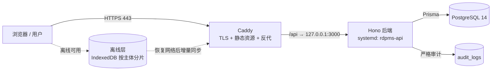
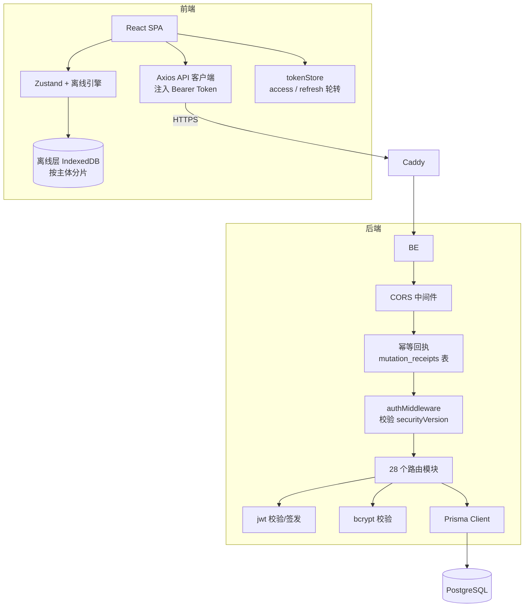
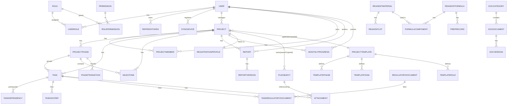

# RDPMS — 研发项目管理系统

> R&D Project Management System · 面向 IVD（体外诊断）/ 诊断试剂研发的科研项目全过程管理平台
> 分支：`main` · 部署形态：原地部署（代码目录 = 运行目录，见 §8）

---

## 目录

1. [系统概述](#1-系统概述)
2. [技术栈总览](#2-技术栈总览)
3. [系统架构](#3-系统架构)
4. [数据库设计](#4-数据库设计)
5. [API 接口文档](#5-api-接口文档)
6. [前端模块设计](#6-前端模块设计)
7. [认证与权限设计](#7-认证与权限设计)
8. [部署架构](#8-部署架构)
9. [安全设计](#9-安全设计)
10. [已知技术债务与待办](#10-已知技术债务与待办)
11. [开发环境搭建指南](#11-开发环境搭建指南)
12. [运维手册](#12-运维手册)

---

## 1. 系统概述

### 1.1 业务定位

RDPMS 是一套面向**诊断试剂 / IVD 研发团队**的研发项目全过程管理系统，覆盖从项目立项、阶段流转、任务执行、进展汇报到注册申报、知识沉淀的完整链路。核心解决"研发过程不可视、汇报靠手工、法规与配方散落、注册进度难追踪"的痛点。

包含以下业务域：

| 业务域 | 说明 |
|--------|------|
| 项目管理 | 项目立项 / 草稿、阶段流转状态机、成员管理、套用模板自动生成任务与里程碑 |
| 任务管理 | 任务看板（拖拽改状态）、前置依赖（环检测）、阶段/优先级/法规适用性标签 |
| 研发汇报 | 日报 / 周报 / 月报，版本历史，提交 / 审阅（已阅）/ 驳回（需修改）工作流 |
| 月度进展 | 按项目 + 月份填写实际工作、完成度、下月计划、风险 |
| 试剂与配方 | 试剂库、试剂原料库、配方编辑器、配制计算器（含配制记录） |
| 引物探针 | 引物 / 探针序列库，CSV 批量导入 |
| 样本库 | 实验样本管理，关联项目 |
| 法规文档 | 法规文件库（适用性 / 优先级标签），关联任务；支持原文件上传与 PDF 导入 |
| 注册申报 | IVD 注册全流程（资料准备 / 送检受理 / 技术审评 / 行政审批 / 取证归档），阶段状态机，合规负责人，到期预警 |
| 知识库 | 文档分类 + 文档版本管理，支持富文本 / Markdown |
| 模板库 | 项目模板（含阶段 / 角色 / 任务结构）、任务模板（含步骤） |

### 1.2 目标用户

| 角色 | 代码 | 典型职责 |
|------|------|----------|
| 系统管理员 | `admin` | 用户 / 权限管理、模板维护、系统备份恢复、注册法规种子数据 |
| 项目经理 | `manager` | 创建与管理项目、增删成员、审阅汇报、推进注册阶段、编辑模板 |
| 研发成员 | `member` | 认领 / 更新任务、提交汇报、填写月度进展、查看注册与法规 |
| 质量 / 注册合规 | 归属上述角色，通过 `registrations.*` 权限位区分 | 维护注册档案、上传法规原文件 |

### 1.3 部署形态

- **单实例原地部署**：一台 Ubuntu 服务器上，**Caddy** 终止 TLS（`rdpms.digifluidic.com`）、托管前端静态产物并反代 `/api` 到本机 Hono 后端；后端连 PostgreSQL。
  代码目录 `/opt/rdpms/app` **同时是运行目录与开发目录** —— 没有 releases/current 多版本机制，发布即原地更新（详见 §8）。
- **离线优先**：前端使用自研 IndexedDB 层（`src/offline/`，按登录主体分片），登录态与同步游标按主体存储；弱网 / 离线时可继续操作，恢复后经 `/api/sync` 增量同步。
- **无状态后端**：JWT 鉴权（access token 15 分钟 + refresh 轮转），不依赖 Redis / 服务端会话存储。

---

## 2. 技术栈总览

### 2.1 后端

| 分类 | 技术 | 版本 | 用途 |
|------|------|------|------|
| 运行时 | Node.js | 20 LTS | 服务运行时 |
| Web 框架 | Hono | ^4.0.0 | HTTP 路由 / 中间件 |
| 服务适配器 | @hono/node-server | ^1.8.0 | Node 原生 HTTP 适配 |
| ORM | Prisma | ^5.10.0 | 数据库访问 / 迁移 |
| 数据库 | PostgreSQL | 14 | 主存储（本地可 SQLite，生产统一 PG） |
| 密码哈希 | bcryptjs | ^2.4.3 | 口令单向哈希（cost 10） |
| 令牌 | jsonwebtoken | ^9.0.2 | JWT 签发 / 校验 |
| CORS | cors | ^2.8.5 | 跨域白名单 |
| ID 生成 | nanoid | ^5.0.4 | 短 ID（部分场景） |
| 报表导出 | pdfkit | ^0.14.0 | PDF 生成 |

### 2.2 前端

| 分类 | 技术 | 版本 | 用途 |
|------|------|------|------|
| UI 框架 | React | ^18.2.0 | 视图层 |
| 语言 | TypeScript | ^5.3.3 | 类型安全（构建门禁：`tsc -b`） |
| 构建 | Vite | ^5.1.0 | 开发服务器 / 生产打包 |
| 路由 | react-router-dom | ^6.22.0 | 前端路由 + 守卫 |
| 状态 | Zustand | ^4.5.0 | 全局 UI 状态 |
| 离线与本地存储 | **自研 IndexedDB 层** | — | `src/offline/`（按登录主体分片；早期版本用 Dexie，已移除） |
| 会话 | 自研 tokenStore | — | `src/auth/tokenStore.ts`（access/refresh 轮转、跨标签锁） |
| HTTP | axios | ^1.6.7 | API 客户端 / 拦截器（`src/api/http.ts`） |
| 样式 | TailwindCSS | ^3.4.19 | 原子化 CSS |
| 组件原子 | @radix-ui/react-* | ^1/2 | avatar / dialog / dropdown / progress / select / tabs |
| 图标 | lucide-react | ^1.8.0 | 图标 |
| 图表 | recharts | ^2.12.0 | 统计图表 |
| 流程图 | @xyflow/react | ^12.10.2 | 阶段 / 流程可视化 |
| 看板拖拽 | @dnd-kit/* | ^6/9/10 | 任务看板拖拽 |
| 导出 | jspdf / html2canvas | ^2.5.1 / ^1.4.1 | 页面 / 报表导出 |
| 图布局 | @dagrejs/dagre | ^3.0.0 | 流程图自动布局 |
| 工具 | clsx / dayjs | ^2.1.0 / ^1.11.10 | 类名拼接 / 日期处理 |

### 2.3 运维

| 分类 | 技术 | 用途 |
|------|------|------|
| 进程守护 | systemd（`rdpms-api.service`） | 后端服务管理、开机自启、崩溃重启；启动入口 `/usr/local/bin/rdpms-start.sh` |
| 反向代理 / 静态 | **Caddy** | TLS 终止（自动证书）+ 前端托管 + `/api` 反代；站点片段 `/etc/caddy/sites/rdpms.caddy` |
| 数据库 | PostgreSQL 14 | 主存储 |
| 备份 | `rdpms-backup.sh` | pg_dump + uploads 快照 + sha256 校验 + 保留策略（日 30 / 周 84 / 月 365） |
| 发布 | `rdpms-deploy.sh` | 原地发布：fetch → 按需装依赖 → migrate → 构建 → 重启（见 §8.3） |

---

## 3. 系统架构

### 3.1 部署拓扑


```mermaid
flowchart LR
  U[浏览器 / 用户] -->|HTTPS 443| CD[Caddy<br/>TLS + 静态资源 + 反代]
  CD -->|/api → 127.0.0.1:3000| BE[Hono 后端<br/>systemd: rdpms-api]
  BE -->|Prisma| PG[(PostgreSQL 14)]
  BE -->|严格审计| AL[(audit_logs)]
  U -.离线可用.-> DX[(离线层<br/>IndexedDB 按主体分片)]
  DX -.恢复网络后增量同步.-> CD
```

- 公网暴露 **443**（Caddy 自动申请证书）；后端 3000 端口**仅本机**可达，不对外。
- 前端为纯静态 SPA，`/api` 经同源反代，避免跨域。

### 3.2 组件与请求链路


```mermaid
flowchart TB
  subgraph 前端
    SPA[React SPA] --> STORE[Zustand + 离线引擎]
    STORE --> OFF[(离线层 IndexedDB<br/>按主体分片)]
    SPA --> AXIOS[Axios API 客户端<br/>注入 Bearer Token]
    SPA --> SESS[tokenStore<br/>access / refresh 轮转]
  end
  AXIOS -->|HTTPS| CD[Caddy]
  CD --> BE
  subgraph 后端
    BE --> CORS[CORS 中间件]
    CORS --> IDEMP[幂等回执<br/>mutation_receipts 表]
    IDEMP --> AUTH[authMiddleware<br/>校验 securityVersion]
    AUTH --> ROUTES[28 个路由模块]
    ROUTES --> JWT[jwt 校验/签发]
    ROUTES --> BC[bcrypt 校验]
    ROUTES --> PRISMA[Prisma Client]
  end
  PRISMA --> PG[(PostgreSQL)]
```

### 3.3 目录结构

```
project-management/
├── README.md                       # 本文件
├── docs/                           # 文档
│   ├── review/codebuddy/deepseek/  # CodeBuddy 审阅资料归档（含 open-items.md）
│   ├── remediation/                # RP 整改包产出
│   ├── audits/                     # 审计记录
│   └── port/                       # 重构实施记录与证据
├── specs/
└── rdpms-system/
    ├── backend/                    # Hono 后端（TypeScript）
    │   ├── prisma/
    │   │   ├── schema.prisma       # 数据模型
    │   │   ├── migrations/         # 版本化迁移（13 个）
    │   │   └── seed.js             # 种子数据（口令外置，见 §11）
    │   ├── src/
    │   │   ├── index.js            # 入口：仅转发到 bootstrap/
    │   │   ├── bootstrap/          # createApp.js（装配）/ server.js（监听 + 生产密钥守卫）
    │   │   ├── routes/             # 28 个路由模块
    │   │   ├── kernel/             # 核心：rbac / audit / 状态机 / 常量
    │   │   ├── platform/           # 平台层：db client / 幂等回执 / 严格审计 / 配置 / 恢复
    │   │   ├── modules/            # 业务模块：access / reports / projects / sync / files …
    │   │   ├── data/               # 任务模板种子等
    │   │   └── utils/
    │   ├── tests/                  # unit / contract / integration
    │   └── package.json
    ├── frontend/                   # React SPA
    │   ├── src/
    │   │   ├── App.tsx             # 路由 + 守卫
    │   │   ├── api/                # http.ts / endpoints/ / adapters/
    │   │   ├── auth/               # tokenStore.ts（会话与轮转）
    │   │   ├── offline/            # IndexedDB 层 / 同步引擎 / 恢复面板
    │   │   ├── shared/             # 与后端共用的规则（如 reportPeriod）
    │   │   └── pages/ components/ hooks/ config/ types/
    │   ├── tests/                  # unit（node:test）+ browser（playwright）
    │   └── package.json
    └── deploy/                     # 部署脚本
        ├── rdpms-api.service       # systemd 单元模板
        ├── scripts/rdpms-start.sh  # 启动入口（校验 dist 后 exec）
        └── scripts/rdpms-deploy.sh # 原地发布脚本
```

---

## 4. 数据库设计

### 4.1 ER 关系图


```mermaid
erDiagram
  USER ||--o{ USERROLE : has
  ROLE ||--o{ USERROLE : assigned
  ROLE ||--o{ ROLEPERMISSION : grants
  PERMISSION ||--o{ ROLEPERMISSION : "in"
  USER ||--o{ REFRESHTOKEN : owns
  USER ||--o{ SYNCDEVICE : registers
  USER ||--o{ PROJECT : manages
  USER ||--o{ PROJECTMEMBER : joins
  USER ||--o{ REPORT : authors
  USER ||--o{ MONTHLYPROGRESS : submits

  PROJECT ||--o{ PROJECTMEMBER : has
  PROJECT ||--o{ PROJECTPHASE : has
  PROJECT ||--o{ TASK : has
  PROJECT ||--o{ MILESTONE : has
  PROJECT ||--o{ REPORT : has
  PROJECT ||--o{ MONTHLYPROGRESS : has
  PROJECT ||--|| REGISTRATIONPROFILE : "has(1-1)"
  PROJECT ||--o{ FILEOBJECT : "owns(ownerProjectId)"
  PROJECT }o--|| PROJECTTEMPLATE : "applied(templateId)"

  PROJECTTEMPLATE ||--o{ TEMPLATEPHASE : defines
  PROJECTTEMPLATE ||--o{ TEMPLATETASK : defines
  PROJECTTEMPLATE ||--o{ TEMPLATEROLE : defines

  PROJECTPHASE ||--o{ TASK : groups
  PROJECTPHASE ||--o{ MILESTONE : contains
  PROJECTPHASE ||--o{ PHASETRANSITION : "from/to"

  TASK ||--o{ TASKDEPENDENCY : "prerequisite"
  TASK ||--o{ TASKDOCREF : links
  TASK ||--o{ TASKREGULATORYDOCUMENT : links
  TASK ||--o{ ATTACHMENT : has
  REGULATORYDOCUMENT ||--o{ TASKREGULATORYDOCUMENT : links

  REPORT ||--o{ REPORTVERSION : has
  FILEOBJECT ||--o{ ATTACHMENT : "referenced by"

  REAGENTMATERIAL ||--o{ REAGENTLOT : has
  REAGENTFORMULA ||--o{ FORMULACOMPONENT : has
  REAGENTMATERIAL ||--o{ FORMULACOMPONENT : "used in"
  REAGENTFORMULA ||--o{ PREPRECORD : has
  DOCCATEGORY ||--o{ DOCDOCUMENT : contains
  DOCDOCUMENT ||--o{ DOCVERSION : has
```

### 4.2 数据表清单

> 约定：**表名与列名统一 snake_case**（Prisma `@@map` / `@map`），模型名保持 PascalCase（括号内）。
> 主键均为 `TEXT`（UUID，由应用生成）。共 **51 个模型**，按域分组如下。

**身份与权限（6）**

| 表（模型） | 关键字段 | 约束 |
|------------|----------|------|
| `users` (User) | id, username, password, name, systemRole, status, securityVersion, lastLoginAt?, deletedAt? | UQ `username` |
| `roles` (Role) | id, code, name, description?, isSystem | UQ `code` |
| `permissions` (Permission) | id, code, name, category, riskLevel | UQ `code` |
| `role_permissions` (RolePermission) | roleId, permissionId | PK[roleId, permissionId] |
| `user_roles` (UserRole) | id, userId, roleId, scopeType?, scopeId? | UQ[userId, roleId, …] |
| `refresh_tokens` (RefreshToken) | id, userId, tokenHash, expiresAt, revokedAt?, datasetEpoch | 索引 userId |

**项目与模板（8）**

| 表（模型） | 关键字段 | 约束 |
|------------|----------|------|
| `projects` (Project) | id, code, name, type, status, managerId, templateId?, startDate?, endDate?, deletedAt? | UQ `code` |
| `project_members` (ProjectMember) | id, projectId, userId, role, joinedAt | UQ[projectId, userId] |
| `project_templates` (ProjectTemplate) | id, code, name, category, parentId?(自引用), content, isMaster | UQ `code` |
| `template_roles` (TemplateRole) | id, templateId, name, permissions | 索引 templateId |
| `template_phases` (TemplatePhase) | id, templateId, code, name, sortOrder | 索引 templateId |
| `template_tasks` (TemplateTask) | id, templatePhaseId, code, title, estimatedDays | 索引 templatePhaseId |
| `project_phases` (ProjectPhase) | id, projectId, templatePhaseId?, code, name, sortOrder, status, plannedStart/End?, actualStart/End?, progressPercent, deletedAt? | 索引 projectId |
| `phase_transitions` (PhaseTransition) | id, projectId, fromPhaseId, toPhaseId, actorId, createdAt | — |

**任务与里程碑（6）**

| 表（模型） | 关键字段 | 约束 |
|------------|----------|------|
| `tasks` (Task) | id, projectId, phaseId?, parentId?, templateTaskId?, code, title, assigneeId?, status, priority, taskType, applicability, dueDate?, completedAt?, deletedAt? | 索引 projectId / phaseId |
| `task_dependencies` (TaskDependency) | id, taskId, prerequisiteId | UQ[taskId, prerequisiteId] |
| `task_doc_refs` (TaskDocRef) | id, taskId, documentId | 索引 taskId |
| `task_templates` (TaskTemplate) | id, name, category?, estimatedDays, priority | UQ `name` |
| `task_template_steps` (TaskTemplateStep) | id, templateId, order, title | 索引 templateId |
| `milestones` (Milestone) | id, projectId, phaseId?, name, date, status, completedAt? | 索引 projectId |

**汇报与进展（4）**

| 表（模型） | 关键字段 | 约束 |
|------------|----------|------|
| `reports` (Report) | id, projectId, authorId, reviewerId?, reportType, periodKey, periodStart, periodEnd, content, status, currentVersion, submittedAt?, reviewedAt?, deletedAt? | UQ[authorId, projectId, periodKey, reportType] |
| `report_versions` (ReportVersion) | id, reportId, version, content, createdAt | UQ[reportId, version] |
| `monthly_progress` (MonthlyProgress) | id, projectId, month, completion, submittedBy | UQ[projectId, month] |
| `registration_profiles` (RegistrationProfile) | id, projectId, registrationType, currentStage?, riskLevel, complianceOwnerId? | UQ `projectId`（1-1） |

**法规与文档（5）**

| 表（模型） | 关键字段 | 约束 |
|------------|----------|------|
| `regulatory_documents` (RegulatoryDocument) | id, dispatchNo, title, category?, applicability, priorityLevel | UQ `dispatchNo` |
| `task_regulatory_documents` (TaskRegulatoryDocument) | taskId, regulatoryDocumentId, relationType | PK[taskId, regulatoryDocumentId] |
| `doc_categories` (DocCategory) | id, name, icon?, sortOrder | — |
| `doc_documents` (DocDocument) | id, categoryId, code, title, docType, version, status, createdBy | UQ `code` |
| `doc_versions` (DocVersion) | id, documentId, version, content, createdBy | UQ[documentId, version] |

**试剂与样品（8）**

| 表（模型） | 关键字段 | 约束 |
|------------|----------|------|
| `reagent_materials` (ReagentMaterial) | id, commonName, chineseName?, category, casNumber?, mw?, purity? | UQ `commonName` |
| `reagent_lots` (ReagentLot) | id, materialId, lotNo, status(LotStatus), expiryDate? | 索引 materialId |
| `reagent_formulas` (ReagentFormula) | id, code, name?, type, pH?, status, projectId? | UQ `code` |
| `formula_components` (FormulaComponent) | id, formulaId, reagentMaterialId?, componentName?, concentration, unit | 索引 formulaId |
| `prep_records` (PrepRecord) | id, formulaId, targetVolume, calcResult, prepDate, createdBy | 索引 formulaId |
| `detection_targets` (DetectionTarget) | id, name, category, … | — |
| `primers` (Primer) | id, name, sequence, targetGene?, detectionTarget? | 索引 name |
| `sample_materials` (SampleMaterial) | id, sampleCode, sampleName, sampleType, species?, status, projectId? | UQ `sampleCode` |

**文件（2）**

| 表（模型） | 关键字段 | 约束 |
|------------|----------|------|
| `file_objects` (FileObject) | id, storageKey, provider, bucket, originalName, mimeType, sizeBytes, checksum, scanStatus, isPublic, uploadedById, **accessScope**, ownerUserId?, ownerProjectId?, sharedReadPermission? | 索引 accessScope / ownerUserId |
| `attachments` (Attachment) | id, fileId, entityType, entityId, createdBy | 索引 [entityType, entityId] |

> 文件访问的**唯一授权依据**是 `file_objects.accessScope`
> （`PRIVATE_STAGING` / `PROJECT` / `SHARED_LIBRARY` / `PUBLIC`）+ 归属字段；
> **不存在"有一条附件关系就放行"的路径**（`modules/files/fileAccessPolicy.ts`）。

**审计与配置（5）**

| 表（模型） | 关键字段 | 约束 |
|------------|----------|------|
| `audit_logs` (AuditLog) | id, action, userId, targetType?, targetId?, detail?, ip?, createdAt | **append-only（DB 触发器）** |
| `system_logs` (SystemLog) | id, action, userId, targetId?, detail?, ip?, createdAt | — |
| `enum_meta` (EnumMeta) | id, domain, code, label, sortOrder | — |
| `code_sequences` (CodeSequence) | id, scope, nextValue | UQ `scope` |
| `system_settings` (SystemSetting) | id, key, value | UQ `key` |

**同步与幂等（7）**

| 表（模型） | 关键字段 | 约束 |
|------------|----------|------|
| `sync_devices` (SyncDevice) | id, userId, deviceId, datasetEpoch, lastCursor? | 索引 userId |
| `sync_mutations` (SyncMutation) | id, actorId, command, resourceScope, idempotencyKey, payloadHash, status | 索引 actorId |
| `mutation_receipts` (MutationReceipt) | id, datasetEpoch, actorId, command, resourceScope, idempotencyKey, payloadHash, status, responseStatus, responseBody, expiresAt | **UQ[actorId, command, resourceScope, idempotencyKey, …]** |
| `sync_publication_state` (SyncPublicationState) | epoch, sequence, initialized | PK `epoch` |
| `sync_source_revisions` (SyncSourceRevision) | id, entity, entityId, revision | — |
| `sync_change_events` (SyncChangeEvent) | id, epoch, sequence, entity, entityId, operation, actorId | **append-only（触发器）** |
| `data_recovery_state` (DataRecoveryState) | id(=1), status, epoch, updatedAt | 单行表 |

### 4.3 设计要点

- **命名规范**：表与列统一 **snake_case**（`@@map` / `@map`），Prisma 模型名保持 PascalCase。
- **主键为 TEXT（UUID）**，由应用生成。**手写迁移不要用 `UUID` 类型** —— 会与既有 `TEXT` 外键不兼容。
- **外键级联**：删除项目（`Cascade`）清理成员 / 阶段 / 任务 / 里程碑 / 汇报 / 进展 / 注册档案；
  删除用户（`Cascade`）清理其创建物，负责人与指派人用 `SetNull`。
- **软删除**：`projects` / `tasks` / `reports` / `project_phases` 等带 `deletedAt`，查询必须过滤。
- **枚举使用**：身份与资源状态用 DB enum（`SystemRole`、`UserStatus`、`LotStatus`、`FileAccessScope` 等）；
  任务与汇报的业务状态仍为字符串常量（见 §10 技术债务）。
- **审计 append-only**：`audit_logs` 由触发器禁止 UPDATE / DELETE（报 `P0001`），
  因此测试断言一律用**增量**，不能全表计数或清理。
- **幂等回执**：`mutation_receipts` 的作用域键有唯一索引，**跨实例安全**；
  业务写入 + 严格审计 + 回执在同一事务提交。
- **同步日志**：`sync_change_events` 由 7 类业务表（projects / phases / tasks / milestones /
  monthly_progress / reports / project_members）的 AFTER 行级触发器写入，不可变且禁止 TRUNCATE。
- **恢复门禁**：`data_recovery_state` 为单行表；其状态非 `READY` 时，
  `rdpms_restore_write_gate()` 触发器会拒绝**所有**业务写入。

---

## 5. API 接口文档

### 5.1 通用约定

- **Base URL**：`/api`（生产经 Caddy 同域反代；前端取 `VITE_API_BASE_URL`，未设时即 `/api`）。
- **认证**：除 `POST /api/auth/login` 外，所有接口需在请求头携带 `Authorization: Bearer <token>`。
- **鉴权**：以**权限位**为准（如 `requirePermission('reports.view')`），
  权限经 `UserRole → Role → RolePermission → Permission` 解析（见 §7.2）。
  下表中「权限」列即该接口要求的权限位：`登录` 表示仅需有效会话，`超管` 表示要求超级管理员。
- **令牌**：access token 默认 15 分钟有效，过期用 `POST /api/auth/refresh` 轮换（见 §7.1）。
- **统一响应**：`{ success, message?, data?, list?, total?, page?, pageSize?, ... }`（前端 `ApiResponse<T>`）。错误返回 `{ error, code }` + 对应 HTTP 状态码。

### 5.2 端点清单

> 本节由路由代码自动核对生成（`src/routes/*.js` 定义 + `bootstrap/createApp.js` 挂载前缀），
> 共 **28 个模块 / 202 个端点**。「功能」列取自各路由的源码注释。**改动路由后请同步更新本节。**
>
> 说明：`/api/audit-logs` 与 `/api/system-logs` 由挂在 `/api` 根下的两个路由模块提供，因此分组标题显示为 `/api`。

#### 审计 —— `/api`

| 方法 | 路径 | 权限 | 功能 |
|------|------|------|------|
| GET | `/api/audit-logs` | `audit.view` |  |
| POST | `/api/audit-logs/export` | `audit.export` |  |
| GET | `/api/audit/entity/:type/:id/summary` | `audit.view` |  |

#### 认证 —— `/api/auth`

| 方法 | 路径 | 权限 | 功能 |
|------|------|------|------|
| POST | `/api/auth/login` | 登录 | 登录 |
| POST | `/api/auth/refresh` | 登录 | 刷新 |
| POST | `/api/auth/logout` | 登录 | 登出 |
| GET | `/api/auth/me` | 登录 | 当前用户（M-1 权限唯一出口） |
| POST | `/api/auth/verify` | 登录 | 旧端点兼容：/verify 返回与 /me 一致 |
| GET | `/api/auth/profile` | 登录 |  |
| GET | `/api/auth/plainOldPassword` | 登录 |  |
| PUT | `/api/auth/password` | 登录 |  |
| PUT | `/api/auth/password/force` | 登录 | 首登强制改密：无需旧密码，但仅当 mustChangePassword=true |

#### 备份 —— `/api/backup`

| 方法 | 路径 | 权限 | 功能 |
|------|------|------|------|
| GET | `/api/backup/export` | `data.export` |  |
| GET | `/api/backup/restore/tables` | 登录 | 可恢复表清单（供前端展示模块与表映射） |
| POST | `/api/backup/restore/preview` | 登录 | 只读校验 + 差异统计 |
| POST | `/api/backup/restore` | 登录 | 单事务应用（失败整体回滚） |
| GET | `/api/backup/restore/status` | 登录 |  |
| POST | `/api/backup/restore/reconcile` | 登录 |  |

#### 字典 —— `/api/dict`

| 方法 | 路径 | 权限 | 功能 |
|------|------|------|------|
| GET | `/api/dict` | 登录 |  |
| GET | `/api/dict/:enumName` | 登录 |  |

#### 知识库与文档 —— `/api/docs`

| 方法 | 路径 | 权限 | 功能 |
|------|------|------|------|
| GET | `/api/docs/categories` | `docs.view` | 分类（docs.view / docs.categories.manage） |
| POST | `/api/docs/categories` | `docs.categories.manage` |  |
| PUT | `/api/docs/categories/:id` | `docs.categories.manage` |  |
| DELETE | `/api/docs/categories/:id` | `docs.categories.manage` |  |
| GET | `/api/docs/documents` | `docs.view` | 文档（docs.view / docs.create / docs.update） |
| GET | `/api/docs/documents/:id` | `docs.view` |  |
| POST | `/api/docs/documents` | `docs.create` |  |
| PUT | `/api/docs/documents/:id` | `docs.update` |  |
| DELETE | `/api/docs/documents/:id` | `docs.delete` | 删除文档（docs.delete，P1 批次二解冻；软删+审计） |
| GET | `/api/docs/documents/:id/versions` | `docs.view` |  |
| GET | `/api/docs/search` | `docs.view` | 关键词搜索（供日报快速引用） |

#### 文件 —— `/api/files`

| 方法 | 路径 | 权限 | 功能 |
|------|------|------|------|
| GET | `/api/files` | `files.download` | 列表（按作用域过滤；files.download） |
| POST | `/api/files` | `files.upload` | 上传（files.upload）：一律先落私有暂存，绑定后才可见 |
| GET | `/api/files/:id/metadata` | `files.download` | 元数据 |
| GET | `/api/files/:id/download` | `files.download` |  |
| GET | `/api/files/:id` | `files.download`、`files.delete` |  |
| PATCH | `/api/files/:id/scope` | `files.delete` | 人工分类（历史无归属文件）：仅超管 |
| DELETE | `/api/files/:id` | `files.delete` | 软删除（被已发布证据引用时只允许解绑，不允许整体删除） |
| POST | `/api/files/:id/restore` | `files.delete` | 仅超管且持 files.delete 可执行，且必须留审计（软删只隐藏，不物理删除）。 |

#### 配方 —— `/api/formulas`

| 方法 | 路径 | 权限 | 功能 |
|------|------|------|------|
| GET | `/api/formulas` | `formulas.view` | 列表（?type=&materialId=） |
| GET | `/api/formulas/:id` | `formulas.view` | 详情 |
| POST | `/api/formulas` | `formulas.create` | 新建（编号走 CodeSequence 原子发号） |
| PUT | `/api/formulas/:id` | `formulas.update` | 更新（组分整体重建） |
| DELETE | `/api/formulas/:id` | 登录 | M-1：formulas.delete 为 P1 后置权限，冻结桩（Tencent 为硬删，解冻时改软删+审计） |
| POST | `/api/formulas/:id/duplicate` | `formulas.create` | 复制（formulas.create） |

#### 阶段流转 —— `/api/phases`

| 方法 | 路径 | 权限 | 功能 |
|------|------|------|------|
| GET | `/api/phases` | `project_phases.view` | 阶段列表（project_phases.view + ∩ read） |
| POST | `/api/phases` | `project_phases.create` | 创建阶段（project_phases.create + ∩ write） |
| GET | `/api/phases/:id` | `project_phases.view` | 详情 |
| PUT | `/api/phases/:id` | `project_phases.update` | 更新（project_phases.update + ∩ write） |
| PATCH | `/api/phases/:id/status` | `project_phases.change_status` | 阶段状态流转（project_phases.change_status + ∩ transition） |
| POST | `/api/phases/:id/transitions` | `project_phases.update` | 建立阶段流转（project_phases.update + ∩ write） |
| DELETE | `/api/phases/:id/transitions/:toPhaseId` | `project_phases.update` | 删除阶段流转 |

#### 配制 —— `/api/prep`

| 方法 | 路径 | 权限 | 功能 |
|------|------|------|------|
| POST | `/api/prep/calculate` | `formulas.view` | 试算 |
| POST | `/api/prep/records` | `prep_records.create` | 保存配制记录 |
| GET | `/api/prep/records` | `prep_records.view` |  |
| GET | `/api/prep/records/:id` | `prep_records.view` |  |

#### 引物 —— `/api/primers`

| 方法 | 路径 | 权限 | 功能 |
|------|------|------|------|
| GET | `/api/primers` | `primers.view` | 列表（keyword / projectId / targetGene / status） |
| GET | `/api/primers/:id` | `primers.view` |  |
| POST | `/api/primers` | `primers.create` |  |
| PUT | `/api/primers/:id` | `primers.update` |  |
| DELETE | `/api/primers/:id` | `primers.delete` | 删除（primers.delete，P1 批次二解冻；软删+审计） |
| POST | `/api/primers/batch-import` | `primers.import` | 前端解析 CSV 后传 rows 数组，逐行校验、逐行 CodeSequence 发号，失败行不阻断整批） |

#### 月度进展 —— `/api/progress`

| 方法 | 路径 | 权限 | 功能 |
|------|------|------|------|
| GET | `/api/progress/project/:projectId` | `progress.view` | 项目月度进展 |
| POST | `/api/progress/project/:projectId` | `progress.create` | 填写/更新月度进展 |
| GET | `/api/progress/all/:periodKey` | `progress.view` | 全部项目月度进展（progress.view；按可见项目过滤） |
| GET | `/api/progress/export/:periodKey` | `progress.view` | 导出月度进展（progress.view；M-1 无 progress.export 码，导出读权限沿用） |
| GET | `/api/progress` | `progress.view` | 兼容挂载（progress.view） |

#### 项目模板 —— `/api/project-templates`

| 方法 | 路径 | 权限 | 功能 |
|------|------|------|------|
| GET | `/api/project-templates` | `project_templates.view` | 列表 |
| GET | `/api/project-templates/:id` | `project_templates.view` | 详情 |
| POST | `/api/project-templates` | `project_templates.create` | 创建 |
| PUT | `/api/project-templates/:id` | `project_templates.update` | 更新 |
| PATCH | `/api/project-templates/:id` | `project_templates.update` |  |
| DELETE | `/api/project-templates/:id` | `project_templates.delete` | 删除（project_templates.delete 为 P0；软删 + 引用检查） |
| POST | `/api/project-templates/:id/copy` | `project_templates.copy` | 复制（project_templates.copy，P1 批次二解冻；roles/phases/tasks 深拷贝） |
| GET | `/api/project-templates/:id/preview` | `project_templates.view` | 预览 |
| POST | `/api/project-templates/:id/apply` | `project_templates.view` | 应用预览（前端创建项目时预览生成结果） |
| GET | `/api/project-templates/:templateId/roles` | `project_templates.view` | 模板角色（templateRole；code 必填） |
| POST | `/api/project-templates/:templateId/roles` | `project_templates.update` |  |
| PUT | `/api/project-templates/:templateId/roles/:roleId` | `project_templates.update` |  |
| DELETE | `/api/project-templates/:templateId/roles/:roleId` | `project_templates.update` |  |
| POST | `/api/project-templates/:templateId/roles/batch` | `project_templates.update` |  |

#### 项目与成员 —— `/api/projects`

| 方法 | 路径 | 权限 | 功能 |
|------|------|------|------|
| GET | `/api/projects` | `projects.view` | 列表（projects.view；非 SUPER_ADMIN 按成员/负责人过滤） |
| GET | `/api/projects/:id` | `projects.view` | 详情（projects.view + ∩：非成员 404；SA 非成员访问写 elevated 审计） |
| POST | `/api/projects` | `projects.create` | 创建（projects.create；编号走 CodeSequence 原子发号） |
| PUT | `/api/projects/:id` | `projects.update` | 更新（projects.update + ∩ write；状态流转走 transition；归档需 projects.archive） |
| DELETE | `/api/projects/:id` | `projects.delete` | 删除（projects.delete，P1 批次二解冻；软删+审计） |
| GET | `/api/projects/:id/members` | `projects.view` | 成员管理（projects.manage_members + ∩ manage_members） |
| POST | `/api/projects/:id/members` | `projects.manage_members` |  |
| DELETE | `/api/projects/:id/members/:userId` | `projects.manage_members` |  |
| GET | `/api/projects/:id/tasks` | `tasks.view` | 项目内资源（嵌套只读；read 能力 + 对应系统权限） |
| GET | `/api/projects/:id/reports` | `reports.view` |  |
| GET | `/api/projects/:id/milestones` | `milestones.view` |  |
| GET | `/api/projects/:id/phases` | `project_phases.view` |  |
| GET | `/api/projects/stats/types` | `projects.view` | 统计（带可见性过滤） |
| GET | `/api/projects/stats/status` | `projects.view` |  |
| POST | `/api/projects/:id/apply-template` | `projects.update` | 套用模板（projects.update + write；模板结构来自 TemplatePhase/TemplateTask 行） |
| POST | `/api/projects/batch-delete` | `projects.delete` | 批量删除（projects.delete；软删+审计，Tencent POST /projects/batch-delete 复刻） |
| POST | `/api/projects/batch-update-status` | `projects.update` | 批量更新状态（逐项目 ∩ transition 校验） |

#### 试剂批次 —— `/api/reagent-lots`

| 方法 | 路径 | 权限 | 功能 |
|------|------|------|------|
| GET | `/api/reagent-lots` | `reagents.view` |  |
| POST | `/api/reagent-lots` | `reagents.create` |  |
| PATCH | `/api/reagent-lots/:id` | `reagents.update` |  |

#### 原料 —— `/api/reagent-materials`

| 方法 | 路径 | 权限 | 功能 |
|------|------|------|------|
| GET | `/api/reagent-materials` | `reagent_materials.view` | 列表 |
| GET | `/api/reagent-materials/:id` | `reagent_materials.view` |  |
| POST | `/api/reagent-materials` | `reagent_materials.create` |  |
| PUT | `/api/reagent-materials/:id` | `reagent_materials.update` |  |
| DELETE | `/api/reagent-materials/:id` | `reagent_materials.delete` | 删除（reagent_materials.delete，P1 批次二解冻；软删+审计） |
| POST | `/api/reagent-materials/bulk-delete` | `reagent_materials.delete` | 批量软删（reagent_materials.delete） |

#### 试剂 —— `/api/reagents`

| 方法 | 路径 | 权限 | 功能 |
|------|------|------|------|
| POST | `/api/reagents` | 登录 | 此处不注册 POST /:id（无业务意义且会按注册顺序抢先匹配 /export）。 |
| PUT | `/api/reagents/:id` | 登录 |  |
| PATCH | `/api/reagents/:id` | 登录 |  |
| DELETE | `/api/reagents/:id` | 登录 |  |
| GET | `/api/reagents` | `reagents.view` | 聚合列表 |
| GET | `/api/reagents/:id` | `reagents.view` | 聚合详情 |
| GET | `/api/reagents/export` | `reagents.export` |  |
| POST | `/api/reagents/export` | `reagents.export` |  |

#### 注册申报 —— `/api/registrations`

| 方法 | 路径 | 权限 | 功能 |
|------|------|------|------|
| GET | `/api/registrations` | `registrations.view` | 注册项目列表（registrations.view） |
| GET | `/api/registrations/stats` | `registrations.view` | 统计 |
| GET | `/api/registrations/templates` | `registrations.view` | 可用模板（project_templates.view 亦可，保持 registrations.view 以兼容原页面） |
| GET | `/api/registrations/:id` | `registrations.view` | 详情（registrations.view） |
| POST | `/api/registrations` | `registrations.create` | 创建（registrations.create；编号走 CodeSequence） |
| PUT | `/api/registrations/:id` | `registrations.update` | 更新（registrations.update） |
| PATCH | `/api/registrations/:id/stage` | `registrations.change_stage` | 阶段推进（registrations.change_stage；严格状态机） |
| PATCH | `/api/registrations/:id/profile` | `registrations.update` | 单独更新档案（不含阶段） |

#### 法规文档 —— `/api/regulatory-documents`

| 方法 | 路径 | 权限 | 功能 |
|------|------|------|------|
| GET | `/api/regulatory-documents/auth` | 登录 |  |
| GET | `/api/regulatory-documents` | `regulatory_documents.view` |  |
| GET | `/api/regulatory-documents/auth` | 登录 |  |
| GET | `/api/regulatory-documents/:id` | `regulatory_documents.view` |  |
| GET | `/api/regulatory-documents/auth` | 登录 |  |
| POST | `/api/regulatory-documents` | `regulatory_documents.create` |  |
| GET | `/api/regulatory-documents/auth` | 登录 |  |
| PUT | `/api/regulatory-documents/:id` | `regulatory_documents.update` |  |
| GET | `/api/regulatory-documents/auth` | 登录 |  |
| DELETE | `/api/regulatory-documents/:id` | `regulatory_documents.delete` |  |
| GET | `/api/regulatory-documents/auth` | 登录 |  |
| POST | `/api/regulatory-documents/import` | 登录 |  |
| GET | `/api/regulatory-documents/auth` | 登录 |  |
| POST | `/api/regulatory-documents/seed` | `regulatory_documents.create` |  |
| POST | `/api/regulatory-documents/:id/original-file` | 登录 | 兼容入口：base64 直传原文（新前端一律走 POST /api/files + PUT originalFileId） |
| GET | `/api/regulatory-documents/auth` | 登录 |  |
| GET | `/api/regulatory-documents/:id/original-file` | 登录 |  |
| GET | `/api/regulatory-documents/auth` | 登录 |  |

#### 汇报 —— `/api/reports`

| 方法 | 路径 | 权限 | 功能 |
|------|------|------|------|
| GET | `/api/reports` | `reports.view` | 列表（reports.view；按可见项目过滤） |
| GET | `/api/reports/:id` | `reports.view` | 详情（reports.view + ∩ read） |
| POST | `/api/reports` | `reports.create` | RF03：本接口只负责「保存草稿」——周期键按类型严格校验，状态由提交命令负责。 |
| PUT | `/api/reports/:id` | `reports.update` | 业务写入、严格审计、回执在同一事务提交（失败不留回执）。 |
| POST | `/api/reports/:id/submit` | `reports.submit` | RF02：版本快照、状态、严格审计、幂等回执全部在同一事务；失败不留半成品与回执。 |
| POST | `/api/reports/:id/approve` | `reports.review` | 审阅通过（reports.review + ∩ transition） |
| POST | `/api/reports/:id/reject` | `reports.review` | 批示需修改（reports.review + ∩ transition） |
| GET | `/api/reports/:id/versions` | `reports.view` | 历史版本 |
| GET | `/api/reports/export/month/:month` | `reports.export` | 导出（reports.export） |
| DELETE | `/api/reports/:id` | `reports.delete` | Tencent 语义：只能删草稿；enh 额外由 reports.delete 权限码把关 |
| PATCH | `/api/reports/:id/recall` | `reports.update` | 撤回（作者本人；SUBMITTED → DRAFT） |

#### 角色 —— `/api/roles`

| 方法 | 路径 | 权限 | 功能 |
|------|------|------|------|
| GET | `/api/roles/permission-catalog` | `roles.view` | P0 权限目录（roles.view；权限分配弹窗数据源） |
| GET | `/api/roles` | `roles.view` |  |
| POST | `/api/roles` | `roles.create` |  |
| PATCH | `/api/roles/:id` | `roles.update` |  |
| DELETE | `/api/roles/:id` | `roles.delete` |  |
| POST | `/api/roles/:id/permissions` | `roles.assign_permissions` |  |

#### 样本 —— `/api/samples`

| 方法 | 路径 | 权限 | 功能 |
|------|------|------|------|
| GET | `/api/samples` | `samples.view` | 列表 |
| GET | `/api/samples/:id` | `samples.view` | 详情 |
| POST | `/api/samples` | `samples.create` | 创建（编号竞态修复：CodeSequence 原子发号） |
| PUT | `/api/samples/:id` | `samples.update` | 更新（白名单；禁止改编号） |
| DELETE | `/api/samples/:id` | 登录 | 删除（M-1：samples.delete 为 P1 后置权限，冻结桩；解冻时软删+审计） |

#### 设置 —— `/api/settings`

| 方法 | 路径 | 权限 | 功能 |
|------|------|------|------|
| GET | `/api/settings` | `settings.view` |  |
| PATCH | `/api/settings` | `settings.update` |  |

#### 统计 —— `/api/stats`

| 方法 | 路径 | 权限 | 功能 |
|------|------|------|------|
| GET | `/api/stats/dashboard` | `dashboard.view` | 仪表盘统计 |
| GET | `/api/stats/projects` | `dashboard.view` | 项目统计（dashboard.view 即可访问；完成率改单查询聚合） |
| GET | `/api/stats/users/:userId/workload` | `dashboard.view` | 个人工作量统计 |
| GET | `/api/stats/reports` | `dashboard.view` | 汇报统计 |

#### 同步 —— `/api/sync`

| 方法 | 路径 | 权限 | 功能 |
|------|------|------|------|
| GET | `/api/sync/init` | 登录 | 增量拉取 |
| POST | `/api/sync/receipts/reserve` | 登录 |  |
| POST | `/api/sync/receipts/query` | 登录 |  |
| POST | `/api/sync/push` | 登录 |  |
| POST | `/api/sync/device` | 登录 | 设备登记 |
| GET | `/api/sync/status` | 登录 | 同步状态 |

#### 系统日志 —— `/api`

| 方法 | 路径 | 权限 | 功能 |
|------|------|------|------|
| GET | `/api/system-logs` | `system.logs.view` |  |

#### 任务模板 —— `/api/task-templates`

| 方法 | 路径 | 权限 | 功能 |
|------|------|------|------|
| GET | `/api/task-templates` | `task_templates.view` | 列表 |
| GET | `/api/task-templates/:id` | `task_templates.view` |  |
| POST | `/api/task-templates` | `task_templates.create` |  |
| PUT | `/api/task-templates/:id` | `task_templates.update` |  |
| DELETE | `/api/task-templates/:id` | `task_templates.delete` | 为 P0） |
| POST | `/api/task-templates/bulk-delete` | `task_templates.delete` | 批量软删（Tencent 复刻；任一被项目引用则整批拒绝，语义与单删一致） |
| POST | `/api/task-templates/seed` | `task_templates.create` | 一键预置标准模板（task_templates.create） |

#### 任务 —— `/api/tasks`

| 方法 | 路径 | 权限 | 功能 |
|------|------|------|------|
| GET | `/api/tasks` | `tasks.view` | 列表（tasks.view；按可见项目过滤） |
| POST | `/api/tasks/:id/prerequisites` | `tasks.update` | 前置任务依赖（tasks.update + ∩ write） |
| DELETE | `/api/tasks/:id/prerequisites/:prerequisiteId` | `tasks.update` |  |
| GET | `/api/tasks/:id` | `tasks.view` | 详情（tasks.view + ∩ read） |
| POST | `/api/tasks` | `tasks.create` | 创建（tasks.create + ∩ write） |
| PUT | `/api/tasks/:id` | `tasks.update` | 更新（tasks.update + ∩ write；定位任务 → projectId → ∩） |
| PATCH | `/api/tasks/:id/status` | `tasks.change_status` | 状态流转（tasks.change_status + ∩ transition；Kanban 拖拽） |
| DELETE | `/api/tasks/:id` | `tasks.delete` | 删除（tasks.delete，P1 批次二解冻；软删含全部后代任务，审计） |
| GET | `/api/tasks/board/:projectId` | `tasks.view` | 看板（tasks.view + ∩ read；英文枚举分组） |
| POST | `/api/tasks/batch/status` | `tasks.change_status` | 批量更新状态（逐任务 ∩ transition） |

#### 用户 —— `/api/users`

| 方法 | 路径 | 权限 | 功能 |
|------|------|------|------|
| GET | `/api/users` | `users.view` | 列表（users.view） |
| GET | `/api/users/:id` | `users.view` | 单个（users.view） |
| POST | `/api/users` | `users.create` | 创建（users.create；systemRole 由服务端固定 MEMBER，M-1 §7.3） |
| POST | `/api/users/batch` | `users.create` | 批量导入（users.create；Tencent POST /users/batch 复刻，逐条校验逐条落库） |
| PUT | `/api/users/:id` | `users.update` | 更新（users.update；白名单 M-1 §6.3） |
| PATCH | `/api/users/:id/status` | 登录 | 启停（users.enable / users.disable） |
| PUT | `/api/users/:id/roles` | `roles.assign_user` | 角色绑定唯一入口（roles.assign_user；M-1 §6.3） |
| PUT | `/api/users/:id/reset-password` | `users.reset_password` | 重置密码（users.reset_password） |
| DELETE | `/api/users/:id` | `users.delete` | 删除（users.delete，8 项高危之一，仅 SUPER_ADMIN 持有） |

---

### 5.3 登录请求/响应示例

```http
POST /api/auth/login
Content-Type: application/json

{ "username": "<SEED_ADMIN_USERNAME 指定的账号>", "password": "<seed 时设置的口令>" }
```

> 代码内**不再有默认弱口令**，种子账号与口令均由 `SEED_*` 环境变量提供（见 §11.2）。

```json
{
  "accessToken": "eyJhbGciOiJIUzI1NiIsInR5cCI6IkpXVCJ9...",
  "refreshToken": "…",
  "expiresIn": 900,
  "token": "eyJhbGciOiJIUzI1NiIsInR5cCI6IkpXVCJ9...",
  "user": {
    "id": "uuid",
    "username": "…",
    "name": "管理员",
    "systemRole": "ADMIN",
    "status": "ACTIVE",
    "permissions": ["projects.create", "users.manage", "registrations.approve", "..."]
  }
}
```

- `expiresIn` 为 access token 剩余秒数（默认 900）；`token` 是 `accessToken` 的兼容别名，供旧客户端使用。
- 令牌过期后调 `POST /api/auth/refresh`（body 带 `refreshToken`）换取新的一对令牌。

---

## 6. 前端模块设计

### 6.1 路由结构（`src/App.tsx`）

两层守卫：

- **`AuthGuard`**：未登录（或会话失效）时重定向 `/login`；
- **`RoleGuard perm={PERMS.XXX}`**：按权限位控制访问，无权限渲染 `403`；
- 响应拦截器遇 401 会清理会话并跳登录，与守卫形成双重保护。

| 路径 | 组件 | 守卫 |
|------|------|------|
| `/login` | `Login` | 公开 |
| `/`（index） | `Dashboard` | AuthGuard |
| `projects`、`projects/new` | `Projects` | AuthGuard |
| `projects/:id` | `ProjectDetail` | AuthGuard |
| `registrations`、`registrations/:id` | `RegistrationProjects` / `RegistrationProjectDetail` | `REGISTRATIONS_VIEW` |
| `regulatory-documents` | → `/knowledge?module=regulatory` | 旧链接兼容重定向 |
| `project-templates`、`project-templates/:id/edit` | `TemplateLibrary` / `TemplateEditor` | AuthGuard |
| `task-templates` | `TaskTemplateLibrary` | AuthGuard |
| `reports` | `Reports` | `REPORTS_VIEW` |
| `reports/:id`、`reports/:id/review` | `ReportEdit` / `ReportReview` | AuthGuard |
| `knowledge`、`knowledge/:id`、`docs` | `Docs` / `KnowledgeDetail` | AuthGuard |
| `reagent-formula`、`/new`、`/:id/edit`、`/calculator` | `FormulaList` / `FormulaEditor` / `PrepCalculator` | AuthGuard |
| `tasks` | `Tasks` | AuthGuard |
| `backup` | `BackupManager` | `DATA_EXPORT` |
| `users` | `Users` | `USERS_VIEW` |
| `audit-logs` | `AuditLogs` | `AUDIT_VIEW` |
| `system-logs` | `SystemLogs` | `SYSTEM_LOGS_VIEW` |
| `roles` | `Roles` | `ROLES_VIEW` |
| `settings` | `Settings` | `SETTINGS_VIEW` |
| `change-password` | `ChangePassword` | AuthGuard |
| `403` | `Forbidden` | — |
| `*` | `NotFound` | — |

### 6.2 状态、会话与离线

全局 UI 状态用 Zustand；**业务数据与离线能力不在 store 里**，而是拆成三层：

| 模块 | 职责 |
|------|------|
| `src/auth/tokenStore.ts` | 会话真源：access / refresh 令牌、登录代际 `loginGeneration`、跨标签轮换协调 |
| `src/offline/idb.ts` | IndexedDB 层，**按登录主体分片**（`activateOwner` / `forOwner`）；每次存储操作校验 userId + loginGeneration + 当前会话 + 已登记的活动会话 |
| `src/offline/engine.ts` | 同步引擎：分页拉取与 checkpoint 提交、上行、冲突与拒绝区、数据集 epoch 围栏 |
| `src/offline/pendingDraft.ts` | 缺项目等暂不可提交内容的本地留存与恢复 |
| `src/offline/deadLetter.ts` | 被拒变更的持久留存（保留最早 payload；同键不同内容另记 `payloadConflict`） |

离线引擎的不变量（改动时必须保持）：无主体不同步、`resetOnLogout` 的状态切换先于任何 `await`、
拉取/下行落盘前后都检查会话代次、缓存键按主体分片。

> 早期版本使用 `src/store/appStore.ts` + Dexie（IndexedDB `RDPatabase` v2，7 个 object store）。
> 该方案已在账号隔离改造中替换：**Dexie 依赖已移除，`appStore` 不再存在**。

### 6.3 组件划分

- **布局**：`components/Layout.tsx`（侧边栏 + 顶栏，包裹受保护路由）。
- **离线与同步反馈**：`OfflineBanner`、`SyncStatusIndicator`、`SyncConflictDialog`、`ErrorBoundary`、`FullPageSpinner`。
- **业务组件**：`KanbanBoard`、`PhaseTaskPanel`、`PhaseProgressBar`、`ProcessFlowDiagram`、`MindMapView`、`HierarchicalTaskList`、`ProjectCard`、`CreateProjectModal`、`EditProjectModal`、`AddMemberModal`、`DocReference`、`ProjectTemplateEditor`、`ReagentDailyReport`、`VisualTableEditor`。
- **页面域目录**：`pages/knowledge/`（任务模板、试剂库、引物库、扩增试剂库、样本库）、
  `pages/reagent-formula/`（配方列表 / 编辑器 / 批量编辑 / 计算器）。

### 6.4 API 客户端（`src/api/`）

```
src/api/
├── http.ts        # axios 实例：BASE_URL、请求/响应拦截器
├── request.ts     # 统一请求封装（错误归一）
├── error.ts       # 错误类型与判定
├── files.ts       # 文件上传/下载专用（表单与 blob）
├── index.ts       # 汇总导出
├── types.ts       # 通用 API 类型
├── adapters/      # 后端 DTO ↔ 前端模型（如 report.ts 的 reportContent）
└── endpoints/     # 按业务域拆分：auth / backup / knowledge / projects / reagents /
                   # registrations / regulatoryDocuments / reports / roles / stats /
                   # sync / system / tasks / templates
```

- 基础地址取 `import.meta.env.VITE_API_BASE_URL`，默认 `/api`。
- 请求拦截器注入 `Authorization: Bearer <access token>`；401 触发会话轮换或跳登录。
- **汇报内容统一经 `src/shared/reportContent.ts` + `api/adapters/report.ts` 读取**
  （历史形态有对象与字符串两种，都要支持）；解析失败时保留 `contentReadError`，**禁止回写空表**。
- **共享规则**（如汇报周期计算）在 `src/shared/reportPeriod.ts`，
  与后端 `src/modules/reports/reportRules.js` 必须同步修改。

---

## 7. 认证与权限设计

### 7.1 JWT 结构

- **签发**（`/api/auth/login` 成功）：`jwt.sign({ userId, systemRole, securityVersion, datasetEpoch }, JWT_SECRET, { expiresIn: ACCESS_TTL_SEC })`。
- **Payload**：`{ userId, systemRole, securityVersion, datasetEpoch }`；`systemRole` 取值
  `SUPER_ADMIN | ADMIN | MANAGER | MEMBER | VIEWER | AUDITOR`（DB 枚举 `SystemRole`）。
- **有效期**：access token 默认 **900 秒（15 分钟）**，可用 `JWT_ACCESS_TTL`（带单位）或 `JWT_ACCESS_TTL_SEC` 覆盖；
  过期经 `POST /api/auth/refresh` 轮换（返回新 access + 新 refresh）。
- **失效与重放**：`securityVersion` 与库中不一致（改密 / 会话撤销）→ 401 `SESSION_REVOKED`；
  refresh token 被重复使用 → `REFRESH_TOKEN_REPLAYED`。
- **校验**：`authMiddleware` 解析 `Authorization: Bearer <token>`，并校验上述字段与账号状态。
- **密钥**：`JWT_SECRET` 生产强制配置；`configSchema` 在 `NODE_ENV=production` 下要求长度 ≥32、
  且不命中弱口令黑名单，否则拒绝启动。

### 7.2 RBAC 权限模型

权限模型为**表驱动**（`Role` / `Permission` / `UserRole` + `RolePermission`），不再是代码内硬编码矩阵：

- `User.systemRole`（枚举 `SystemRole`）决定系统级身份：
  `SUPER_ADMIN | ADMIN | MANAGER | MEMBER | VIEWER | AUDITOR`；
- 业务权限通过 `UserRole → Role → RolePermission → Permission.code` 绑定，
  权限位形如 `projects.edit`、`tasks.assign`、`reports.submit`；
- 写入口的授权真源在 `src/modules/access/writeGuards.js`
  （`assertActionPermission` / `assertTaskEdit` / `assertTaskStatusChange` / `assertTaskAssign` /
  `assertPhaseStatusChange` / `assertReportWritable` …），**普通 API 与同步接口必须调用同一组守卫**；
- `SUPER_ADMIN` 视为持有全部 P0 权限（`kernel/constants.js` 的 `P0_PERMISSIONS`）。

> 后端是唯一安全边界；前端仅做按钮显隐，不构成安全控制。
### 7.3 中间件链

```
请求 → CORS 中间件（ALLOWED_ORIGINS 白名单）
     → 幂等回执 withIdempotency（actor + command + 资源作用域 + key + payloadHash）
     → authMiddleware（令牌 + securityVersion + 账号状态）
     → 路由模块级鉴权（writeGuards / 权限位）
     → 业务处理器
     → onError / notFound 统一处理
```

- **CORS**：`ALLOWED_ORIGINS` 逗号分隔白名单；旧别名 `CORS_ORIGINS` 与之同设时必须完全一致，
  否则 `configSchema` 拒绝启动。不使用通配 `*`。
- **幂等**：作用域键在 `mutation_receipts` 表上有唯一索引，**跨实例安全**；
  业务写入、严格审计与回执在同一事务提交，失败不留下成功回执；
  同键不同 payload 返回 409 `IDEMPOTENCY_PAYLOAD_MISMATCH`。

---

## 8. 部署架构

> **原地部署**（2026-10-08 起）：代码目录 `/opt/rdpms/app` **同时是运行目录与开发目录**，
> 没有 `releases/<ts>` 快照与 `current` 软链。发布即原地更新，见 §8.3。

### 8.1 部署形态与目录

`/opt/rdpms`、`/srv/rdpms` 均为 `/mnt/datadisk0/rdpms` 的软链，部署根内容：

```
/mnt/datadisk0/rdpms/
├── app/                    # 代码（git 仓库，main 分支）= 运行目录 = 开发目录
├── backups/                # 数据库与 uploads 备份（rdpms 属主）
├── logs/                   # 服务日志（systemd append 目标）
├── uploads/                # 用户上传（服务读写）
├── .env                    # 生产配置（root:rdpms 640）
└── .codebuddy/  .vscode/   # 工具配置
```

**为什么这样**：单实例 + 单人开发场景下，多版本快照带来的回滚能力不足以抵消它的复杂度
（目录累积、残留进程、manifest 校验链）。**代价是失去秒级回滚**，见 §8.4。

- **进程隔离**：后端以专用系统用户 `rdpms` 运行；`systemd` 设 `MemoryMax=1024M`、`Restart=always`。
- **数据库隔离**：专用 PostgreSQL 角色 + 独立库 `rdpms`，仅本机 127.0.0.1 可达。
- **端口隔离**：对外仅 443（Caddy）；后端 3000 仅监听本机。
- **属主**：`app/` 归 `ubuntu`（开发与构建身份），服务以 `rdpms` 身份**只读**运行代码与产物；
  发布脚本以 ubuntu 执行，内部通过 `sudo` 重启服务。

### 8.2 环境变量（`/srv/rdpms/.env`）

后端配置集中在 `/srv/rdpms/.env`（`root:rdpms` 640，经 systemd `EnvironmentFile` 注入）。

| 变量 | 必填 | 说明 |
|------|:----:|------|
| `DATABASE_URL` | ✅ | PostgreSQL 连接串（可带 `?schema=public`） |
| `DIRECT_URL` | ✅ | Prisma 直连串（迁移用；与 `DATABASE_URL` 同库同主机） |
| `JWT_SECRET` | ✅ | ≥32 字符且不命中弱口令黑名单，否则生产拒绝启动 |
| `ALLOWED_ORIGINS` | ✅（生产） | CORS 白名单，逗号分隔 |
| `CORS_ORIGINS` | — | 旧别名；与 `ALLOWED_ORIGINS` 同设时必须完全一致 |
| `UPLOAD_DIR` | ✅（生产） | 上传根目录，须为绝对路径且不在代码目录内 |
| `NODE_ENV` / `HOST` / `PORT` | — | 生产下 `HOST` 必须为回环地址 |
| `STORAGE_DRIVER` | — | 仅支持 `local` |
| `TRUST_PROXY_HOPS` | — | 仅支持 `1`（当前未实现代理信任策略，该值仅作兼容） |
| `ENABLE_BACKUP_EXPORT` | — | 仅容忍 `false`；导出权限由审计过的 SUPER_ADMIN 权限控制，不由该变量控制 |
| `MAX_UPLOAD_MB` / `SEED_*` | — | 上传展示预算 / 种子账号与口令 |

> 以上由 `src/platform/config/configSchema.ts` 在启动时校验，**不合规直接拒绝启动**（fail fast）。

**前端（构建期）**：`VITE_API_BASE_URL`（默认 `/api`，同域反代时无需修改）。

### 8.3 服务与发布

**systemd 单元** `/etc/systemd/system/rdpms-api.service`（模板见仓库 `rdpms-system/deploy/rdpms-api.service`）：

```ini
[Unit]
Description=RDPMS API (Hono + Prisma + PostgreSQL)
After=network-online.target postgresql.service
Wants=network-online.target
RequiresMountsFor=/mnt/datadisk0
StartLimitIntervalSec=300

[Service]
Type=simple
User=rdpms
Group=rdpms
WorkingDirectory=/opt/rdpms/app/rdpms-system/backend
EnvironmentFile=/srv/rdpms/.env
ExecStart=/usr/local/bin/rdpms-start.sh
MemoryMax=1024M
Restart=always
RestartSec=5
StandardOutput=append:/mnt/datadisk0/rdpms/logs/app.out.log
StandardError=append:/mnt/datadisk0/rdpms/logs/app.err.log
# 其余加固项见单元模板：NoNewPrivileges / ProtectSystem / ReadWritePaths 等
```

- `RequiresMountsFor=/mnt/datadisk0`：数据盘未就绪时不启动（否则代码目录断链、日志也无处可写）。
- `ExecStart` 指向启动包装 `/usr/local/bin/rdpms-start.sh`：**校验 `dist/index.js` 存在后 exec**，
  缺失即失败退出。不做 src 回退 —— `src/` 下是 TypeScript，node 无法直接执行，
  回退只会把"构建没跑"这种部署事故变成更难排查的启动错误。

**发布（一条命令）**：

```bash
cd /opt/rdpms/app
bash rdpms-system/deploy/scripts/rdpms-deploy.sh          # 默认 main 分支
```

流程：`git fetch` → `merge --ff-only` → **按需** `npm ci`（仅当对应 `package-lock.json` 实际变化，
避免每次发布都等一轮网络安装）→ `prisma generate` + `migrate deploy` → 前后端构建 →
`systemctl restart rdpms-api`。实测一次完整发布约 **53 秒**（依赖无变化时）。

**启动脚本与单元的安装**：

```bash
cd /opt/rdpms/app
sudo cp rdpms-system/deploy/scripts/rdpms-start.sh /usr/local/bin/rdpms-start.sh
sudo chown root:rdpms /usr/local/bin/rdpms-start.sh && sudo chmod 750 /usr/local/bin/rdpms-start.sh
sudo cp rdpms-system/deploy/rdpms-api.service /etc/systemd/system/rdpms-api.service
sudo systemctl daemon-reload
```

### 8.4 回滚

原地部署**没有**"切回上一个 release"这种秒级动作，回滚是"改代码 + 重新构建"：

```bash
cd /opt/rdpms/app
git log --oneline -5                                # 找到回退目标
git checkout <commit>                               # 或 git revert <commit>
bash rdpms-system/deploy/scripts/rdpms-deploy.sh    # 重新构建 + 重启
```

注意两点：

1. **数据库迁移是前滚的**，回退代码不等于回退数据库。本项目现有迁移均为 additive
   （新增表 / 列 / 触发器），对旧代码兼容，因此代码回退通常可行；涉及数据语义变更的迁移需单独评估。
2. 回滚目标若是**旧提交**，需确认该提交的 `dist` 能被重新构建（`npm run build` 通过）。

### 8.5 反向代理（Caddy）

站点片段 `/etc/caddy/sites/rdpms.caddy`：

```caddyfile
rdpms.digifluidic.com {
    tls <邮箱>
    encode gzip

    header {
        Strict-Transport-Security "max-age=31536000; includeSubDomains"
        X-Content-Type-Options "nosniff"
        Referrer-Policy "no-referrer"
        X-Frame-Options "SAMEORIGIN"
        -Server
    }

    handle /api/* {
        reverse_proxy 127.0.0.1:3000
    }

    handle {
        root * /opt/rdpms/app/rdpms-system/frontend/dist
        try_files {path} /index.html
        file_server
    }
}
```

改配置后：`sudo caddy validate --config /etc/caddy/Caddyfile && sudo systemctl reload caddy`。

---

## 9. 安全设计

### 9.1 认证与令牌

- JWT 无状态：access token 默认 **15 分钟**（`JWT_ACCESS_TTL` / `JWT_ACCESS_TTL_SEC` 可覆盖），
  配 refresh token 轮换；`JWT_SECRET` 生产强制配置（`configSchema` 校验长度与弱口令黑名单，不合规拒绝启动）。
- 令牌携带 `securityVersion`：改密或会话撤销后版本递增，旧令牌立即失效（401 `SESSION_REVOKED`）。
- 密码以 bcrypt 单向哈希存储，登录用 `bcrypt.compare` 校验，响应中**绝不返回 password 字段**。
- 账号非 `ACTIVE`（如 `DISABLED`）时拒绝登录；连续失败 **5 次锁定 15 分钟**（原子计数，防并发绕过）。

### 9.2 鉴权与越权防护

- 后端为唯一安全边界：写操作统一经 `src/modules/access/writeGuards.js` 的守卫
  （`assertActionPermission` / `assertTaskEdit` / `assertTaskStatusChange` / `assertTaskAssign` /
  `assertPhaseStatusChange` / `assertReportWritable` …），**普通 API 与同步接口共用同一组守卫**；
  `registrations` / `regulatory-documents` 另有权限位细粒度校验。
- CORS 使用 `ALLOWED_ORIGINS` 白名单匹配来源，不使用通配 `*`。

### 9.3 密码策略

- 后端要求新密码 `length >= 12`（创建用户、管理员重置、用户自助改密三处一致）。
- 管理员可重置成员密码；重置与改密都会递增该用户的 `securityVersion`，使既有会话全部失效。
- 前端 `Settings.tsx` 仍为 ≥6 位的旧校验 —— **前后端不一致，已登记为待办**。

### 9.4 审计日志（`audit_logs`）

- 关键动作写入 `audit_logs`，字段含 `action, userId, targetId, detail, ip, createdAt`。
- **两级审计**：业务证据必须走 `platform/audit/strictAudit.js` 的 `writeAuditStrict(tx, entry)`
  （与业务同事务，失败一并回滚）；`kernel/audit.js` 的 `writeAudit` 会吞掉错误，**不得用于业务证据**。
- `audit_logs` 由数据库触发器强制 append-only（UPDATE / DELETE 报 `P0001`），
  因此测试断言一律用**增量**而非全表计数。
- `ip` 取自 `X-Forwarded-For` 首值（经 Caddy 反代）。

### 9.5 限流 / 防重放

- **幂等回执**：写请求按「actor + command + 资源作用域 + key + payloadHash」落 `mutation_receipts` 表
  （唯一索引保证并发安全），防弱网重传重复写入；同键不同内容返回 409。
- **登录防爆破**：连续失败 5 次锁定 15 分钟（见 9.1）。
- **全局限流**：⚠️ 当前**未实现**统一速率限制，属待办。

### 9.6 其他

- 数据库凭据独立于应用（专用角色），端口最小化暴露（对外仅 443，后端 3000 仅本机）。
- 种子账号由 `SEED_SUPER_ADMIN_USERNAME` / `SEED_ADMIN_USERNAME` 指定，
  **口令必须外置**（`SEED_SUPER_ADMIN_PASSWORD` / `SEED_ADMIN_PASSWORD`），代码内不再有默认弱口令。

---

## 10. 已知技术债务与待办

> 完整清单（含验证记录与下一步）见 `docs/review/codebuddy/deepseek/open-items.md`。

| 类别 | 项 | 说明 |
|------|----|------|
| 测试 | **前端 4 项单测未解决** | `offlineAccountSwitch.test.ts` 引擎时序套件：`A03-E4` 尚未定性（缺陷 or 旧预期冲突），`A03-E2` / `A03-E3` / `RP13-T01` 为夹具时序问题 |
| 安全 | 无统一速率限制 | 仅有登录失败锁定（5 次 / 15 分钟），无全局限流 |
| 安全 | 密码策略前后端不一致 | 后端 ≥12 位，前端 `Settings.tsx` 仍为 ≥6 位 |
| 安全 | 备份未加密、未异地 | `rdpms-backup.sh` 产出明文 `pg_dump`，且仅存本机（脚本自身会告警） |
| 数据 | 部分状态字段为字符串 | `role` / `status` / `reportType` 等缺 DB 层枚举约束 |
| 工程化 | 缺 CI/CD 流水线 | 已有 `test:ci`（lint + typecheck + test）脚本，但没有自动化流水线 |
| 工程化 | 输入校验层仍不完整 | 部分路由靠手写 `if` 判断 |
| 前端 | 大组件 | `TemplateEditor`、`ProcessFlowDiagram` 等体积大，影响首屏 |
| 兼容性 | IndexedDB v2→v4 迁移 | 旧库原始数据转入 `legacyQuarantine`，离线草稿需经 RecoveryPanel 恢复；**缺真实浏览器 UI 验证** |
| 运维 | 部署死代码 | `deploy/scripts/` 下 RP18 门禁体系（`deploy-control.py` / `candidate-gate.py` / `drill/`）已不参与流程 |
| 运维 | 系统盘占用偏高 | 77%（50G 用 37G）；与 rdpms 无关，但会影响同机所有服务 |
| 运维 | 日志不轮转 | systemd `append:` 直写文件，需人工关注体积 |

---

## 11. 开发环境搭建指南

### 11.1 前置

- Node.js 20 LTS、`npm`、`python3`（部署脚本用）
- PostgreSQL 14（本地或容器）
- 前端 TS 编译器位于 `frontend/node_modules`（后端不自带 `tsc`）

### 11.2 后端

```bash
cd rdpms-system/backend
npm install
cp .env.example .env          # 填 DATABASE_URL / DIRECT_URL / JWT_SECRET（≥32 字符）
npx prisma generate
npx prisma migrate deploy     # 版本化迁移；禁止 db push（部署流程不接受）
npm run dev                   # nodemon，端口 3000
```

种子数据（口令必须外置，代码内无默认口令）：

```bash
SEED_SUPER_ADMIN_PASSWORD='...' SEED_ADMIN_PASSWORD='...' node prisma/seed.js
```

### 11.3 前端

```bash
cd rdpms-system/frontend
npm install
npm run dev                   # Vite，默认 5173，代理 /api → :3000
```

### 11.4 验证

- 浏览器打开 `http://localhost:5173/`，用 seed 时设置的管理员账号登录。
- `curl http://localhost:3000/health` 应返回健康响应。

### 11.5 测试

| 层次 | 命令 | 连库 |
|------|------|:----:|
| 后端未定义标识符 | `npm run lint:undefined` | 否 |
| 后端完整类型 | `npm run typecheck`（`tsc --noEmit`） | 否 |
| 后端类型报告 | `npm run typecheck:report`（实际是 `check-undefined.mjs --full`，**不是**类型检查） | 否 |
| 后端单元 + 契约 | `npm test` | 否 |
| 后端集成 | `npm run test:integration` | **是**（`rdpms_test`） |
| 隔离库生命周期 | `npm run test:db:reset` / `check` / `drop` | 管理通道 |
| 前端完整类型 + 构建 | `npm run build`（`tsc -b && vite build`） | 否 |
| 前端纯逻辑单测 | `npm test` | 否 |
| 浏览器用例 | `node tests/browser/<name>.e2e.mjs` | **是**（`rdpms_test`） |

集成测试使用隔离库 `rdpms_test`（配置 `<repo>/.env.test.local`，由
`backend/scripts/lib/testDbGuard.mjs` 强制校验库名形状），**绝不连生产库**。

> 仓库根 `start-dev.sh` 可一键拉起本地开发栈（清理旧进程 → 迁移 → seed → 起前后端 → 健康检查）。

---

## 12. 运维手册

### 12.1 备份

统一入口（发布流程与外层脚本都调它）：

```bash
sudo /usr/local/bin/rdpms-backup.sh predeploy
```

产出 `/srv/rdpms/backups/pg/predeploy/rdpms-<ts>.dump`（含 `.sha256`，并做 `pg_restore -l` 校验）
与 `/srv/rdpms/backups/uploads/<ts>` 上传快照，随后执行保留策略（日 30 / 周 84 / 月 365）。
脚本会告警"未配置异地同步"——当前备份**仅存本机**。

手工恢复（示例）：

```bash
pg_restore -d rdpms -c /srv/rdpms/backups/pg/predeploy/rdpms-<ts>.dump
```

应用层导出/恢复（管理员，经 `/api/backup`，权限由审计过的 SUPER_ADMIN 权限控制）：

```bash
curl -H "Authorization: Bearer $TOKEN" \
  "http://localhost:3000/api/backup/export?modules=projects,reports" > backup.json
```

### 12.2 日志

```bash
sudo tail -f /mnt/datadisk0/rdpms/logs/app.out.log     # 后端 stdout
sudo tail -f /mnt/datadisk0/rdpms/logs/app.err.log     # 后端 stderr
sudo journalctl -u rdpms-api -n 100                    # systemd 视角（启动失败先看这里）
sudo journalctl -u caddy -n 50                         # Caddy
```

注意：应用日志是**追加写、不轮转**的（systemd `append:`），体积需人工关注。

### 12.3 重启 / 发布

```bash
# 仅重启（代码未变）
sudo systemctl restart rdpms-api

# 发布（取码 + 依赖 + 迁移 + 构建 + 重启，一条命令）
cd /opt/rdpms/app && bash rdpms-system/deploy/scripts/rdpms-deploy.sh

# 回滚
cd /opt/rdpms/app && git checkout <旧提交> && bash rdpms-system/deploy/scripts/rdpms-deploy.sh
```

### 12.4 故障排查

| 现象 | 可能原因 | 处置 |
|------|----------|------|
| 服务起不来且 `app.err.log` 无内容 | 数据盘未挂载，日志目标目录不存在 | `mountpoint /mnt/datadisk0`；`journalctl -u rdpms-api` |
| 启动报"缺少构建产物 dist/index.js" | 拉了代码但没构建 | 跑 `rdpms-deploy.sh`（或 `npm run build`） |
| 全员 401 `SESSION_REVOKED` | `securityVersion` 变更（改密 / 会话撤销 / 版本升级） | 重新登录；属预期行为 |
| 页面 502 或打不开 | 后端未起 / 端口错 | `systemctl status rdpms-api`；`curl 127.0.0.1:3000/health` |
| 前端仍是旧页面 | 浏览器缓存，或 Caddy `root` 未指向新产物 | 硬刷新；核对 `rdpms.caddy` 的 `root` 与 `ls .../frontend/dist/assets/` |
| `/api` 404 或 CORS 报错 | Caddy `handle /api/*` 未生效 / `ALLOWED_ORIGINS` 不含来源 | `caddy validate --config /etc/caddy/Caddyfile`；核对 `.env` |
| 频繁提示会话过期 | access token 仅 15 分钟 | 正常；刷新页面自动轮换，失败则重新登录 |
| 离线草稿"不见了" | IndexedDB 升级后原数据转入 `legacyQuarantine` | 经 RecoveryPanel 恢复 |
| 数据库连不上 | `DATABASE_URL` 错 / PG 未起 | 校验连接串；`systemctl status postgresql` |
| 公网无法访问 | 云安全组未放通 443 | 控制台放通入站 TCP 443 |

---

*文档版本：2026-10-09 修订 · 对应分支 `main`*
