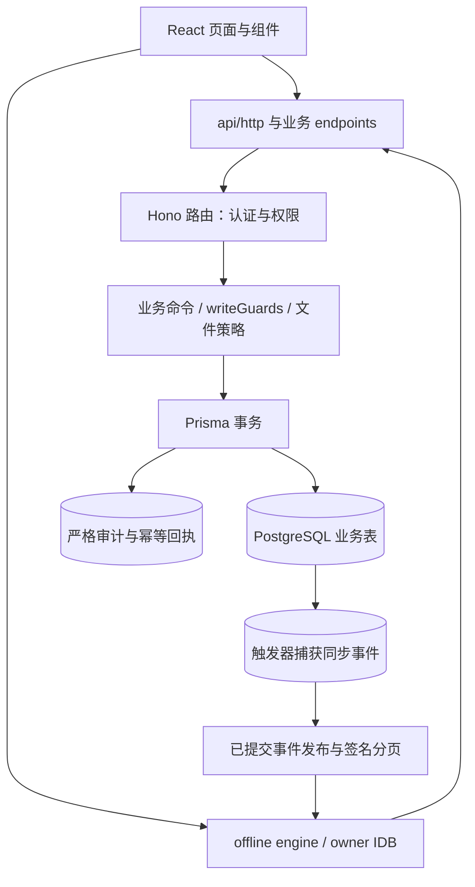
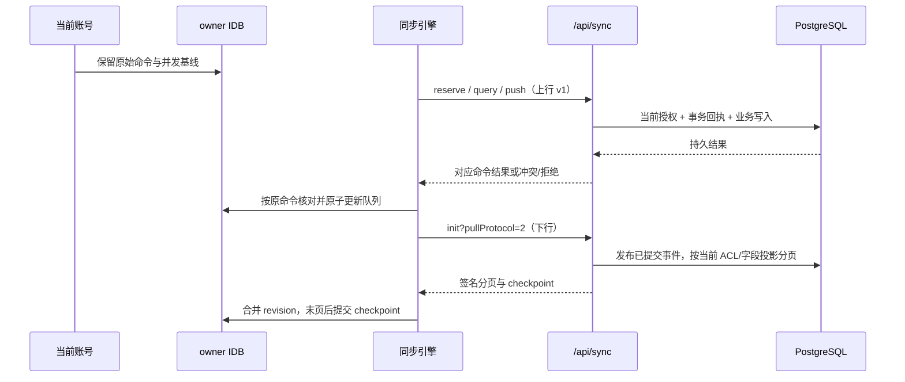
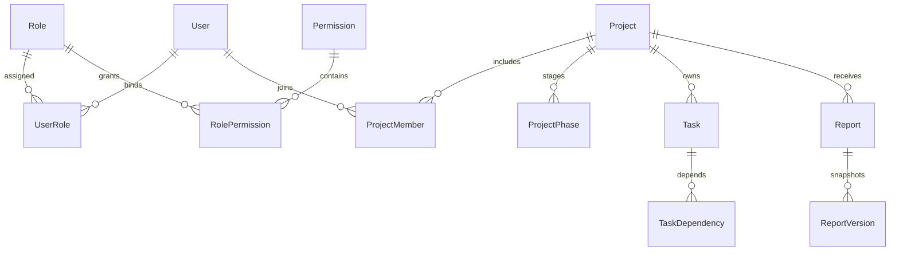

# RDPMS — 研发项目管理系统

R&D Project Management System，面向 IVD / 诊断试剂研发团队，覆盖项目、任务、进展汇报、注册申报、法规资料与实验知识管理。

> 文档更新：**2026-10-10**。源码核对基线：`f8bc5e4`（归档备份已提交）。
> 2026-10-10 实验室台账 v1.1（工作树、**尚未提交**）：8 份盘点表导入（2360 试剂物料 / 3272 批次 / 59 引物 / 8 靶标 / 79 设备）；
> 新增 `Equipment`、`StorageLocation` 模型与 `equipment.*`、`storage_locations.*` 权限（P0 90→96 条，P1 解冻 +`reagent_materials.import`）；
> 新增 `/api/equipment`、`/api/storage-locations`、`/api/detection-targets` 路由与前端实验台账三页面；详见 §1.1/§4.2/§5.3/§6.1。
> 本文描述当前仓库行为；服务器路径与部署形态依据入库运维记录，未在本轮连接服务器重验。
> 文档更新不代表测试重新通过、历史发现全部关闭或生产发布验收完成。当前文档入口见 [docs/README.md](docs/README.md)。

## 目录

1. [系统概述](#1-系统概述)
2. [技术栈总览](#2-技术栈总览)
3. [系统架构与关键数据流](#3-系统架构与关键数据流)
4. [数据库设计](#4-数据库设计)
5. [API 约定与路由索引](#5-api-约定与路由索引)
6. [前端模块与离线同步](#6-前端模块与离线同步)
7. [认证与权限](#7-认证与权限)
8. [部署架构](#8-部署架构)
9. [文件审计与恢复边界](#9-文件审计与恢复边界)
10. [当前待办与验证状态](#10-当前待办与验证状态)
11. [本地开发与验证](#11-本地开发与验证)
12. [运维检查与文档维护](#12-运维检查与文档维护)

## 1. 系统概述

### 1.1 业务范围

| 业务域 | 当前代码提供的能力 | 主要入口 |
|---|---|---|
| 项目与阶段 | 项目聚合创建、模板应用、成员、负责人转移、状态流转 | projects / phases / registrations |
| 任务 | 看板、指派、状态、前置依赖、子任务增量、法规引用 | tasks / task-templates |
| 研发汇报 | 日/周/月报、草稿、提交、审阅、驳回、版本快照 | reports / reportCommands |
| 月度进展 | 项目月份记录、完成度、计划与风险 | progress |
| 注册与法规 | 注册档案、阶段工作流、法规文件、导入来源 | registrations / regulatory-documents |
| 知识与模板 | 文档分类/版本、项目模板、任务模板 | docs / project-templates / task-templates |
| 实验资料 | 试剂原料、批次（含库位/规格/开封状态）、配方、配制、引物探针、检测靶标、样本 | reagent-materials / reagent-lots / formulas / prep / primers / detection-targets / samples |
| 设备与库位 | 设备/仪器台账、库位树（房间→柜/冰箱→层→盒） | equipment / storage-locations |
| 平台管理 | 账号、角色、文件、审计、系统日志、模块导出恢复 | users / roles / files / audit / backup |

路由存在不表示所有操作均有独立页面，也不表示均支持离线写入。
试剂聚合接口 `reagents` 与批次写入口 `reagent-lots` 分离；具体写能力以路由中的拒绝和授权逻辑为准。

### 1.2 身份与业务职责

系统身份为 `SUPER_ADMIN / ADMIN / MANAGER / MEMBER / VIEWER / AUDITOR`，不是旧的三个小写角色码。
业务权限来自角色绑定；项目内权限还取决于当前成员关系、负责人及 capability。
质量、注册等职责可通过权限与项目角色表达，不能仅由前端菜单或身份名称推断。

### 1.3 当前运行方式

- **服务端**：PostgreSQL-only，Hono 单实例，systemd 守护；当前发布采用原地更新。
- **浏览器**：React SPA，Bearer access token + JSON body refresh；不采用 cookie 会话。
- **离线**：指定同步实体在 IndexedDB 中保留镜像和待提交命令；恢复网络后按权限拉取与提交。
- **服务状态**：JWT 是自包含凭证，但账号版本、refresh、回执、恢复状态和同步水位均依赖数据库，不能称为完全无状态后端。

## 2. 技术栈总览

版本表取当前 lockfile 的解析值，不代表服务器实际安装版本；安装应遵循各端 package-lock.json。

| 层次 | 技术 | 锁定版本/方式 |
|---|---|---|
| 运行时 | Node.js | 项目运行与构建按 Node 20 系列准备；目标实际版本另行核对 |
| 后端 | Hono / @hono/node-server | Hono 4.12.12；Node HTTP 适配 |
| 数据访问 | Prisma / @prisma/client | 5.22.0 / 5.22.0；PostgreSQL |
| 后端语言 | JavaScript + TypeScript | TypeScript 5.9.3；NodeNext、allowJs=true、checkJs=false |
| 前端 | React / React Router | React 18.3.1；BrowserRouter |
| 前端构建 | Vite / TypeScript | 5.4.21 / 5.9.3；tsc -b + Vite |
| UI | Tailwind、Radix、Lucide、Recharts | 样式、组件原子、图标与图表 |
| 图与拖拽 | @xyflow/react、dagre、dnd-kit | 流程/阶段布局、任务看板 |
| 本地状态 | Zustand、原生 IndexedDB 封装 | UI 状态与业务离线存储分离，无 Dexie 依赖 |
| 网络与身份 | axios、jsonwebtoken、bcryptjs | 统一客户端、JWT、密码哈希 |
| 测试 | node:test、esbuild、fake-indexeddb、playwright-core | 后端测试、前端 TS 单测与独立浏览器脚本 |
| 运维 | systemd、Caddy、PostgreSQL 工具 | 运行模板及发布脚本见 §8 |

后端 `npm run typecheck` 检查当前 TS 编译项目；由于 `checkJs=false`，不能把通过结果当作全部旧 JS 已严格类型检查。
CORS 实际使用 `hono/cors`，不是因为 package.json 仍有 `cors` 依赖就使用 Express CORS 中间件。

## 3. 系统架构与关键数据流

### 3.1 分层与依赖


```mermaid
flowchart TD
  UI[React 页面与组件] --> HTTP[api/http 与业务 endpoints]
  UI --> OFF[offline engine / owner IDB]
  OFF --> HTTP
  HTTP --> AUTH[Hono 路由：认证与权限]
  AUTH --> CMD[业务命令 / writeGuards / 文件策略]
  CMD --> TX[Prisma 事务]
  TX --> DB[(PostgreSQL 业务表)]
  TX --> AUDIT[(严格审计与幂等回执)]
  DB --> EVENTS[(触发器捕获同步事件)]
  EVENTS --> PUB[已提交事件发布与签名分页]
  PUB --> OFF
```

| 层 | 源码 | 职责 |
|---|---|---|
| 装配 | `backend/src/bootstrap/createApp.js` | 挂载路由、CORS、依赖作用域、health/ready、错误处理；不监听端口 |
| 启动 | `backend/src/index.js` → `bootstrap/server.js` | 配置/密钥守卫、创建 Prisma Client、监听回环端口 |
| 请求平台 | `platform/requestContext.js`、`platform/db/client.js` | 请求级依赖与数据库访问，传播数据集上下文 |
| 授权 | `kernel/rbac.js`、`modules/access/writeGuards.ts` | 认证、权限装载、当前资源写入资格 |
| 业务命令 | `modules/projects/`、`modules/reports/`、`modules/sync/` | 聚合、报告原子操作、同步命令与读投影 |
| 横切保护 | `platform/idempotency/`、`platform/recovery/`、严格审计 | 回执、数据恢复围栏、关键写入追溯 |
| 前端基础 | `api/`、`auth/`、`offline/`、`shared/` | HTTP 会话、账号分区、恢复、内容/周期规则 |

当前是模块化单体；路由仍承担部分业务逻辑，并非所有写接口都已抽成独立命令。

### 3.2 在线写入

1. 客户端在请求发出时捕获会话，附带 Bearer 凭证。
2. 后端验证当前账号、securityVersion、datasetEpoch，并装载当前权限。
3. 入口根据权限、项目关系、资源状态和动作执行守卫。
4. 支持回执的命令在授权后进入幂等处理，将业务变更、关键审计与成功回执放在同一事务。
5. 同键同内容可按当前授权回放；同键异内容返回冲突。未采用该封装的接口不能自动继承上述保证。

**幂等回放不在认证之前执行**；不能按裸 key 回放他人或旧数据集的响应。

### 3.3 报告保存与提交

`reports` 路由和同步命令共享报告规则。草稿保存将可编辑状态与并发基线合并进条件 UPDATE；
提交在事务中保护报告行、生成 ReportVersion 并更新 currentVersion/状态。
POST 的新建与墓碑恢复分支分别使用 create 与受条件约束的恢复，不能用无条件 upsert 覆盖已经提交的正文。
冲突是客户端需要处理的结果，不能用重试覆盖新版本；legacy 输入支持不等于所有已部署客户端都通过兼容验证。

### 3.4 离线往返


```mermaid
sequenceDiagram
  participant U as 当前账号
  participant I as owner IDB
  participant E as 同步引擎
  participant S as /api/sync
  participant P as PostgreSQL
  U->>I: 保留原始命令与并发基线
  E->>S: reserve / query / push（上行 v1）
  S->>P: 当前授权 + 事务回执 + 业务写入
  P-->>S: 持久结果
  S-->>E: 对应命令结果或冲突/拒绝
  E->>I: 按原命令核对并原子更新队列
  E->>S: init?pullProtocol=2（下行）
  S->>P: 发布已提交事件，按当前 ACL/字段投影分页
  S-->>E: 签名分页与 checkpoint
  E->>I: 合并 revision，末页后提交 checkpoint
```

上行 `protocolVersion=1`、下行 `pullProtocol=2`、IndexedDB schema v4 是三个不同版本维度。

### 3.5 目录结构

```text
project-management/
├── README.md
├── docs/                         # 当前指南、合同、必要补正证据、清理索引
├── specs/                        # 设计材料；适用性以当前源码为准
├── start-dev.sh                  # 旧开发快捷脚本，有杀进程/db push 副作用，见 §11
└── rdpms-system/
    ├── backend/
    │   ├── prisma/               # schema、版本化迁移、seed
    │   ├── src/
    │   │   ├── bootstrap/        # 装配与启动分离
    │   │   ├── routes/           # HTTP 入口
    │   │   ├── kernel/           # 认证、常量、审计、恢复等
    │   │   ├── platform/         # db、配置、身份、幂等、恢复上下文、backup（归档加密/校验/保留/磁盘）
    │   │   └── modules/          # access/auth/projects/reports/sync/files
    │   ├── scripts/              # 运维 CLI：归档备份 / 离线校验 / 测试库生命周期
    │   └── tests/                # unit、contract、integration
    ├── frontend/
    │   ├── src/                  # App、pages、components、api、auth、offline、shared
    │   ├── scripts/              # 前端单测运行器
    │   └── tests/                # unit 与 browser
    └── deploy/
        ├── rdpms-api.service
        ├── systemd/              # rdpms-api.service 与 rdpms-backup.{service,timer} 模板
        └── scripts/              # 当前 start/deploy 与仍被测试引用的旧工具
```

## 4. 数据库设计

### 4.1 数据模型与关系

唯一模型真源为 [schema.prisma](rdpms-system/backend/prisma/schema.prisma)；当前 **54 个 Prisma model、14 个 SQL 迁移目录**。
Prisma model 数不是某次服务器盘点的实际表数，也不包括 `_prisma_migrations` 等平台表。


```mermaid
erDiagram
  User ||--o{ UserRole : binds
  Role ||--o{ UserRole : assigned
  Role ||--o{ RolePermission : grants
  Permission ||--o{ RolePermission : contains
  Project ||--o{ ProjectMember : includes
  User ||--o{ ProjectMember : joins
  Project ||--o{ ProjectPhase : stages
  Project ||--o{ Task : owns
  Project ||--o{ Report : receives
  Report ||--o{ ReportVersion : snapshots
  Task ||--o{ TaskDependency : depends
```

图为主要关系摘要，不列出所有外键、删除动作与恢复表；完整约束以 schema 和迁移 SQL 为准。

### 4.2 模型索引

以下由当前 schema 提取：字段列仅列身份、归属、状态、版本等关键标量；并非完整列定义。
“复合键”仅列 schema 的 @@id/@@unique，单字段唯一性与 SQL 手工约束仍需查看源文件。

| Prisma 模型 | 数据表 | 关键字段及类型 | 复合键 |
|---|---|---|---|
| `User` | `users` | `id: String`, `securityVersion: Int`, `systemRole: SystemRole`, `status: UserStatus` | 见 schema |
| `SyncDevice` | `sync_devices` | `datasetEpoch: String`, `id: String`, `userId: String` | 见 schema |
| `SyncMutation` | `sync_mutations` | `id: String`, `userId: String`, `entity: String`, `entityId: String`, `status: String` | 见 schema |
| `RefreshToken` | `refresh_tokens` | `datasetEpoch: String`, `id: String`, `userId: String` | 见 schema |
| `Role` | `roles` | `id: String` | 见 schema |
| `Permission` | `permissions` | `id: String` | 见 schema |
| `RolePermission` | `role_permissions` |  | `[roleId, permissionId]` |
| `UserRole` | `user_roles` | `userId: String` | `[userId, roleId]` |
| `Project` | `projects` | `id: String`, `status: ProjectStatus` | 见 schema |
| `ProjectMember` | `project_members` | `id: String`, `projectId: String`, `userId: String` | `[projectId, userId]` |
| `ProjectTemplate` | `project_templates` | `id: String`, `status: TemplateStatus` | 见 schema |
| `TemplateRole` | `template_roles` | `id: String` | `[templateId, code]` |
| `TemplatePhase` | `template_phases` | `id: String` | `[templateId, code]` |
| `TemplateTask` | `template_tasks` | `id: String` | `[templatePhaseId, sortOrder, title]` |
| `ProjectPhase` | `project_phases` | `id: String`, `projectId: String`, `status: PhaseStatus` | `[projectId, code]` |
| `PhaseTransition` | `phase_transitions` | `id: String` | `[fromPhaseId, toPhaseId]` |
| `Milestone` | `milestones` | `id: String`, `projectId: String`, `status: TaskStatus` | 见 schema |
| `Task` | `tasks` | `id: String`, `projectId: String`, `status: TaskStatus` | `[projectId, code]` |
| `TaskDependency` | `task_dependencies` | `id: String` | `[taskId, prerequisiteId]` |
| `TaskDocRef` | `task_doc_refs` |  | `[taskId, docDocumentId]` |
| `TaskTemplate` | `task_templates` | `id: String` | 见 schema |
| `TaskTemplateStep` | `task_template_steps` | `id: String` | `[templateId, sortOrder]` |
| `RegulatoryDocument` | `regulatory_documents` | `id: String`, `status: RegulatoryDocStatus` | 见 schema |
| `TaskRegulatoryDocument` | `task_regulatory_documents` |  | `[taskId, regulatoryDocumentId]` |
| `RegistrationProfile` | `registration_profiles` | `id: String`, `projectId: String` | 见 schema |
| `Report` | `reports` | `id: String`, `projectId: String`, `authorId: String`, `status: ReportStatus`, `currentVersion: Int` | `[projectId, authorId, reportType, periodKey]` |
| `ReportVersion` | `report_versions` | `id: String` | `[reportId, version]` |
| `MonthlyProgress` | `monthly_progress` | `id: String`, `projectId: String` | `[projectId, periodKey]` |
| `DocCategory` | `doc_categories` | `id: String`, `status: DocumentStatus` | 见 schema |
| `DocDocument` | `doc_documents` | `id: String`, `currentVersion: String`, `status: DocumentStatus` | 见 schema |
| `DocVersion` | `doc_versions` | `id: String` | `[documentId, version]` |
| `ReagentMaterial` | `reagent_materials` | `id: String`, `status: DocumentStatus`；v1.1：`externalCode`, `projectLabel` | 见 schema |
| `ReagentLot` | `reagent_lots` | `id: String`, `status: LotStatus`；v1.1：`locationId`, `spec`, `containerCount`, `openedStatus`, `form`, `notes` | `[materialId, lotNo]` |
| `StorageLocation` | `storage_locations` | `id: String`, `code: String`, `type: StorageLocationType`, `parentId: String?`, `path: String`, `depth: Int` | 见 schema |
| `Equipment` | `equipment` | `id: String`, `code: String`, `name: String`, `status: EquipmentStatus`, `scrapped: Boolean` | 见 schema |
| `ReagentFormula` | `reagent_formulas` | `id: String`, `status: FormulaStatus`, `projectId: String?` | 见 schema |
| `FormulaComponent` | `formula_components` | `id: String` | 见 schema |
| `PrepRecord` | `prep_records` | `id: String` | 见 schema |
| `DetectionTarget` | `detection_targets` | `id: String`, `status: DocumentStatus` | 见 schema |
| `Primer` | `primers` | `id: String`, `projectId: String?`, `status: DocumentStatus` | 见 schema |
| `SampleMaterial` | `sample_materials` | `id: String`, `projectId: String?`, `status: SampleStatus` | 见 schema |
| `FileObject` | `file_objects` | `id: String`, `scanStatus: FileScanStatus`, `accessScope: FileAccessScope` | 见 schema |
| `Attachment` | `attachments` | `id: String`, `entityId: String` | 见 schema |
| `AuditLog` | `audit_logs` | `id: String`, `action: String`, `entityId: String?` | 见 schema |
| `SystemLog` | `system_logs` | `id: String`, `action: String`, `userId: String?` | 见 schema |
| `EnumMeta` | `enum_meta` | `id: String` | `[enumName, code]` |
| `CodeSequence` | `code_sequences` | `id: String` | `[scope, periodKey]` |
| `SystemSetting` | `system_settings` | `key: String` | 见 schema |
| `MutationReceipt` | `mutation_receipts` | `datasetEpoch: String`, `id: String`, `status: MutationReceiptStatus` | `[actorId, command, resourceScope, idempotencyKey]` |
| `DataRecoveryState` | `data_recovery_state` | `id: Int`, `epoch: String`, `status: String` | 见 schema |
| `SyncPublicationState` | `sync_publication_state` | `epoch: String`, `head: BigInt`, `floor: BigInt`, `initialized: Boolean` | 见 schema |
| `SyncSourceRevision` | `sync_source_revisions` | `epoch: String`, `entity: String`, `entityId: String`, `revision: BigInt` | `[epoch,entity,entityId]` |
| `SyncChangeEvent` | `sync_change_events` | `id: String`, `epoch: String`, `entity: String`, `entityId: String`, `projectId: String`, `authorId: String?`, `revision: BigInt`, `action: String`, `publishedSequence: BigInt?` | `[epoch,publishedSequence]`；`[epoch,entity,entityId,revision]` |
| `BackupArchive` | `backup_archives` | `id: String`, `jobId: String`, `status: String`, `verifyStatus: String`, `dirPath: String`, `fileSize: BigInt`, `checksum: String?`, `snapshotMode: String`, `tableCounts: Json` | `[jobId]`（唯一） |

`backup_archives` 是归档备份产物的登记表，口径为**文件系统为准、DB 标记登记状态**：没有登记行的产物目录不会被保留策略删除；
`status='failed'` 的行只有失败留痕（`dirPath` 为空串、`fileSize=0`）。该表的行数按**快照时刻**统计，因此归档内容不含本次作业自己那一行。

### 4.3 数据一致性约束

- 表列映射主要采用 snake_case；普通业务 id 多为 String/TEXT，**epoch 与部分日志 id 明确使用 PostgreSQL UUID**，不能笼统规定手写迁移一律禁用 UUID。
- ProjectStatus、TaskStatus、TaskPriority、ReportType、ReportStatus 等已有 DB enum；部分其他领域状态仍为 String，须逐字段判断。
- 核心业务采用软删/退出标记；物理外键 Cascade 不代表业务 DELETE 可以绕过状态、权限、审计或保留规则。
- `audit_logs` append-only；不得为清理测试账号关闭触发器或删除审计行，合成账号可随明确自有整库销毁。
- `mutation_receipts` 的唯一作用域用于命令幂等；`sync_mutations` 另保留同步协议状态，二者不能混为一个缓存。
- 七类同步源表触发器捕获变更，源 revision 与 publication sequence 分工；日志只允许受约束地分配 publication sequence，不能称为完全不可 UPDATE。
- 恢复门禁覆盖迁移中登记的表；仅受控恢复 run 可在恢复状态写入，不能声称任何状态下一律拒绝所有写入。
- Prisma schema 之外还有函数、触发器与约束。`db push` 不能替代版本化迁移及自定义对象校验。

## 5. API 约定与路由索引

### 5.1 请求、授权与响应

- 默认 API base 为 `/api`，前端只从 `config/env.ts` 读取 `VITE_API_BASE_URL`。
- 公开入口包括登录、refresh，以及 health/ready；refresh 在 JSON body 提交 refresh token。其余业务路由按挂载中间件认证与授权。
- 一般使用 `Authorization: Bearer <accessToken>`；权限表只是动作门槛，还需资源作用域、当前状态、账号版本与 epoch 校验。
- **没有统一成功信封**：各路由返回对象、数组或 `{ list, total, ... }`；前端 endpoints/adapters 负责对应读取，不能统一按 `{ success, data }` 解包。
- 常见错误体为 `{ error, code }`；客户端会兼容其他历史形态。`400/401/403/404/409/503` 的具体 code 以路由为准。
- 分页、过滤、日期、幂等 key 和并发基线是端点合同，不存在一个对所有接口通用的默认值。
- 无访问资格时部分资源返回 404 隐藏存在性；不能把空列表、401 或 404 当作业务成功证明。

### 5.2 登录与刷新示例

```http
POST /api/auth/login
Content-Type: application/json

{ "username": "<合成或已授权账号>", "password": "<该账号口令>" }
```

成功响应主要字段如下（示意，不是可使用的凭据；省略个人资料字段）：

```json
{
  "accessToken": "<access JWT>",
  "refreshToken": "<opaque refresh token>",
  "expiresIn": 900,
  "token": "<access JWT compatibility alias>",
  "user": {
    "id": "<user id>",
    "username": "<username>",
    "name": "<display name>",
    "displayName": "<display name>",
    "systemRole": "MEMBER",
    "status": "ACTIVE",
    "mustChangePassword": false,
    "permissions": ["reports.view"]
  }
}
```

`expiresIn` 根据实际 token 剩余时间计算，900 是默认 TTL；refresh 返回新的 token 对，并消费旧 refresh。
强制改密账号需先完成 `PUT /api/auth/password/force`，不能用普通业务请求跳过。

### 5.3 路由清单

从 createApp 挂载和 routes 中的直接方法声明提取，共 **32 个模块、217 个声明端点**，另有根路径与健康就绪入口。
计数仅包含 get/post/put/patch/delete 等静态方法声明，不含 files 的 all 方法兜底、中间件及根健康入口。
此索引不解析运行时授权、不等于 OpenAPI schema，也不把中间件或测试注入身份当成完整认证证明。
每个条目的参数、权限、校验和状态码请沿对应源文件读取。

| 方法 | 公开/根入口 | 说明 |
|---|---|---|
| GET | `/` | 服务名称和版本 |
| GET | `/health`、`/api/health` | liveness |
| GET | `/api/ready` | 数据库和恢复状态检查 |

#### `/api/auth` — [auth.js](rdpms-system/backend/src/routes/auth.js)

| 方法 | 路径 |
|---|---|
| POST | `/api/auth/login` |
| POST | `/api/auth/refresh` |
| POST | `/api/auth/logout` |
| GET | `/api/auth/me` |
| POST | `/api/auth/verify` |
| GET | `/api/auth/profile` |
| PUT | `/api/auth/password` |
| PUT | `/api/auth/password/force` |

#### `/api/users` — [users.js](rdpms-system/backend/src/routes/users.js)

| 方法 | 路径 |
|---|---|
| GET | `/api/users` |
| GET | `/api/users/:id` |
| POST | `/api/users` |
| POST | `/api/users/batch` |
| PUT | `/api/users/:id` |
| PATCH | `/api/users/:id/status` |
| PUT | `/api/users/:id/roles` |
| PUT | `/api/users/:id/reset-password` |
| DELETE | `/api/users/:id` |

#### `/api/roles` — [roles.js](rdpms-system/backend/src/routes/roles.js)

| 方法 | 路径 |
|---|---|
| GET | `/api/roles/permission-catalog` |
| GET | `/api/roles` |
| POST | `/api/roles` |
| PATCH | `/api/roles/:id` |
| DELETE | `/api/roles/:id` |
| POST | `/api/roles/:id/permissions` |

#### `/api/projects` — [projects.js](rdpms-system/backend/src/routes/projects.js)

| 方法 | 路径 |
|---|---|
| GET | `/api/projects` |
| GET | `/api/projects/:id` |
| POST | `/api/projects` |
| PUT | `/api/projects/:id` |
| DELETE | `/api/projects/:id` |
| GET | `/api/projects/:id/members` |
| POST | `/api/projects/:id/members` |
| DELETE | `/api/projects/:id/members/:userId` |
| GET | `/api/projects/:id/tasks` |
| GET | `/api/projects/:id/reports` |
| GET | `/api/projects/:id/milestones` |
| GET | `/api/projects/:id/phases` |
| GET | `/api/projects/stats/types` |
| GET | `/api/projects/stats/status` |
| POST | `/api/projects/:id/apply-template` |
| POST | `/api/projects/batch-delete` |
| POST | `/api/projects/batch-update-status` |

#### `/api/phases` — [phases.js](rdpms-system/backend/src/routes/phases.js)

| 方法 | 路径 |
|---|---|
| GET | `/api/phases` |
| POST | `/api/phases` |
| GET | `/api/phases/:id` |
| PUT | `/api/phases/:id` |
| PATCH | `/api/phases/:id/status` |
| POST | `/api/phases/:id/transitions` |
| DELETE | `/api/phases/:id/transitions/:toPhaseId` |

#### `/api/tasks` — [tasks.js](rdpms-system/backend/src/routes/tasks.js)

| 方法 | 路径 |
|---|---|
| GET | `/api/tasks` |
| POST | `/api/tasks/:id/prerequisites` |
| DELETE | `/api/tasks/:id/prerequisites/:prerequisiteId` |
| GET | `/api/tasks/:id` |
| POST | `/api/tasks` |
| PUT | `/api/tasks/:id` |
| PATCH | `/api/tasks/:id/status` |
| DELETE | `/api/tasks/:id` |
| GET | `/api/tasks/board/:projectId` |
| POST | `/api/tasks/batch/status` |

#### `/api/reports` — [reports.js](rdpms-system/backend/src/routes/reports.js)

| 方法 | 路径 |
|---|---|
| GET | `/api/reports` |
| GET | `/api/reports/:id` |
| POST | `/api/reports` |
| PUT | `/api/reports/:id` |
| POST | `/api/reports/:id/submit` |
| POST | `/api/reports/:id/approve` |
| POST | `/api/reports/:id/reject` |
| GET | `/api/reports/:id/versions` |
| GET | `/api/reports/export/month/:month` |
| DELETE | `/api/reports/:id` |
| PATCH | `/api/reports/:id/recall` |

#### `/api/progress` — [progress.js](rdpms-system/backend/src/routes/progress.js)

| 方法 | 路径 |
|---|---|
| GET | `/api/progress/project/:projectId` |
| POST | `/api/progress/project/:projectId` |
| GET | `/api/progress/all/:periodKey` |
| GET | `/api/progress/export/:periodKey` |
| GET | `/api/progress` |

#### `/api/docs` — [docs.js](rdpms-system/backend/src/routes/docs.js)

| 方法 | 路径 |
|---|---|
| GET | `/api/docs/categories` |
| POST | `/api/docs/categories` |
| PUT | `/api/docs/categories/:id` |
| DELETE | `/api/docs/categories/:id` |
| GET | `/api/docs/documents` |
| GET | `/api/docs/documents/:id` |
| POST | `/api/docs/documents` |
| PUT | `/api/docs/documents/:id` |
| DELETE | `/api/docs/documents/:id` |
| GET | `/api/docs/documents/:id/versions` |
| GET | `/api/docs/search` |

#### `/api/samples` — [samples.js](rdpms-system/backend/src/routes/samples.js)

| 方法 | 路径 |
|---|---|
| GET | `/api/samples` |
| GET | `/api/samples/:id` |
| POST | `/api/samples` |
| PUT | `/api/samples/:id` |
| DELETE | `/api/samples/:id` |

#### `/api/primers` — [primers.js](rdpms-system/backend/src/routes/primers.js)

| 方法 | 路径 |
|---|---|
| GET | `/api/primers` |
| GET | `/api/primers/:id` |
| POST | `/api/primers` |
| PUT | `/api/primers/:id` |
| DELETE | `/api/primers/:id` |
| POST | `/api/primers/batch-import` |

#### `/api/reagents` — [reagents.js](rdpms-system/backend/src/routes/reagents.js)

| 方法 | 路径 |
|---|---|
| POST | `/api/reagents` |
| PUT | `/api/reagents/:id` |
| PATCH | `/api/reagents/:id` |
| DELETE | `/api/reagents/:id` |
| GET | `/api/reagents` |
| GET | `/api/reagents/:id` |
| GET | `/api/reagents/export` |
| POST | `/api/reagents/export` |

#### `/api/reagent-lots` — [reagent-lots.js](rdpms-system/backend/src/routes/reagent-lots.js)

| 方法 | 路径 |
|---|---|
| GET | `/api/reagent-lots` |
| POST | `/api/reagent-lots` |
| PATCH | `/api/reagent-lots/:id` |

#### `/api/reagent-materials` — [reagentMaterials.js](rdpms-system/backend/src/routes/reagentMaterials.js)

| 方法 | 路径 |
|---|---|
| GET | `/api/reagent-materials` |
| GET | `/api/reagent-materials/:id` |
| POST | `/api/reagent-materials` |
| PUT | `/api/reagent-materials/:id` |
| DELETE | `/api/reagent-materials/:id` |
| POST | `/api/reagent-materials/bulk-delete` |
| POST | `/api/reagent-materials/batch-import`（`reagent_materials.import`，2026-10-10 解冻，≤200/批，同名去重失败） |

#### `/api/equipment` — [equipment.js](rdpms-system/backend/src/routes/equipment.js)

设备/仪器台账（v1.1，2026-10-10；`equipment.view/create/update/delete`）。资产编码为业务编码，API 层字段名 `assetCode`（映射 `code` 列）。

| 方法 | 路径 |
|---|---|
| GET | `/api/equipment` |
| GET | `/api/equipment/:id` |
| POST | `/api/equipment` |
| POST | `/api/equipment/batch-import`（`equipment.create`，≤200/批） |
| PUT | `/api/equipment/:id` |
| DELETE | `/api/equipment/:id` |

#### `/api/storage-locations` — [storageLocations.js](rdpms-system/backend/src/routes/storageLocations.js)

库位树（v1.1；`storage_locations.view/manage`）。`code` 发号器生成（`LOC-0001`）；删除受子库位/批次引用保护。

| 方法 | 路径 |
|---|---|
| GET | `/api/storage-locations`（`?format=tree` 返回嵌套树） |
| GET | `/api/storage-locations/:id` |
| POST | `/api/storage-locations` |
| PUT | `/api/storage-locations/:id` |
| DELETE | `/api/storage-locations/:id` |

#### `/api/detection-targets` — [detectionTargets.js](rdpms-system/backend/src/routes/detectionTargets.js)

检测靶标（v1.1）。**不设独立权限码**（否决清单 `detection_targets.*` 通配），读写复用 primers 域权限（view/create/update/delete）；`code` 发号器生成（`TGT-001`）。

| 方法 | 路径 |
|---|---|
| GET | `/api/detection-targets` |
| GET | `/api/detection-targets/:id` |
| POST | `/api/detection-targets` |
| PUT | `/api/detection-targets/:id` |
| DELETE | `/api/detection-targets/:id` |

#### `/api/formulas` — [formulas.js](rdpms-system/backend/src/routes/formulas.js)

| 方法 | 路径 |
|---|---|
| GET | `/api/formulas` |
| GET | `/api/formulas/:id` |
| POST | `/api/formulas` |
| PUT | `/api/formulas/:id` |
| DELETE | `/api/formulas/:id` |
| POST | `/api/formulas/:id/duplicate` |

#### `/api/prep` — [prep-calculator.js](rdpms-system/backend/src/routes/prep-calculator.js)

| 方法 | 路径 |
|---|---|
| POST | `/api/prep/calculate` |
| POST | `/api/prep/records` |
| GET | `/api/prep/records` |
| GET | `/api/prep/records/:id` |

#### `/api/project-templates` — [projectTemplates.js](rdpms-system/backend/src/routes/projectTemplates.js)

| 方法 | 路径 |
|---|---|
| GET | `/api/project-templates` |
| GET | `/api/project-templates/:id` |
| POST | `/api/project-templates` |
| PUT | `/api/project-templates/:id` |
| PATCH | `/api/project-templates/:id` |
| DELETE | `/api/project-templates/:id` |
| POST | `/api/project-templates/:id/copy` |
| GET | `/api/project-templates/:id/preview` |
| POST | `/api/project-templates/:id/apply` |
| GET | `/api/project-templates/:templateId/roles` |
| POST | `/api/project-templates/:templateId/roles` |
| PUT | `/api/project-templates/:templateId/roles/:roleId` |
| DELETE | `/api/project-templates/:templateId/roles/:roleId` |
| POST | `/api/project-templates/:templateId/roles/batch` |

#### `/api/task-templates` — [taskTemplates.js](rdpms-system/backend/src/routes/taskTemplates.js)

| 方法 | 路径 |
|---|---|
| GET | `/api/task-templates` |
| GET | `/api/task-templates/:id` |
| POST | `/api/task-templates` |
| PUT | `/api/task-templates/:id` |
| DELETE | `/api/task-templates/:id` |
| POST | `/api/task-templates/bulk-delete` |
| POST | `/api/task-templates/seed` |

#### `/api/registrations` — [registrations.js](rdpms-system/backend/src/routes/registrations.js)

| 方法 | 路径 |
|---|---|
| GET | `/api/registrations` |
| GET | `/api/registrations/stats` |
| GET | `/api/registrations/templates` |
| GET | `/api/registrations/:id` |
| POST | `/api/registrations` |
| PUT | `/api/registrations/:id` |
| PATCH | `/api/registrations/:id/stage` |
| PATCH | `/api/registrations/:id/profile` |

#### `/api/regulatory-documents` — [regulatory-documents.js](rdpms-system/backend/src/routes/regulatory-documents.js)

| 方法 | 路径 |
|---|---|
| GET | `/api/regulatory-documents` |
| GET | `/api/regulatory-documents/:id` |
| POST | `/api/regulatory-documents` |
| PUT | `/api/regulatory-documents/:id` |
| DELETE | `/api/regulatory-documents/:id` |
| POST | `/api/regulatory-documents/import` |
| POST | `/api/regulatory-documents/seed` |
| POST | `/api/regulatory-documents/:id/original-file` |
| GET | `/api/regulatory-documents/:id/original-file` |

#### `/api` — [audit.js](rdpms-system/backend/src/routes/audit.js)

| 方法 | 路径 |
|---|---|
| GET | `/api/audit-logs` |
| POST | `/api/audit-logs/export` |
| GET | `/api/audit/entity/:type/:id/summary` |

#### `/api` — [system-logs.js](rdpms-system/backend/src/routes/system-logs.js)

| 方法 | 路径 |
|---|---|
| GET | `/api/system-logs` |

#### `/api/settings` — [settings.js](rdpms-system/backend/src/routes/settings.js)

| 方法 | 路径 |
|---|---|
| GET | `/api/settings` |
| PATCH | `/api/settings` |

#### `/api/dict` — [dict.js](rdpms-system/backend/src/routes/dict.js)

| 方法 | 路径 |
|---|---|
| GET | `/api/dict` |
| GET | `/api/dict/:enumName` |

#### `/api/files` — [files.js](rdpms-system/backend/src/routes/files.js)

| 方法 | 路径 |
|---|---|
| GET | `/api/files` |
| POST | `/api/files` |
| GET | `/api/files/:id/metadata` |
| GET | `/api/files/:id/download` |
| GET | `/api/files/:id` |
| PATCH | `/api/files/:id/scope` |
| DELETE | `/api/files/:id` |
| POST | `/api/files/:id/restore` |

#### `/api/stats` — [stats.js](rdpms-system/backend/src/routes/stats.js)

| 方法 | 路径 |
|---|---|
| GET | `/api/stats/dashboard` |
| GET | `/api/stats/projects` |
| GET | `/api/stats/users/:userId/workload` |
| GET | `/api/stats/reports` |

#### `/api/backup` — [backup.js](rdpms-system/backend/src/routes/backup.js)

| 方法 | 路径 |
|---|---|
| GET | `/api/backup/export` |
| GET | `/api/backup/restore/tables` |
| POST | `/api/backup/restore/preview` |
| POST | `/api/backup/restore` |
| GET | `/api/backup/restore/status` |
| POST | `/api/backup/restore/reconcile` |

#### `/api/backup/archives`、`/api/backup/storage` — [backupArchives.js](rdpms-system/backend/src/routes/backupArchives.js)

与 `/api/backup` 共用前缀、路径不重叠；全部仅 SUPER_ADMIN（`data.export`），运行/校验/下载/删除均写审计。

| 方法 | 路径 | 说明 |
|---|---|---|
| GET | `/api/backup/archives` | 归档历史（分页 + 状态筛选，附产物是否仍在磁盘） |
| POST | `/api/backup/archives/run` | 立即生成一份归档（阻塞至完成；并发返回 409） |
| POST | `/api/backup/archives/retention` | 保留策略，默认 `dryRun=true` |
| GET | `/api/backup/archives/:id` | 详情（meta 隐去 `dekCipher`） |
| GET | `/api/backup/archives/:id/download` | 下载产物，`format=aes\|meta` |
| POST | `/api/backup/archives/:id/verify` | 离线校验（7 项） |
| DELETE | `/api/backup/archives/:id` | 删除记录与产物 |
| GET | `/api/backup/storage` | 磁盘水位 + 归档占用（按天）+ 其它备份目录 + 未登记目录 |

#### `/api/sync` — [sync.js](rdpms-system/backend/src/routes/sync.js)

| 方法 | 路径 |
|---|---|
| GET | `/api/sync/init` |
| POST | `/api/sync/receipts/reserve` |
| POST | `/api/sync/receipts/query` |
| POST | `/api/sync/push` |
| POST | `/api/sync/device` |
| GET | `/api/sync/status` |

## 6. 前端模块与离线同步

### 6.1 路由结构（`src/App.tsx`）

两层守卫：

- **`AuthGuard`**：未登录（或会话失效）时重定向 `/login`；
- **`RoleGuard perm={PERMS.XXX}`**：按权限位控制访问，无权限默认跳转 `/403`，或呈现指定 fallback；
- AuthGuard 在 bootstrap 期间等待身份确认；强制改密账号转向 `/change-password`；
- HTTP 层只在匹配条件时有界刷新，不因任意 401 清除后来登录的会话。

| 路径 | 组件 | 守卫 |
|------|------|------|
| `/login` | `Login` | 公开 |
| `/`（index） | `Dashboard` | AuthGuard |
| `projects`、`projects/new` | `Projects` | AuthGuard |
| `projects/:id` | `ProjectDetail` | AuthGuard |
| `registrations`、`registrations/:id` | `RegistrationProjects` / `RegistrationProjectDetail` | `REGISTRATIONS_VIEW` |
| `regulatory-documents` | → `/knowledge?module=regulatory` | 旧链接兼容重定向 |
| `project-templates`、`project-templates/:id/edit` | `TemplateLibrary` / `TemplateEditor` | AuthGuard |
| `task-templates` | `TaskTemplateLibrary` | AuthGuard |
| `reports` | `Reports` | `REPORTS_VIEW` |
| `reports/:id`、`reports/:id/review` | `ReportEdit` / `ReportReview` | AuthGuard |
| `knowledge`、`knowledge/:id`、`docs` | `Docs` / `KnowledgeDetail` | AuthGuard |
| `reagent-formula`、`/new`、`/:id/edit`、`/calculator` | `FormulaList` / `FormulaEditor` / `PrepCalculator` | AuthGuard |
| `inventory` | `Inventory`（实验台账：批次/库存，v1.1） | `REAGENTS_VIEW` |
| `equipment` | `Equipment`（设备台账，v1.1） | `EQUIPMENT_VIEW` |
| `storage-locations` | `StorageLocations`（库位树，v1.1） | `STORAGE_LOCATIONS_VIEW` |
| `tasks` | `Tasks` | AuthGuard |
| `backup` | `BackupManager`（三页签：导出与恢复 / 归档备份 / 存储用量） | `DATA_EXPORT` |
| `users` | `Users` | `USERS_VIEW` |
| `audit-logs` | `AuditLogs` | `AUDIT_VIEW` |
| `system-logs` | `SystemLogs` | `SYSTEM_LOGS_VIEW` |
| `roles` | `Roles` | `ROLES_VIEW` |
| `settings` | `Settings` | `SETTINGS_VIEW` |
| `change-password` | `ChangePassword` | AuthGuard |
| `403` | `Forbidden` | AuthGuard |
| `*` | `NotFound` | AuthGuard |

### 6.2 页面、组件与会话

`App.tsx` 装配 AuthProvider / SyncProvider，AuthGuard 确认会话，RoleGuard 处理声明的页面权限；
页面显示权限不是后端授权的替代。`Layout` 承载导航，业务页面按项目、报告、注册、知识和实验资料组织。
部分库页面嵌入知识模块，并非每个 pages/ 文件都有独立路由。

| 模块 | 责任 |
|---|---|
| `api/http.ts` | 请求时捕获会话；同一登录代际协调 refresh；拒绝把迟到响应写入新账号会话 |
| `auth/tokenStore.ts` | actorId、loginGeneration、tokenRevision、access/refresh；使用 Web Locks 时协调标签页 |
| `offline/idb.ts` | schema v4、owner 分区、事务内当前会话与活动 owner 围栏 |
| `offline/engine.ts` | 调度、读投影、分页、回执恢复、冲突/拒绝及 epoch 变化 |
| `offline/RecoveryPanel.tsx` | 当前账号可验证原文的查看、导出、重试、冲突处理与显式放弃 |
| `shared/reportContent.ts` | 历史内容兼容与读取失败保全，不能将解析失败当空内容回写 |
| `shared/projectEditCommand.ts` | 项目编辑命令 DTO 组织 |

跨标签协调依赖浏览器能力；不满足安全共享条件时 tokenStore 可退回进程内 memory 模式，不能宣称所有浏览器均有持久共享会话。
401 只有符合客户端识别条件时才尝试有界 refresh，不能概括为“所有 401 自动刷新”。403 不由 HTTP 层自动跳转。

### 6.3 七实体下行与水位

同步实体为 `projects / projectPhases / tasks / milestones / monthlyProgress / reports / projectMembers`。
读取先执行实体读权限、当前项目 ACL、字段投影；reports 还有 own-only 约束，不能把普通 API 返回集合直接等同于同步集合。

v2 init 先调用 publisher：事务内 upsert 当前 epoch 的 publication state，必要时锁源表捕获初始快照，
再发布已提交事件。**首次拉取不依赖业务写入来创建水位行**。
分页绑定 actor/device/epoch/aclVersion 与固定上界，checkpoint 在一轮完成后推进；旧 revision 不得覆盖已应用的新 revision。
遗留时间戳协议仍有兼容路径，但不具有 v2 的完整合同，旧客户端矩阵仍待补齐。
初始化存在批量捕获与锁成本；当前代码发布批量上限为 10,000，不能推断任意规模无阻塞。

### 6.4 上行与恢复

- 原始 payload、幂等 key、基线和 actor 必须保留；回执 reserve/query/push 绑定命令作用域。
- 超时或响应不确定时先核对回执，不得自动生成新 key 重做一次业务写入。
- 冲突、拒绝和未知结果进入相应保全/恢复路径；入队不等于服务器已接受。
- 登出使旧 owner 失效，不等于删除所有分区。重新登录同一用户可以在当前授权下恢复其保留内容。
- 旧库迁入 legacyQuarantine；缺可靠账号归属的内容不能按当前账号自动认领、导出或删除。
- dataset epoch 改变后不得直接把旧命令当作新数据集命令提交。UI 应明确保留原文与重新核对。
- 浏览器本地存储仍可能被用户清理或受设备损坏影响，不是云端备份。

## 7. 认证与权限

### 7.1 会话生命周期

access JWT 包含 `userId / systemRole / securityVersion / datasetEpoch`，默认 900 秒。
`JWT_ACCESS_TTL` 优先于 `JWT_ACCESS_TTL_SEC`；refresh 默认 7 天，可配置 `JWT_REFRESH_TTL`。
服务端保存 refresh 的 tokenHash、family 与消费状态；refresh 重复使用返回 `REFRESH_TOKEN_REPLAYED`，不把普通竞争自动认定为盗用并撤销赢家。

认证每次读取当前账号与数据集状态，权限不是相信 token 中的旧角色快照：

| 条件 | 常见结果 |
|---|---|
| access 签名/期限无效 | `INVALID_TOKEN` |
| 旧 token 缺有效 securityVersion | `SESSION_VERSION_REQUIRED` |
| securityVersion 不匹配 | `SESSION_REVOKED` |
| datasetEpoch 缺失/不匹配 | `DATASET_EPOCH_REQUIRED` / `DATASET_EPOCH_CHANGED` |
| 账号停用/删除 | `SESSION_INVALID` |
| 尚需强制改密 | 按限制路径处理，普通业务不可跳过 |

新客户端不自动采用旧双键 token，会话升级需重新登录；原始离线内容仍应保全。

### 7.2 当前授权链

```text
请求作用域 / CORS
  → authMiddleware：JWT + 当前账号 + securityVersion + datasetEpoch
  → 当前权限：UserRole → RolePermission → Permission
  → 资源/项目 capability / 状态守卫
  → 对应业务命令（适用时：幂等 + 事务 + 关键审计）
```

SUPER_ADMIN 从 P0_PERMISSIONS 与 P1_UNFROZEN 获取权限集，不是任意未来权限码都自动放行。
`modules/auth/accountPolicy.ts` 对账号命令采用当前 actor/target 锁定与等级保护；
普通管理入口不能授予同级/更高级身份，不能绕过目标保护或强制改密。
角色定义创建与自定义角色绑定扩展是不同能力，不能因创建入口存在就宣布所有绑定策略已启用。

顶层管理账号唯一：`admin`（系统角色 SUPER_ADMIN，由 `prisma/seed.js` 对齐）。原 `superadmin` 账号已按用户裁定硬删除
（2026-10-10），因此「再造一个超管」只能改 seed 或数据库 —— 应用层没有通道（同级授予与同级账号管理都被拒）。

### 7.3 登录、密码与边界

错误密码达到阈值触发临时锁定（当前 5 次、15 分钟）；待激活账号的锁期限同样约束登录，不能自动激活。
临时到期恢复与手工锁、停用分开处理；并发凭据/账号变化需重新核对。
当前账号创建、改密和重置入口要求口令至少 12 位；种子口令必须外置，不提供默认生产口令。
密码使用 bcrypt；不同历史入口/记录可能采用不同 cost，不能笼统标成 cost 10。
当前没有统一全局限流，也不能仅凭密码哈希或前端守卫宣称已防护所有攻击。

## 8. 部署架构

> **原地部署**（2026-10-08 起）：代码目录 `/opt/rdpms/app` **同时是运行目录与开发目录**，
> 没有 `releases/<ts>` 快照与 `current` 软链。发布即原地更新，见 §8.3。

### 8.1 部署形态与目录

`/opt/rdpms`、`/srv/rdpms` 均为 `/mnt/datadisk0/rdpms` 的软链，部署根内容：

```
/mnt/datadisk0/rdpms/
├── app/                    # 代码（git 仓库，main 分支）= 运行目录 = 开发目录
├── backups/                # 数据库与 uploads 备份（rdpms 属主）
├── logs/                   # 服务日志（systemd append 目标）
├── uploads/                # 用户上传（服务读写）
├── .env                    # 生产配置（root:rdpms 640）
└── .codebuddy/  .vscode/   # 工具配置
```

**为什么这样**：单实例 + 单人开发场景下，多版本快照带来的回滚能力不足以抵消它的复杂度
（目录累积、残留进程、manifest 校验链）。**代价是失去秒级回滚**，见 §8.4。

以下为仓库服务模板与入库服务器记录的约定，实际安装副本需另外核对。

- **进程隔离**：后端以专用系统用户 `rdpms` 运行；`systemd` 设 `MemoryMax=1024M`、`Restart=always`。
- **数据库隔离**：专用 PostgreSQL 角色 + 独立库 `rdpms`，仅本机 127.0.0.1 可达。
- **端口隔离**：对外仅 443（Caddy）；后端 3000 仅监听本机。
- **属主**：`app/` 归 `ubuntu`（开发与构建身份），服务以 `rdpms` 身份**只读**运行代码与产物；
  发布脚本以 ubuntu 执行，内部通过 `sudo` 重启服务。

### 8.2 环境变量（`/srv/rdpms/.env`）

后端配置集中在 `/srv/rdpms/.env`（`root:rdpms` 640，经 systemd `EnvironmentFile` 注入）。

| 变量 | 必填 | 说明 |
|------|:----:|------|
| `DATABASE_URL` | ✅ | PostgreSQL 连接串（可带 `?schema=public`） |
| `DIRECT_URL` | ✅ | Prisma 直连串（迁移用；与 `DATABASE_URL` 同库同主机） |
| `JWT_SECRET` | ✅ | ≥32 字符且不命中弱口令黑名单，否则生产拒绝启动 |
| `ALLOWED_ORIGINS` | ✅（生产） | CORS 白名单，逗号分隔 |
| `CORS_ORIGINS` | — | 旧别名；与 `ALLOWED_ORIGINS` 同设时必须完全一致 |
| `UPLOAD_DIR` | ✅（生产） | 上传根目录，须为绝对路径且不在代码目录内 |
| `NODE_ENV` / `HOST` / `PORT` | — | 生产下 `HOST` 必须为回环地址 |
| `STORAGE_DRIVER` | — | 仅支持 `local` |
| `TRUST_PROXY_HOPS` | — | 仅支持 `1`（当前未实现代理信任策略，该值仅作兼容） |
| `ENABLE_BACKUP_EXPORT` | — | 仅容忍 `false`；导出权限由审计过的 SUPER_ADMIN 权限控制，不由该变量控制 |
| `MAX_UPLOAD_MB` / `SEED_*` | — | 上传展示预算 / 种子账号与口令。顶层账号唯一：`admin` = SUPER_ADMIN（`SEED_ADMIN_USERNAME/PASSWORD`）；`SEED_SUPER_ADMIN_USERNAME/_PASSWORD` 自 2026-10-10 起不再使用（留着不报错） |
| `BACKUP_MASTER_KEY` | 归档用 | base64 的 32 字节主密钥（`openssl rand -base64 32`）；**缺失时归档功能 fail-closed，绝不明文备份** |
| `BACKUP_ARCHIVE_DIR` | 归档用 | 归档根目录（生产必须为绝对路径且不在代码目录内），如 `/srv/rdpms/backups/archive` |
| `BACKUP_KEEP_DAYS` / `BACKUP_KEEP_COUNT` | — | 保留策略：天数（默认 30）与份数（默认 60）；`0` 表示该维度不限制；永远保留最新一份 |
| `BACKUP_WARN_PCT` / `BACKUP_MIN_FREE_MB` | — | 磁盘门禁：占用告警线（默认 90%）与最小可用空间（默认 1024 MB，不足直接拒绝备份） |
| `BACKUP_PG_DUMP_DSN` / `PG_DUMP_BIN` / `PG_RESTORE_BIN` | — | 归档作业的连接串与 pg 工具兜底；默认用 `DATABASE_URL` 与应用角色（需表与序列的 SELECT 权限，见 §12.2） |
| `BACKUP_DUMP_TIMEOUT_MS` | — | 单份 dump 超时（默认 30 分钟），同时决定快照事务的生命周期 |

> 归档相关变量由 `src/platform/backup/*` 自行读取，**不在** `configSchema.ts` 的启动校验内；未配置主密钥时应用照常启动，
> 但归档入口会以 `BACKUP_KMS_NOT_CONFIGURED`（HTTP 503）明确拒绝，而不是静默降级。

> 以上由 `src/platform/config/configSchema.ts` 在启动时校验，**不合规直接拒绝启动**（fail fast）。

**前端（构建期）**：`VITE_API_BASE_URL`（默认 `/api`，同域反代时无需修改）。

### 8.3 服务与发布

**systemd 单元** `/etc/systemd/system/rdpms-api.service`（模板见仓库 `rdpms-system/deploy/rdpms-api.service`）：

```ini
[Unit]
Description=RDPMS API (Hono + Prisma + PostgreSQL)
After=network-online.target postgresql.service
Wants=network-online.target
RequiresMountsFor=/mnt/datadisk0
StartLimitIntervalSec=300

[Service]
Type=simple
User=rdpms
Group=rdpms
WorkingDirectory=/opt/rdpms/app/rdpms-system/backend
EnvironmentFile=/srv/rdpms/.env
ExecStart=/usr/local/bin/rdpms-start.sh
MemoryMax=1024M
Restart=always
RestartSec=5
StandardOutput=append:/mnt/datadisk0/rdpms/logs/app.out.log
StandardError=append:/mnt/datadisk0/rdpms/logs/app.err.log
# 其余加固项见单元模板：NoNewPrivileges / ProtectSystem / ReadWritePaths 等
```

- `RequiresMountsFor=/mnt/datadisk0`：数据盘未就绪时不启动（否则代码目录断链、日志也无处可写）。
- `ExecStart` 指向启动包装 `/usr/local/bin/rdpms-start.sh`：**校验 `dist/index.js` 存在后 exec**，
  缺失即失败退出。不做 src 回退 —— `src/` 下是 TypeScript，node 无法直接执行，
  回退只会把"构建没跑"这种部署事故变成更难排查的启动错误。

**发布（一条命令）**：

```bash
cd /opt/rdpms/app
bash rdpms-system/deploy/scripts/rdpms-deploy.sh          # 默认 main 分支
```

```bash
cd /opt/rdpms/app
bash rdpms-system/deploy/scripts/rdpms-deploy.sh                  # 发布 origin/main 最新
bash rdpms-system/deploy/scripts/rdpms-deploy.sh --commit <sha>   # 部署指定提交（回退，见 §8.4）
```

九步：取码（`fetch` + `ff-only`）→ **按需** `npm ci`（lockfile 变化**或** `node_modules` 缺失时，
避免每次发布都等一轮网络安装）→ **发布前备份**（`rdpms-backup.sh predeploy`，失败即中止）→
`prisma generate` → 前后端构建 → `migrate deploy` → 重启 + active 校验 + **HTTP health 检查**。

**顺序说明**：迁移放在构建**之后** —— 构建失败时不触碰数据库，可直接排查后重试；
若先迁移再构建，一旦构建失败就会留下「已前滚的数据库 + 旧代码」这种最难处理的状态。

**实测**（2026-10-09，本机）：正向发布约 **54 秒**（依赖无变化时）；
`--commit` 路径同样实测通过（约 53 秒，health 返回 200）。两者均含备份与健康检查。

**脚本边界**：不停写、不运行测试、不校验 `/api/ready` 或实际 UI；不会自动安装改动后的
启动包装与 systemd 单元（安装命令见本节末尾）。构建或迁移失败不会自动回滚已改动的内容；
迁移本身是前滚的（见 §8.4）。

**启动脚本与单元的安装**：

```bash
cd /opt/rdpms/app
sudo cp rdpms-system/deploy/scripts/rdpms-start.sh /usr/local/bin/rdpms-start.sh
sudo chown root:rdpms /usr/local/bin/rdpms-start.sh && sudo chmod 750 /usr/local/bin/rdpms-start.sh
sudo cp rdpms-system/deploy/rdpms-api.service /etc/systemd/system/rdpms-api.service
sudo systemctl daemon-reload
```

### 8.4 回退与失败处理

**回退代码** —— 脚本支持指定提交（2026-10-09 起，已实测）：

```bash
cd /opt/rdpms/app
bash rdpms-system/deploy/scripts/rdpms-deploy.sh --commit <旧提交>
```

`--commit` 会**跳过取码**、直接检出该提交后走完整流程（备份 → 构建 → 迁移 → 重启 → 健康检查），
因此不会被 `origin/main` 覆盖。执行后仓库处于 detached HEAD（回退时的正常状态）；
恢复正常跟踪：`git checkout main`。

> ⚠ **不要**用「先 `git checkout <旧提交>`、再运行不带参数的 `rdpms-deploy.sh`」来回退 ——
> 不带参数时脚本第一步就是 `fetch + merge origin/main`，会把刚检出的旧提交快进回最新，
> 等于把回退撤销掉。回退必须走 `--commit`。

**数据库不可回退**：迁移是前滚的，回退代码不会回退数据库结构。新增列/表/触发器**不自动证明**
旧应用兼容；涉及数据语义、`securityVersion`、数据集 epoch 与权限的迁移必须逐项核对后再决定是否回退。

**失败处理**：迁移之前的中止（取码 / 依赖 / 备份 / 构建）不会改动数据库，排查后重跑即可；
迁移已执行后失败，先确认目标提交的旧代码能否在新库结构上运行，再决定前滚修复还是按上述方式回退。

### 8.5 反向代理（Caddy）

站点片段 `/etc/caddy/sites/rdpms.caddy`：

```caddyfile
rdpms.digifluidic.com {
    tls <邮箱>
    encode gzip

    header {
        Strict-Transport-Security "max-age=31536000; includeSubDomains"
        X-Content-Type-Options "nosniff"
        Referrer-Policy "no-referrer"
        X-Frame-Options "SAMEORIGIN"
        -Server
    }

    handle /api/* {
        reverse_proxy 127.0.0.1:3000
    }

    handle {
        root * /opt/rdpms/app/rdpms-system/frontend/dist
        try_files {path} /index.html
        file_server
    }
}
```

改配置后：`sudo caddy validate --config /etc/caddy/Caddyfile && sudo systemctl reload caddy`。

---

## 9. 文件审计与恢复边界

### 9.1 文件访问

FileObject 明确区分 `PRIVATE_STAGING / PROJECT / SHARED_LIBRARY / PUBLIC`，
按 owner、项目资格或声明的共享读权限判断；关联到附件不自动产生访问资格。
list、metadata、download、delete 和 import-source 应经过各自动作的统一策略。
历史归属不明不能自动公开，分类仍需实际数据清单和负责人确认。

**字节读取另外要求 scanStatus=CLEAN**；INFECTED 及非 CLEAN 状态均拒绝，超管不绕过。
策略存在不代表已有可用扫描服务，实际上传/扫描配置及历史文件状态需要目标环境核对。
`isPublic` 也不意味着整个 files 路由不需认证；以路由和动作策略为准。

### 9.2 审计与回执

关键命令采用严格审计并与业务同事务，普通操作也有非严格日志路径；不能把所有日志都描述为提交前置条件。
审计表 append-only，包含 actor/action/entity 等追溯信息；成功回执只证明对应事务结果，不等于实际 UI 已更新。
当前未声明日志加密、无限期保留或异地备份保证。

### 9.3 模块恢复与整库恢复

`/api/backup` 的 JSON 导出/校验/应用覆盖选定模块，恢复注册表显式定义顺序和字段。
恢复 apply 后进入 `RESTORE_NEEDS_RECONCILIATION`，由对应恢复资格核对后回到 READY；
新 epoch 防止旧 token、设备与回执误用于新数据集。
模块恢复 manifest 为 `MODULE_JSON_METADATA_ONLY`，**不包含二进制文件完整恢复证明**。

运维 pg_dump/pg_restore + uploads 是另一种恢复范围。需要共同恢复点、文件关联、凭据/账号安全下限和 epoch 核对。
仓库内旧配对恢复工具的自有演练，不能替代当前服务器外置备份脚本的恢复验收。

**归档备份**（`backup_archives` + `/api/backup/archives`，仓库内实现）是第三种范围：整库 `pg_dump -Fc -Z6` → AES-256-GCM 加密落盘 →
单事务登记，可离线校验、下载与按策略清理；**应用内不做整库覆盖恢复**，恢复仍是运维 `pg_restore`（解密走 `backup-verify.mjs --decrypt-to`）。
边界要一起读：dump 只含数据库逻辑内容，**不含 uploads 二进制**（与 `/usr/local/bin/rdpms-backup.sh` 的 uploads 快照互补）；
`backup_archives` 自身行数按快照时刻统计；`_prisma_migrations` 不计入表清单对账。

## 10. 当前待办与验证状态

本 README 不汇总历次测试为一个“全部通过”。当前部署相关跟踪见 [open-items.md](docs/review/codebuddy/deepseek/open-items.md)。

| 项目 | 当前已知事实 | 下一步 |
|---|---|---|
| 前端正式单测 | 正式文件仍调用旧无 owner IDB API；服务器补丁报告 60/64，但尚未合入正式文件 | 审阅 patch、对齐 owner/session 与协议夹具，保留竞争断言后全套复验 |
| 四项候选失败 | A03-E4 未定性，其余时序原因是执行者定位，不是本轮复现结论 | 用确定性屏障确认失败原因，不顺带放宽业务规则 |
| v2 首拉 | 源码有懒初始化，撤回“缺 publication state 必然报错”判断 | 在新建自有库验证首次 API、批量与锁等待 |
| legacy 客户端 | 缺受支持部署版本/producer/revision/旧队列矩阵 | 提供真实客户端矩阵，不能据合成用例关闭兼容性项 |
| IDB 升级与恢复 UI | schema v4 / quarantine / RecoveryPanel 已实现 | 补可见 UI 与原文留存验收，截图文件名不是证明 |
| 历史文件分类 | 策略已实现，实际历史归属未因策略自动补齐 | 数据所有者提供最小只读清单并核对修复映射 |
| 原地发布 | 无自动备份/停写/测试/HTTP ready 检查，无专用回退模式 | 补运行控制与失败处置；不把 active 当业务正常 |
| 依赖安装 | 仅 lockfile 差异触发；缺依赖、安装失败重试可能被跳过 | 专项核对安装状态与重试合同 |
| 旧部署工具 | 退出生产入口但仍被专项集成测试调用 | 分清测试范围，不能直接当死代码删除 |
| 外置备份与日志 | 服务器脚本未入库；systemd 模板为 append 日志 | 核对恢复、加密/异地与轮转，避免据旧文档推定已实现 |
| 归档备份上线 | **已完成（2026-10-10）**：`.env` 两项 + 归档目录 + `rdpms-backup.timer` 均已就位；首次生产归档经单元触发成功 | — |
| 归档备份验收 | 隔离库演练通过；生产产物离线校验 **7/7 通过**、篡改 1 字节即被「解密」检查拦下 | 仍待：生产恢复演练（解密 → `pg_restore` → 按 meta.tableCounts 逐表比对）；smoke / perm-matrix 的归档断言在目标环境执行 |
| 归档范围缺口 | 归档只覆盖数据库，不含 uploads 二进制与异地副本 | 与既有 uploads 快照、COS 异地方案一并决策，避免形成"看似完整的备份" |
| 密码提示 | Settings 页面仍提示至少 6 位；不能代替服务端口令策略 | 按当前服务端合同统一提示与校验 |
| 全局限流 | 当前未实现统一入口速率限制 | 按实际风险单独设计与验收 |

旧审计与整改过程已按用户要求移出工作树，保留 Git 历史和本地归档；删除报告不关闭其未完成事项。
归档范围见 [清理记录](docs/maintenance/2026-10-09/cleanup-manifest.json)，本地归档不是异地备份。

## 11. 本地开发与验证

### 11.1 前置与安全范围

准备 Node 20、npm、PostgreSQL 及各端锁定依赖；部分运维/演练工具需要 Python3。
后端 package.json 已声明 TypeScript devDependency；缺 tsc 应先核对实际安装，不能默认从前端借编译器。
以下命令是开发参考，**只可用于明确自有的本地环境**；配置中的库名、路径和口令须自行设置。
禁止将真实 dotenv、凭据、上传目录或生产库用于测试。

### 11.2 后端

```bash
cd rdpms-system/backend
npm ci
cp .env.example .env
# 编辑本地 .env：DATABASE_URL / DIRECT_URL / JWT_SECRET，以及需要的 SEED_*。
# 确认两个连接目标是自有开发库后执行：
npx --no-install prisma generate
npx --no-install prisma migrate deploy
npm run build
node --env-file=.env dist/index.js
```

`node --env-file` 需要支持该参数的 Node 20 版本。运行入口没有自动 dotenv 加载；
已有环境注入时可用 `npm run dev`（nodemon 自动 build）。不能因为 Prisma CLI 读到了 .env，就推断 node 运行进程也读到了它。
seed 仅用于明确的新建环境，设置外置口令后可执行 `node --env-file=.env prisma/seed.js`；不要对现有生产库重复初始化。

### 11.3 前端

```bash
cd rdpms-system/frontend
npm ci
VITE_API_PROXY_TARGET=http://127.0.0.1:3000 npm run dev
```

Vite 默认 5173；配置里的默认后端代理是 `http://[::1]:3000`，而后端默认监听 127.0.0.1，
因此示例显式指定 IPv4 目标。浏览器访问开发端口，先核对认证、权限和合法成功请求。
`VITE_API_BASE_URL` 默认 `/api`，不要把数据库 URL 或服务端密钥写入 VITE_*。

**不要把根目录 start-dev.sh 作为安全默认入口**：当前它会按端口 kill -9 进程、执行 db push --accept-data-loss 和 seed，
且不经过专用测试库 guard。仅能在充分确认自有资源与副作用后使用，不能用于生产或共享工作环境。

### 11.4 验证命令及含义

下表命令在对应 backend / frontend 目录运行；本文更新没有实际执行这些测试或构建。

| 目录 | 命令 | 覆盖/资源边界 |
|---|---|---|
| backend | `npm run lint:undefined` | 旧 JS 未定义标识符检查，非全面静态审计 |
| backend | `npm run typecheck` | tsc --noEmit；checkJs=false，非全部 JS 严格检查 |
| backend | `npm run typecheck:report` | check-undefined --full，**不是 tsc 类型检查** |
| backend | `npm test` | build + unit/contract；注入 actor 用例不是完整 JWT 链 |
| backend | `npm run test:ci` | lint + typecheck + unit/contract，不含全部集成/浏览器 |
| backend | `npm run test:integration` | 先 guard/build，再启动测试应用；真实隔离库，部分套件有额外配置要求 |
| backend | `npm run test:db:check` | 检查指定测试资源/配置 |
| backend | `npm run test:db:reset` / `drop` | 破坏性生命周期操作，只能针对确认自有测试库 |
| frontend | `npm test` | esbuild 打包 node:test；含 fake-indexeddb，非真实浏览器/UI |
| frontend | `npm run build` | tsc -b + Vite，编译通过不等于运行通过 |
| frontend | `node tests/browser/<name>.e2e.mjs` | 用例各自有浏览器、URL、账号、DB及文件前置；逐个核对后运行 |

后端 guard 默认配置路径为仓库根 `.env.test.local`（由 BACKEND_ROOT 上移两层计算），
可用 `RDPMS_TEST_ENV_FILE` 指向自有唯一配置。guard 允许本机 `rdpms_test` 或 `rdpms_test_<suffix>`，
拒绝生产库和非本机目标；本轮建议每套件使用自有唯一库，禁止绕过 guard。
个别历史套件对固定库名或共享状态有额外假设，不能承诺全套在任意随机库/同进程下可直接运行。

结果分别记为 PASS / FAIL / NOT_RUN / ENV_BLOCKED；本地通过、候选验证、目标环境验证、发布和 UI 验收分别记录。

## 12. 运维检查与文档维护

### 12.1 健康、就绪与日志

```bash
# 只读探测；在有目标访问权限的环境执行
curl --fail http://127.0.0.1:3000/api/health
curl --fail http://127.0.0.1:3000/api/ready
sudo systemctl status rdpms-api --no-pager
sudo journalctl -u rdpms-api -n 100 --no-pager
```

health 是 liveness，不验证数据库；ready 检查数据库 SELECT 1 及 recovery state=READY，不代替全业务验收。
响应仅在进程环境提供 RDPMS_BUILD_ID / RDPMS_INSTANCE_ID 时带标识；当前原地启动脚本不自动生成 buildId。
systemd 模板把 stdout/stderr append 到数据盘日志文件；仓库未配置自动轮转证明。

### 12.2 发布、备份与恢复

生产发布、启动包装和单元安装见 §8；发布脚本会改动数据库、依赖与运行产物，不是只读操作。

**发布前备份**：由发布脚本第 4 步自动调用，失败即中止发布（除非显式 `SKIP_BACKUP=1`）。

```bash
sudo /usr/local/bin/rdpms-backup.sh predeploy
```

**2026-10-09 实测**（本机）：产出 `/srv/rdpms/backups/pg/predeploy/rdpms-<时间戳>.dump`
（含 `.sha256`，并执行 `pg_restore -l` 校验）+ `/srv/rdpms/backups/uploads/<时间戳>` 快照，
随后应用保留策略（日 30 / 周 84 / 月 365）。
脚本自身会告警 **未配置异地同步（COS_TARGET）——备份目前仅存本机，属同机风险**。

恢复：模块 JSON 恢复与物理整库/文件恢复须分别验收；恢复后重新核对安全版本、凭据、
数据集 epoch 与旧离线队列。**不要照搬本文档的一条 `pg_restore -c` 直接覆盖生产**。
（备份脚本不在仓库内，属服务器安装副本；其行为以上述实测为准。）

**归档备份（仓库内实现：加密 + 历史 + 离线校验 + 保留策略 + 磁盘用量）**

前置（缺一即 fail-closed，不会退化成明文备份）：

```bash
sudo sh -c 'umask 077; printf "\nBACKUP_MASTER_KEY=%s\nBACKUP_ARCHIVE_DIR=/srv/rdpms/backups/archive\n" "$(openssl rand -base64 32)" >> /srv/rdpms/.env'
sudo install -d -o rdpms -g rdpms -m 0700 /srv/rdpms/backups/archive
```

安装每日定时（模板在 `deploy/systemd/`）：

```bash
sudo cp rdpms-system/deploy/systemd/rdpms-backup.service /etc/systemd/system/
sudo cp rdpms-system/deploy/systemd/rdpms-backup.timer   /etc/systemd/system/
sudo systemctl daemon-reload && sudo systemctl enable --now rdpms-backup.timer
sudo systemctl start rdpms-backup.service      # 手工试跑一次
systemctl list-timers rdpms-backup.timer
```

> 与既有的 `/usr/local/bin/rdpms-backup.sh` 分工：本服务负责加密归档与面板，既有脚本负责 uploads 快照与异地（COS）。
> **不要给两者各装一个每日 timer**，否则同一时段会跑两次整库 dump。

手工执行与离线校验（不需要 HTTP，也不依赖管理员的 access token）：

```bash
cd /opt/rdpms/app/rdpms-system/backend
node scripts/backup-now.mjs --run-type manual --env-file /srv/rdpms/.env
node scripts/backup-verify.mjs /srv/rdpms/backups/archive/<日期>/<产物目录>
```

整库恢复流程：`backup-verify.mjs <产物目录> --decrypt-to /tmp/x.dump` → 维护窗口内 `pg_restore` 灌入目标库 →
按 meta 的 `tableCounts` 逐表行数比对。面板入口：`系统 → 数据备份与恢复 → 归档备份 / 存储用量`（仅 SUPER_ADMIN）。

**2026-10-09 隔离库演练实测**（库 `rdpms_test_rf30`，演练后已删除）：归档 53 表；7 项离线校验全通过；
密文篡改 1 字节 → 解密检查失败；仅改 `meta.sha256` → 哈希检查失败；meta 少一张表 → TOC 对账失败；
`pg_restore` 回灌后 52 张表行数逐表一致（`backup_archives` 按快照计数，不含本次作业自己那一行，属预期）；
HTTP 层 `archives`/`storage`/`run`/`verify`/`download`/`retention`/`delete` 均按预期，ADMIN 全部 403，且审计已落库。

**2026-10-10 生产启用与首次验收**：`/srv/rdpms/.env` 增加 `BACKUP_MASTER_KEY` 与 `BACKUP_ARCHIVE_DIR=/srv/rdpms/backups/archive`
（目录 `rdpms:rdpms 0700`），`rdpms-backup.{service,timer}` 已安装并 `enable --now`（下次触发 02:03，Persistent + 5 分钟随机延迟）。
经单元触发的首次生产归档 `backup-20261010T022914-d2a1dc77`：54 表 / 密文 737,336 字节 / 快照 `exported` / 0.8s；
产物目录只有 `.dump.aes` 与 `.meta.json`（无明文 dump）；离线校验 7 项全通过，篡改密文 1 字节即被「解密」检查拦下。
**生产恢复演练（解密 → `pg_restore` → 逐表行数比对）仍待做**；uploads 快照与 COS 异地仍由 `rdpms-backup.sh` 负责且尚无定时。

### 12.3 维护入口与资料优先级

| 信息 | 优先依据 |
|---|---|
| 数据模型 | schema.prisma + migrations SQL（包括自定义对象） |
| HTTP 实际行为 | createApp 挂载 + routes + 调用的守卫/命令 |
| 浏览器路由 | App.tsx + AuthGuard/RoleGuard |
| 会话/离线 | tokenStore、http、engine、idb 与实际运行证据 |
| 部署 | rdpms-deploy.sh、rdpms-start.sh、rdpms-api.service；服务器安装副本需另行核对 |
| 未闭环工作 | docs/review/codebuddy/deepseek/open-items.md |
| 文档入口/旧资料 | docs/README.md 与 docs/maintenance/2026-10-09/ |

更新接口或模型后同步相关索引。README 是导航和合同摘要，不取代源代码、运行日志或签署的目标环境验收。
