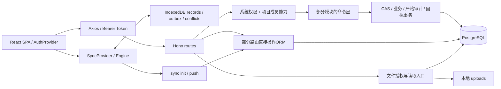

# RDPMS 深入代码审计与架构评估

- 日期：2026-09-29；仓库：`/Users/renkang/VS Code/project-management`。
- 基线：`138cf2da1b63195cef7e884f69bdf8ded6ed3c21`（main）。业务代码未修改，审计产物未提交。
- 结论：**28 条确认问题：16 P1、12 P2；未认定 P0。** 其中21条后端、4条前端引擎、1条备份脚本经隔离复现；2条部署问题静态确认。复现成功表示缺陷存在，不表示应用验收通过。
- P1：本次优先修复的权限边界、核心功能、不可恢复数据/恢复可靠性问题；P2：有明确触发条件的一致性、可用性或防护缺口。本次优先级不与仓库历史P0/P1权限冻结命名混用。

## 当前架构与数据流

现状是正在模块化的单体：React 18/TypeScript SPA → Hono API → Prisma/PostgreSQL；二进制文件存本地上传目录，数据库保存FileObject/Attachment引用。已有可复用的授权、命令、严格审计和幂等基础，但各入口接入不完整，是本次多类问题的共同根因。

1. **身份流**：登录签发access/refresh token，前端tokenStore保存在localStorage；Axios追加Bearer，401触发刷新。服务端加载用户、角色权限。用户状态与项目成员能力组成授权上下文；SUPER_ADMIN可elevated访问非成员项目。刷新、重置密码和强制改密的后端规则存在下文缺口。
2. **在线写入流**：`bootstrap/createApp.js`通过AsyncLocalStorage传递每个应用/请求的DB及actorResolver，便于隔离验证；部分tasks/reports/files已使用TS命令。`platform/idempotency/receipts.js`提供主体/命令/资源/载荷哈希回执，`platform/audit/strictAudit.js`支持同事务审计。许多JS路由仍直接调用Prisma，`checkJs:false`使授权投影字段缺失等问题不能被构建发现。
3. **离线流**：实际使用自封装IndexedDB，非旧README所述Dexie方案。启动身份→引擎拉取增量及ACL→更新镜像/游标→推送outbox→处理成功、冲突、拒绝区。kv和拒绝区已有部分主体隔离，records/outbox清理及冲突迁移还不完整。服务端sync保留独立权限/状态/幂等实现，未完整复用在线命令。
4. **文件流**：上传形成FileObject，关联Attachment/业务对象；下载查策略再读磁盘。通用文件与法规原文件有不同入口，扫描限制没有统一执行。数据库快照不能替代二进制备份。
5. **发布流**：检查current→发布前DB/files备份→clone候选→npm ci→迁移→构建→软链切换/restart→smoke→清旧release。smoke失败提示人工决定回滚，这符合脚本声明，未把人工回滚本身列为漏洞。迁移先于构建/切流意味着回滚还需确认旧二进制与新schema兼容；本次未证明当前6条迁移造成回滚失败。

## 发现总表

| 编号 | 严重度 | 问题 |
|---|---|---|
| B01 | P1 | [ADMIN 可接管 SUPER_ADMIN](#b01) |
| B02 | P1 | [项目编辑可绕过删除权限并硬删任务/里程碑](#b02) |
| B03 | P1 | [项目状态与模板起始日期读取了未选择的字段](#b03) |
| B04 | P1 | [同步拉取绕过各实体查看权限](#b04) |
| B05 | P2 | [同步回执未绑定主体与载荷](#b05) |
| B06 | P1 | [同步业务写入与回执非原子](#b06) |
| B07 | P1 | [同步截断后推进时间游标，永久漏数](#b07) |
| B08 | P2 | [新增项目成员不能得到历史数据](#b08) |
| B09 | P1 | [同步直接修改项目状态绕过归档权限与状态机](#b09) |
| B10 | P1 | [汇报提交快照与最终正文可能不一致](#b10) |
| B11 | P1 | [法规原文件入口绕过感染文件拦截](#b11) |
| B12 | P2 | [超管对非成员项目的文件访问被错误拒绝](#b12) |
| B13 | P1 | [恢复接口跳过重复记录却虚报恢复成功数量](#b13) |
| B14 | P1 | [临时登录锁定实际永久生效](#b14) |
| B15 | P2 | [刷新令牌并发可双重消费，TTL响应也不准确](#b15) |
| B16 | P2 | [在线任务修改未应用并发基线](#b16) |
| B17 | P2 | [自定义角色创建无法提交必填code](#b17) |
| B18 | P1 | [创建项目子步骤失败留下已提交项目](#b18) |
| B19 | P2 | [任务父子关系允许跨项目](#b19) |
| B20 | P2 | [软删除项目仍出现在普通列表](#b20) |
| B21 | P1 | [注册项目入口绕过项目成员边界](#b21) |
| F01 | P1 | [初始化身份时清空尚未同步的用户草稿](#f01) |
| F02 | P1 | [冲突先出队后持久化，失败会丢失本地修改](#f02) |
| F03 | P2 | [实体缓存没有账号命名空间](#f03) |
| F04 | P2 | [离线队列不分批，超过500条后无法推进](#f04) |
| D01 | P1 | [文件备份把新快照建成旧快照的软链](#d01) |
| D02 | P2 | [发布前检查校验旧版本而非候选版本](#d02) |
| D03 | P2 | [部署配置检查与运行时配置不一致](#d03) |

## 逐项证据、影响路径与建议

下列路径相对 `rdpms-system/`；行号对应冻结基线。复现编号与JSON的前缀一致。

### B01 · P1 · ADMIN 可接管 SUPER_ADMIN

- **位置**：[backend/src/routes/users.js:347](../../../rdpms-system/backend/src/routes/users.js#L347)；[backend/src/kernel/rbac.js:1](../../../rdpms-system/backend/src/kernel/rbac.js#L1)；[backend/prisma/seed.js:258](../../../rdpms-system/backend/prisma/seed.js#L258)。
- **触发与证据**：默认 ADMIN 权限含 users.reset_password；目标查找不检查角色等级。真实 ADMIN JWT 重置超管密码200，再以新密码登录取得SUPER_ADMIN，访问 /api/backup/restore/tables 为200，且 mustChangePassword=true。
- **影响路径**：低一级管理员获得超级管理员能力；前端强制改密页面不能限制直接API调用。
- **建议与验收**：在密码重置命令检查操作者与目标角色/受保护账号；强制改密会话在后端仅允许受限端点；重置与凭据撤销、严格审计同事务。验收 ADMIN→SUPER_ADMIN 必须拒绝且无副作用。

### B02 · P1 · 项目编辑可绕过删除权限并硬删任务/里程碑

- **位置**：[backend/src/routes/projects.js:307](../../../rdpms-system/backend/src/routes/projects.js#L307)；[backend/src/routes/projects.js:355](../../../rdpms-system/backend/src/routes/projects.js#L355)；[backend/src/routes/projects.js:440](../../../rdpms-system/backend/src/routes/projects.js#L440)。
- **触发与证据**：成员仅持 projects.update：DELETE /tasks/:id 返回403，PUT /projects/:id 携带 tasks:[]、milestones:[] 返回200，原任务物理消失。路由先 deleteMany 再重建集合。默认全局 MANAGER 有projects.update而无tasks.delete。
- **影响路径**：绕过对象级操作权限；正常计划编辑也可能重建ID、丢关联且无同步墓碑。
- **建议与验收**：删除嵌套全量替换入口或拆成逐实体命令；保留ID，分别检查创建/修改/删除权限及项目能力，写软删除墓碑，事务处理差量。验收禁止删除的账号不能通过任何入口删除。

### B03 · P1 · 项目状态与模板起始日期读取了未选择的字段

- **位置**：[backend/src/kernel/projectAccess.js:22](../../../rdpms-system/backend/src/kernel/projectAccess.js#L22)；[backend/src/routes/projects.js:331](../../../rdpms-system/backend/src/routes/projects.js#L331)；[backend/src/routes/projects.js:672](../../../rdpms-system/backend/src/routes/projects.js#L672)；[backend/src/routes/projects.js:790](../../../rdpms-system/backend/src/routes/projects.js#L790)。
- **触发与证据**：resolveProjectAccess 仅select id/code/name/deletedAt/managerId，后续把access.project.status用于状态机。实测合法 PLANNING→IN_PROGRESS 被400拒绝，错误含undefined。模板起算同样读取未选择的startDate。
- **影响路径**：状态更新失败；前端编辑提交status时连带阻断普通编辑；模板日期口径缺失。
- **建议与验收**：显式定义有类型的项目访问上下文与业务快照，按命令加载字段，禁止用授权投影充当完整实体。验收状态转换与带status的普通编辑。

### B04 · P1 · 同步拉取绕过各实体查看权限

- **位置**：[backend/src/routes/sync.js:271](../../../rdpms-system/backend/src/routes/sync.js#L271)；[backend/src/routes/sync.js:290](../../../rdpms-system/backend/src/routes/sync.js#L290)。
- **触发与证据**：有效项目成员但permissions为空：任务详情403，/api/sync/init为200且含该任务。拉取只按项目可见范围和ownOnly过滤，不检查tasks.view等权限。
- **影响路径**：权限撤回后或受限角色仍可经同步读取实体内容；不同入口的保密边界不一致。
- **建议与验收**：为每个实体共用查询授权策略；ACL变化按实体/字段清理缓存。验收HTTP禁止的数据不得经sync返回。

### B05 · P2 · 同步回执未绑定主体与载荷

- **位置**：[backend/src/routes/sync.js:362](../../../rdpms-system/backend/src/routes/sync.js#L362)；[backend/prisma/schema.prisma:486](../../../rdpms-system/backend/prisma/schema.prisma#L486)。
- **触发与证据**：按全局clientMutationId查回执并在资源授权前重放；同key不同内容仍applied，数据库保持旧内容；知道该key的非成员也取得资源ID、时间等旧回执。
- **影响路径**：错误确认未保存的新内容，跨主体回执元数据泄漏。需已知mutationId；未证明随机ID可猜或正文泄漏。
- **建议与验收**：复用actor+command+resource+key+payloadHash回执模型，先鉴权和授权，再判断重放；错载荷409、错主体拒绝。

### B06 · P1 · 同步业务写入与回执非原子

- **位置**：[backend/src/routes/sync.js:461](../../../rdpms-system/backend/src/routes/sync.js#L461)；[backend/src/routes/sync.js:480](../../../rdpms-system/backend/src/routes/sync.js#L480)；[backend/src/routes/sync.js:546](../../../rdpms-system/backend/src/routes/sync.js#L546)。
- **触发与证据**：在真实SQL写入后注入receipt upsert故障：API500，但任务正文已提交、回执数0。
- **影响路径**：客户端无法判断是否提交，重试可重复执行；与HTTP命令事务语义不一致。
- **建议与验收**：业务状态、墓碑/版本、严格审计和回执在同一Prisma事务；故障验收应全部回滚或全部成功。

### B07 · P1 · 同步截断后推进时间游标，永久漏数

- **位置**：[backend/src/routes/sync.js:302](../../../rdpms-system/backend/src/routes/sync.js#L302)；[backend/src/routes/sync.js:317](../../../rdpms-system/backend/src/routes/sync.js#L317)；[backend/src/routes/sync.js:320](../../../rdpms-system/backend/src/routes/sync.js#L320)。
- **触发与证据**：单实体take3000、墓碑take5000，没有续页，cursor直接取响应结束时间。3001条旧任务首轮3000条，下一轮0条。另有实体查询结束至cursor生成之间写入的丢失窗口（静态确认时序，未单独注入）。
- **影响路径**：离线镜像不完整且正常增量无法补齐；删除墓碑同样有截断风险。
- **建议与验收**：设计有固定读取边界的快照/变更分页，稳定次序包含同时间ID，消费完才推进检查点；若用序列日志必须处理事务提交乱序，不能直接max(sequence)。验收超过上限、同时间戳、拉取中写入。

### B08 · P2 · 新增项目成员不能得到历史数据

- **位置**：[backend/src/routes/sync.js:281](../../../rdpms-system/backend/src/routes/sync.js#L281)；[backend/src/routes/sync.js:303](../../../rdpms-system/backend/src/routes/sync.js#L303)；[backend/prisma/schema.prisma:634](../../../rdpms-system/backend/prisma/schema.prisma#L634)。
- **触发与证据**：用户已有cursor后加入一个历史项目，响应ACL含新项目，但项目和历史任务upserts均为空；时间筛选仍只用旧实体updatedAt。
- **影响路径**：新授权的项目离线缺失；成员角色变化也缺少可靠增量版本（ProjectMember使用joinedAt）。
- **建议与验收**：ACL/成员变动产生版本事件；新增授权范围强制局部快照，撤权事务清理；成员具备updatedAt或revision。验收历史项目加入、离开重入及角色变化。

### B09 · P1 · 同步直接修改项目状态绕过归档权限与状态机

- **位置**：[backend/src/routes/sync.js:48](../../../rdpms-system/backend/src/routes/sync.js#L48)；[backend/src/routes/sync.js:418](../../../rdpms-system/backend/src/routes/sync.js#L418)。
- **触发与证据**：只有projects.update的项目MEMBER经sync把PLANNING直接改为ARCHIVED，结果applied；未要求projects.archive或transition能力。
- **影响路径**：绕过专用接口的权限和允许状态转换。
- **建议与验收**：从通用字段upsert移除状态/成员角色等敏感操作；同步调用与HTTP同一显式命令。验收所有入口状态图与授权结果一致。

### B10 · P1 · 汇报提交快照与最终正文可能不一致

- **位置**：[backend/src/routes/reports.js:391](../../../rdpms-system/backend/src/routes/reports.js#L391)；[backend/src/routes/reports.js:407](../../../rdpms-system/backend/src/routes/reports.js#L407)；[backend/src/modules/reports/reportCommands.ts:136](../../../rdpms-system/backend/src/modules/reports/reportCommands.ts#L136)。
- **触发与证据**：提交先在事务外读取report，再用捕获的content建版本并无条件更新状态。受控交错插入并发保存后：状态SUBMITTED，正文concurrent-save，提交版本仍before；换幂等key对SUBMITTED再次提交仍200。
- **影响路径**：审批证据与当前数据不一致，状态机无法阻止重复提交。
- **建议与验收**：在同一事务按status+revision重新读取并CAS更新，版本复制自成功提交的同一修订；提交仅允许明确来源状态。审核/驳回也纳入命令、CAS和严格审计。

### B11 · P1 · 法规原文件入口绕过感染文件拦截

- **位置**：[backend/src/routes/files.js:186](../../../rdpms-system/backend/src/routes/files.js#L186)；[backend/src/routes/regulatory-documents.js:522](../../../rdpms-system/backend/src/routes/regulatory-documents.js#L522)。
- **触发与证据**：用普通文本构造scanStatus=INFECTED的文件：通用下载403，法规/:id/original-file返回200及文件字节。后者只做文件访问策略，未检查scanStatus。
- **影响路径**：已隔离文件仍可通过别名下载路径分发；测试未使用真实恶意文件。
- **建议与验收**：集中FileReadService处理资源授权、扫描状态、下载权限和审计，所有原件/预览/导出引用共用。验收INFECTED所有入口一致拒绝。

### B12 · P2 · 超管对非成员项目的文件访问被错误拒绝

- **位置**：[backend/src/kernel/projectAccess.js:36](../../../rdpms-system/backend/src/kernel/projectAccess.js#L36)；[backend/src/routes/files.js:53](../../../rdpms-system/backend/src/routes/files.js#L53)；[backend/src/modules/files/fileAccessPolicy.ts:147](../../../rdpms-system/backend/src/modules/files/fileAccessPolicy.ts#L147)。
- **触发与证据**：SUPER_ADMIN对非成员项目得到elevated能力但isMember=false；文件policy仅识别成员。项目详情200，项目文件元数据404。
- **影响路径**：声明的超管访问规则与文件模块不一致，影响支持及恢复操作。
- **建议与验收**：文件策略消费统一授权决策与elevated标记；确需超管访问时写敏感读取审计，不能只传isMember布尔值。

### B13 · P1 · 恢复接口跳过重复记录却虚报恢复成功数量

- **位置**：[backend/src/kernel/backupRestore.js:213](../../../rdpms-system/backend/src/kernel/backupRestore.js#L213)；[backend/src/kernel/backupRestore.js:324](../../../rdpms-system/backend/src/kernel/backupRestore.js#L324)。
- **触发与证据**：预检未发现payload内重复唯一字段；两个不同user id使用同username，preview ok，恢复200报created=2，DB实际只有1。createMany skipDuplicates=true，统计按输入行数而非实际count。
- **影响路径**：静默丢数据并向操作员报告虚假恢复结果。
- **建议与验收**：完整校验载荷内部与目标库所有唯一/复合键，禁止不透明skipDuplicates；按数据库结果计数并对账，任何非显式冲突全批回滚。恢复演练校验行数、关联、文件清单与摘要。

### B14 · P1 · 临时登录锁定实际永久生效

- **位置**：[backend/src/routes/auth.js:128](../../../rdpms-system/backend/src/routes/auth.js#L128)；[backend/src/routes/auth.js:140](../../../rdpms-system/backend/src/routes/auth.js#L140)。
- **触发与证据**：失败次数达到阈值同时设置status=LOCKED和lockedUntil；入口用OR判断。lockedUntil已过期的用户输入正确密码仍403 ACCOUNT_LOCKED。
- **影响路径**：知道用户名者可通过失败登录把账号锁到管理员介入，配置的等待时间无法自动恢复。
- **建议与验收**：区分人工禁用/锁定与时间锁定；原子累计失败次数，到期条件解锁，成功登录清零。验收阈值前后、过期及并发失败登录。

### B15 · P2 · 刷新令牌并发可双重消费，TTL响应也不准确

- **位置**：[backend/src/routes/auth.js:26](../../../rdpms-system/backend/src/routes/auth.js#L26)；[backend/src/routes/auth.js:187](../../../rdpms-system/backend/src/routes/auth.js#L187)；[backend/src/routes/auth.js:200](../../../rdpms-system/backend/src/routes/auth.js#L200)。
- **触发与证据**：控制两次读取均在撤销前完成：同refresh token两请求均200，产生2个后继；撤销与签发分离。JWT_ACCESS_TTL=15m时JWT有效900秒但expiresIn固定7200。
- **影响路径**：一次性轮换失效、令牌链分叉；TTL契约误导客户端。
- **建议与验收**：事务内条件撤销并检查影响行数，只允许一个胜者；保存稳定family关系并定义重放处理；响应TTL来自实际签发值。

### B16 · P2 · 在线任务修改未应用并发基线

- **位置**：[backend/src/routes/tasks.js:235](../../../rdpms-system/backend/src/routes/tasks.js#L235)；[backend/src/routes/tasks.js:284](../../../rdpms-system/backend/src/routes/tasks.js#L284)；[backend/src/routes/tasks.js:332](../../../rdpms-system/backend/src/routes/tasks.js#L332)。
- **触发与证据**：底层命令支持CAS，但HTTP不传递；实测携带早于当前记录的expectedUpdatedAt仍200并覆盖任务。
- **影响路径**：两个用户编辑同一任务时后写覆盖先写，无法发现丢失更新。
- **建议与验收**：HTTP/sync共享required revision合同，所有写入包括状态/指派检查CAS，冲突返回409和当前revision。

### B17 · P2 · 自定义角色创建无法提交必填code

- **位置**：[backend/src/routes/roles.js:66](../../../rdpms-system/backend/src/routes/roles.js#L66)；[backend/src/kernel/constants.js:184](../../../rdpms-system/backend/src/kernel/constants.js#L184)。
- **触发与证据**：创建角色白名单允许且要求code，但全局禁止字段同时包含code；合法输入400“包含禁止提交的字段code”。
- **影响路径**：角色创建功能完全不可用。权限目录/可授予集合亦分散，应随修复对齐而不简单放开全部字段。
- **建议与验收**：分离服务端生成字段和各命令可输入字段，用类型化DTO替代跨实体全局黑名单。验收合法code创建及保留字段拒绝。

### B18 · P1 · 创建项目子步骤失败留下已提交项目

- **位置**：[backend/src/routes/projects.js:215](../../../rdpms-system/backend/src/routes/projects.js#L215)；[backend/src/routes/projects.js:243](../../../rdpms-system/backend/src/routes/projects.js#L243)；[backend/src/routes/projects.js:278](../../../rdpms-system/backend/src/routes/projects.js#L278)。
- **触发与证据**：项目/成员先create，阶段/任务/里程碑后续独立写；提交不存在assignee触发FK错误，HTTP500但项目仍在且任务数0。
- **影响路径**：用户收到失败却留下半成品，重试可生成重复项目和编号消耗。
- **建议与验收**：全量输入及关联先验证，项目聚合创建在单事务，附同事务回执。验收任一子步骤失败时项目和成员均不留存。

### B19 · P2 · 任务父子关系允许跨项目

- **位置**：[backend/src/routes/sync.js:75](../../../rdpms-system/backend/src/routes/sync.js#L75)；[backend/src/routes/sync.js:245](../../../rdpms-system/backend/src/routes/sync.js#L245)；[backend/prisma/schema.prisma:852](../../../rdpms-system/backend/prisma/schema.prisma#L852)；[backend/src/routes/tasks.js:369](../../../rdpms-system/backend/src/routes/tasks.js#L369)。
- **触发与证据**：项目B成员通过sync创建本项目子任务，parentId引用无权访问的项目A任务，DB接受。只验证phase所属，parent FK仅约束id。
- **影响路径**：项目边界与任务树不变量破坏；按parentId遍历/级联时可能跨越项目边界。未证明可据此删除别人的任务。
- **建议与验收**：写命令验证父项同项目并检查环；数据库增加适当复合唯一/FK约束，级联/递归始终带projectId。历史数据迁移先列出异常边。

### B20 · P2 · 软删除项目仍出现在普通列表

- **位置**：[backend/src/routes/projects.js:114](../../../rdpms-system/backend/src/routes/projects.js#L114)；[backend/src/routes/projects.js:147](../../../rdpms-system/backend/src/routes/projects.js#L147)；[backend/src/kernel/projectAccess.js:89](../../../rdpms-system/backend/src/kernel/projectAccess.js#L89)。
- **触发与证据**：列表仅叠加可见性、未统一deletedAt过滤；实际软删项目列表返回1项，详情404。
- **影响路径**：列表与详情不一致，统计/子资源查询可能继续纳入已删除项目。
- **建议与验收**：封装alive+visibility查询scope，定义聚合软删与墓碑规则；回收站使用单独显式查询。验收列表、详情、搜索、同步一致。

### B21 · P1 · 注册项目入口绕过项目成员边界

- **位置**：[backend/src/routes/registrations.js:50](../../../rdpms-system/backend/src/routes/registrations.js#L50)；[backend/src/routes/registrations.js:137](../../../rdpms-system/backend/src/routes/registrations.js#L137)；[backend/src/routes/registrations.js:223](../../../rdpms-system/backend/src/routes/registrations.js#L223)；[backend/src/routes/registrations.js:326](../../../rdpms-system/backend/src/routes/registrations.js#L326)。
- **触发与证据**：过滤仅subtype+deletedAt，无成员约束。非成员普通project详情404，registration详情200并含私有任务；具registrations.update的非成员修改返回200且DB名称改变。默认MEMBER/VIEWER有view，MANAGER有update。
- **影响路径**：可经另一业务入口读取其他项目成员、任务、档案；有更新权限者能改非成员项目。
- **建议与验收**：注册项目作为Project聚合扩展，所有列表/统计/详情/更新/阶段/档案复用项目scope与能力决策。验收六系统角色×各项目角色×非成员的入口矩阵。

### F01 · P1 · 初始化身份时清空尚未同步的用户草稿

- **位置**：[frontend/src/auth/AuthProvider.tsx:18](../../../rdpms-system/frontend/src/auth/AuthProvider.tsx#L18)；[frontend/src/offline/SyncProvider.tsx:27](../../../rdpms-system/frontend/src/offline/SyncProvider.tsx#L27)；[frontend/src/offline/engine.ts:472](../../../rdpms-system/frontend/src/offline/engine.ts#L472)；[frontend/src/offline/engine.ts:511](../../../rdpms-system/frontend/src/offline/engine.ts#L511)；[frontend/src/offline/idb.ts:176](../../../rdpms-system/frontend/src/offline/idb.ts#L176)。
- **触发与证据**：页面初始user=null触发resetOnLogout；fresh engine的currentUserId=null，保存流程略过已有userId草稿，随后全局outboxClear。真实引擎夹具outbox从1变0，用户拒绝区仍0。
- **影响路径**：带待同步变更刷新页面，在清理先于身份恢复的时序下会丢草稿。此为引擎+调用链验证，未做浏览器E2E。
- **建议与验收**：bootstrapping不触发退出；显式退出事件携带旧主体，只事务迁移该主体草稿；清理不得全局删除outbox。验收断网刷新/恢复登录与快速切号。

### F02 · P1 · 冲突先出队后持久化，失败会丢失本地修改

- **位置**：[frontend/src/offline/engine.ts:284](../../../rdpms-system/frontend/src/offline/engine.ts#L284)；[frontend/src/offline/engine.ts:334](../../../rdpms-system/frontend/src/offline/engine.ts#L334)。
- **触发与证据**：收到conflict先outboxDelete，再批量kvSet冲突。注入后一步存储故障后outbox=0、persistedConflicts=0。
- **影响路径**：磁盘/配额/进程中断窗口内，服务器未接受的数据没有任何本地恢复副本。
- **建议与验收**：与已有deadLetterMove一样，在同一IndexedDB事务内写冲突与删除队列；事务失败保留原队列。验收每一持久化失败点与重启恢复。

### F03 · P2 · 实体缓存没有账号命名空间

- **位置**：[frontend/src/offline/idb.ts:24](../../../rdpms-system/frontend/src/offline/idb.ts#L24)；[frontend/src/offline/engine.ts:213](../../../rdpms-system/frontend/src/offline/engine.ts#L213)；[frontend/src/offline/engine.ts:421](../../../rdpms-system/frontend/src/offline/engine.ts#L421)。
- **触发与证据**：records key仅entity:id；切到另一账号且共享同项目、旧清理未完成时，仅按project ACL保留缓存。实际引擎readCachedRecords能读到前账号自有报告。
- **影响路径**：缓存访问层存在账号隔离缺口。当前报告页面未发现消费该缓存，不能扩大为已验证的报告UI泄露。
- **建议与验收**：records、outbox、cursor、conflicts均按userId分区；读API必须传主体；存储升级期间保全旧草稿。验收共享项目下A→B切换和A再登录。

### F04 · P2 · 离线队列不分批，超过500条后无法推进

- **位置**：[frontend/src/offline/engine.ts:264](../../../rdpms-system/frontend/src/offline/engine.ts#L264)；[backend/src/routes/sync.js:346](../../../rdpms-system/backend/src/routes/sync.js#L346)。
- **触发与证据**：前端将全部outbox一次发送，后端上限500；真实引擎501条发送501，模拟同一后端限制拒绝后队列仍501。
- **影响路径**：积累大量离线操作后反复失败，无自动前进路径。
- **建议与验收**：按服务器协议限制分批和按依赖顺序发送，逐批确认并持久化，限制字节数；验收501/1001及中间批失败恢复。

### D01 · P1 · 文件备份把新快照建成旧快照的软链

- **位置**：[deploy/scripts/backup-pg.sh:69](../../../rdpms-system/deploy/scripts/backup-pg.sh#L69)。
- **触发与证据**：latest本身是软链，cp -al latest SNAP保留软链，随后rsync --delete经SNAP修改旧目录。隔离macOS本机复现：第二快照是软链、第一快照旧文件消失、新文件出现。未在目标Linux执行。
- **影响路径**：历史uploads快照被后续备份污染，数据库恢复后可能找不到对应时点文件。
- **建议与验收**：创建真实新目录，以解析后的上一快照为rsync --link-dest来源，临时目录完成校验后发布；不覆盖历史快照。验收两轮增删改后首轮manifest与内容不变，再做DB+文件配对恢复。

### D02 · P2 · 发布前检查校验旧版本而非候选版本

- **位置**：[deploy/scripts/preflight.sh:59](../../../rdpms-system/deploy/scripts/preflight.sh#L59)；[deploy/scripts/deploy.sh:95](../../../rdpms-system/deploy/scripts/deploy.sh#L95)；[deploy/scripts/deploy.sh:103](../../../rdpms-system/deploy/scripts/deploy.sh#L103)；[deploy/scripts/deploy.sh:138](../../../rdpms-system/deploy/scripts/deploy.sh#L138)。
- **触发与证据**：preflight默认REPO_ROOT/APP_DIR指向current，deploy在clone候选之前调用，候选构建后没有再执行同等门禁。静态确认。
- **影响路径**：旧版本通过无法证明新版本schema/seed/源码契约通过，门禁保护对象错误。
- **建议与验收**：区分主机检查与制品检查；候选依赖/构建后，显式传候选root运行制品门禁，再迁移/切流。验收故意破坏候选契约时在切流前失败。

### D03 · P2 · 部署配置检查与运行时配置不一致

- **位置**：[deploy/scripts/preflight.sh:125](../../../rdpms-system/deploy/scripts/preflight.sh#L125)；[deploy/scripts/preflight.sh:131](../../../rdpms-system/deploy/scripts/preflight.sh#L131)；[backend/.env.example:32](../../../rdpms-system/backend/.env.example#L32)；[backend/src/bootstrap/createApp.js:67](../../../rdpms-system/backend/src/bootstrap/createApp.js#L67)。
- **触发与证据**：示例与preflight校验ALLOWED_ORIGINS，应用读CORS_ORIGINS，缺省为*；preflight要求ENABLE_BACKUP_EXPORT=false，但backend/src无读取该开关。静态确认。
- **影响路径**：通过检查不代表请求来源限制/导出禁用生效。导出仍受角色权限限制；未认定无认证导出或凭此可直接窃取令牌。
- **建议与验收**：单一类型化配置模块启动时验证，preflight消费同一schema；开关要么真实执行要么删除虚假约束。验收生产配置与运行时响应、导出开关一致。

## 分阶段架构优化方案

建议保留模块单体，在现有DI、命令、Prisma事务和严格审计基础上逐步收敛规则。当前证据不支持为了本次问题直接拆微服务、重写前端或更换数据库。以下阶段按验收门槛推进，不虚构人力与工期。

| 阶段 | 范围与次序 | 交付/退出条件 |
|---|---|---|
| 0：优先止损 | B01、B21、B02；F01/F02；D01；B03/B14 | 阻断越权；刷新与存储失败不丢草稿；两轮备份后历史内容不变；项目正常编辑及锁定到期可用。先验证备份，再开展数据修复。 |
| 1：统一写入和授权 | projects/registrations → tasks/reports → files；B04/B06/B09/B10/B16/B18 | HTTP与sync只是输入适配层；所有业务入口调用同一授权、状态机和命令；CAS+业务+版本/墓碑+严格审计+回执同事务；同一个权限矩阵覆盖所有入口。 |
| 2：重建同步协议边界 | B05/B07/B08、F03/F04；迁移现有IndexedDB数据 | 分页无缺口、授权变化补齐/清理、请求分批；本地按主体分区、原子移交队列；新旧客户端协议有版本，存储升级保留草稿；恢复中断可重入。 |
| 3：固化模型与文件策略 | B11/B12/B13/B17/B19/B20；清理历史异常数据 | 同项目关系由命令和数据库约束共同保证；统一软删scope；所有文件出口共享扫描/授权；恢复结果按行/引用/文件摘要对账，不静默skip。 |
| 4：发布与可恢复性 | D02/D03；恢复演练、迁移兼容与观测 | 主机与候选制品门禁分开；构建验证后才进行受控迁移；expand/contract保证回退窗口；DB+文件同一恢复manifest；上线验证instance/build指纹和readiness；演练失败发布与回退并记录实际RPO/RTO。 |

目标模块边界：Identity/Access（主体与统一授权决策）、Project（含Registration扩展）、Work（Task/Phase/Milestone）、Reporting、Files、SyncAdapter、Operations。避免路由之间通过重新拼ORM语句实现相同规则。显式区分读取投影和写命令DTO，先迁移高风险JS路由为TS，再分目录启用更严格类型检查。

关键事务约定：授权外部条件在事务内复核；读出修订→校验来源状态→CAS→业务关联/版本→严格审计→回执提交。幂等不能替代CAS；回执重放不能跳过当前主体与资源授权。外部文件操作无法直接参与PG事务时，用明确的待提交状态、补偿/清理任务及可重入文件命令，不能把文件写成功假定为DB提交成功。

同步协议验收至少包括：3001+实体、5001+墓碑、同时间戳、多事务提交乱序、拉取中写入、成员新加入/离开重入、实体权限撤销、501+待发送操作、重放错载荷、推送响应丢失、IDB写入失败、冷启动刷新和快速切号。新回归用例应把本次“缺陷复现断言”转换为“正确行为断言”，不能照搬当前成功条件。

## 验证证据与限制

- [后端结果](backend-results.json)：20/20缺陷复现；[脚本](verify-backend.mjs)。
- [注册项目补充结果](additional-results.json)：1/1缺陷复现；[脚本](verify-additional.mjs)。
- [离线结果](offline-results.json)：4/4缺陷复现；[脚本](verify-offline.ts)。实际引擎+fake-indexeddb+受控传输，无真实浏览器渲染。
- [备份结果](backup-result.json)：1条本机文件系统复现；[脚本](verify-backup.py)。目标生产Linux备份/恢复未执行。
- 临时副本安装锁定依赖，后端TypeScript构建成功，全部6条仓库迁移在PG18.4独立库成功执行。21条后端验证访问真实该库；大部分使用注入actor，B01明确使用真实JWT认证和角色加载。并发、故障注入已在脚本及结果注明。
- 专用库 `rdpms_audit_isolated`、loopback端口50796；脚本验证真实data_directory归属。现已精确停止此PG实例，未触碰生产/预发数据。业务代码未修改，没有运行生产发布、生产恢复或全量产品测试。
- 未对性能容量、线上部署配置、外部扫描服务、浏览器兼容性给出已验证结论。没有把代码风格、缺少缓存/微服务或未证实的猜测计入问题数。
- 项目直接删除缺scope没有独立计为普通角色漏洞：核查默认权限与当前可授予集合后，不满足默认普通用户可达条件。F03没有扩大为UI正文泄露，B05没有假设能猜随机键，B19没有扩大为可删除其他项目任务。

## 接续入口

先读 [HANDOFF.md](HANDOFF.md) 和 [manifest.json](manifest.json)，比较HEAD与工作区，仅复核增量。用户尚未要求实施修复或提交。临时环境可能被系统回收；固定夹具脚本不能在已运行过的库直接重跑，更不能指向业务库。当前阶段审计报告已形成；下一步是用户选择修复范围后按阶段0拆包。
