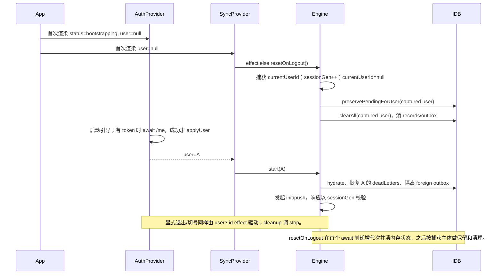

# R07：离线启动、账号切换与本地隔离

- **状态：COMPLETE_WITH_PENDING**
- **审计基线 / 当前 HEAD：** `138cf2da1b63195cef7e884f69bdf8ded6ed3c21`
- **范围：** `App.tsx`、`AuthProvider.tsx`、`SyncProvider.tsx`、`engine.ts`、`idb.ts`；另追踪 `readCachedRecords` 的实际消费者 `Tasks.tsx`。
- **方法：** 定向源码审阅 + 继承 2026-09-29 离线引擎/fake-indexeddb 历史结果；未运行测试、未启动浏览器、未修改业务代码。

## 身份及同步时序

**调用链与结论：** `App` 将 `AuthProvider` 与 `SyncProvider` 包裹在路由内；`AuthProvider` 初始身份为 null、状态为 bootstrapping，并异步恢复 `/me`；`SyncProvider` 的 effect 仅观察 `user?.id`，user 为空即执行 `resetOnLogout()`。引擎启动清理有 sessionGen 保护，能阻止已过期清理尾段在新会话开始后继续清理；同步响应也捕获主体/代次，陈旧响应会退出。

但是初次引导中的 null 与用户显式退出共用同一条 `resetOnLogout` 分支。若持久化 outbox 已有带 `userId=A` 的记录而引擎刚加载、`currentUserId=null`，`preservePendingForUser(null)` 仅挑选未标主体或主体为 null 的行；随后 `clearAll(null)` 无条件清空整个 records/outbox。若这段清理在 `/me` 恢复 A 并 `start(A)` 之前执行，A 的待同步记录仍会被删除。状态代次保护的是“新会话已先开始”的竞态，不能覆盖启动引导时“清理先于身份恢复”的窗口。历史夹具结果与此路径一致，但真实 React 浏览器调度/持久数据场景尚未验证。

## 本地存储主体隔离矩阵

| 存储 | 主键/主体字段 | 读取方式 | 清理/隔离范围 | 审阅结论 |
|---|---|---|---|---|
| `kv` 游标、ACL、冲突 | 新键按 `base:userId`；仍保留旧全局 key | hydrate 通过当前主体派生 key | `clearAll(userId)` 删除全局旧键，并删除当前主体分片键 | 主体分片有做；历史全局键兼容/迁移语义未在本包验证 |
| `records` 实体镜像 | key=`entity:id`；没有 userId | `recordsAll()` 全库；`readCachedRecords(entity)` 只按实体筛选 | ACL 变化按当前可见项目 ID 扫全库清除；退出清全库 | **没有账号命名空间**；同一项目对两个用户均可见时，ACL 清理不会删除旧主体写入的该项目记录 |
| `outbox` | key=`clientMutationId`；新行带可选 `userId` | `outboxAll()` 全库；push 对读取出的队列整体构造 changes | 退出先挑本主体/未标主体转 dead-letter，再全局 `outboxClear()`；新会话隔离明确标记的 foreign rows | 主体字段是部分保护，不是物理分区；首次匿名清理可能遗漏 A 归属行并全局删除；启动/隔离竞态仍需浏览器场景验证 |
| `deadLetters` | key=`userId:clientMutationId`，并有 userId 索引 | `deadLettersForUser(userId)` 过滤 | 清理按主体读写；退出不清它 | 本地主体隔离最明确；与 outbox/records 行为不对称 |
| 内存状态 | `currentUserId`、`sessionGen`；拒绝区数组 | 当前引擎实例 | start/reset 切换主体、递增代次并重置/恢复状态 | 对已启动会话的过期请求有保护；不使 records/outbox 自动成为主体隔离存储 |

## F01：启动引导清理可删除待同步草稿

- **裁定：SUPPORTED / P1，历史 ID 保留。**
- **入口与前提：** `SyncProvider` 首次 user=null effect 调 `engine.resetOnLogout()`；需 IndexedDB 内存在已标主体且尚未同步的 outbox，且 null 清理先于身份恢复的 `start(A)` 完成。
- **当前静态路径：** `SyncProvider.tsx:30-35` → `engine.ts:515-541`。reset 在 await 前捕获当前主体、递增代次并设 currentUserId=null；`preservePendingForUser` 在 `engine.ts:473-491` 只选 `!row.userId || row.userId === userId`；null 情况会排除 A 行；随后 `idb.clearAll(uidAtLogout)` 在 `idb.ts:176-188` 总是清空 records/outbox。`AuthProvider.tsx:18,32-57` 显示身份恢复另行异步执行。
- **保护/反证：** 显式退出能在 await 前捕获当时主体；会话代次在 `engine.ts:519-540` 阻止新会话启动后的陈旧清理；正常 `start(A)` 会恢复 A 的拒绝项并隔离明确标记的 foreign outbox。它们没有阻止首次 `user=null` 被当成登出的入口。
- **已证明影响：** 历史 `offline-results.json#F01_BOOTSTRAP_ERASES_USER_OUTBOX` 在 fresh engine/currentUserId=null、SyncProvider 初始 user=null 的注入场景中观察到 outbox 从 1 降到 0，dead-letter 仍为 0；旧报告据此裁为用户草稿丢失。
- **证据限制：** 历史运行是实际打包的前端引擎 + fake-indexeddb + 注入 transport，不是浏览器渲染；真实页面初始挂载、React effect 与 /me 网络时序尚未复现。按计划不扩大为已验证的真实浏览器启动问题。
- **建议：** 区分 `bootstrapping`、明确登出与身份切换事件；启动时在主体恢复前禁止清除持久队列。任何迁移/退出保留都应以 outbox 原主体为依据，在同一 IndexedDB 事务中先保留再移除，并对匿名/旧版无主体记录制定不丢失策略。
- **验收条件：** 临时浏览器数据目录中预置 A 的待同步记录；断网刷新并在 `/me` 成功恢复前后检查记录仍可由 A 重试；显式退出 A 后 B 登录不得代发 A 的变更，A 再登录可恢复；快速退出/登录下陈旧清理不得删 B 新写记录。当前未执行这些浏览器验收。

## F03：实体镜像及缓存读取没有账号命名空间

- **裁定：SUPPORTED / P2，历史 ID 保留；影响边界为本地缓存 API，页面展示影响待证。**
- **入口与前提：** 同设备账号 A、B 对同一项目均有 ACL 可见性；records 中留有 A 之前拉取的实体；B 的在线请求失败后页面使用 `readCachedRecords` 回退。
- **当前静态路径：** `idb.ts:24-30,42-47,88-112` 定义全局 records store，key 仅 entity:id，RecordRow 不含 userId；`engine.ts:140-144` 的 readCachedRecords 全库读取并仅按 entity 筛选；pull 在 `engine.ts:189-210` 写相同全局 key；ACL 清理 `engine.ts:213-235` 只按可见 projectId 判定。
- **真实消费者：** 本次 `rg` 仅找到 `frontend/src/pages/Tasks.tsx:427-443` 的调用：`taskAPI.list` 失败时读取 `readCachedRecords('tasks')` 并把结果放入 Tasks 页面状态。Reports 页面本轮未发现读取缓存报告记录的调用。因此当前证据不能声称“报告页面显示 A 的报告给 B”；但任务列表确有缓存 API 到页面状态的静态调用链。历史记录证明的是报告实体的缓存 API 可跨账号读取，不证明任务页面跨账号显示或特定任务属于用户私有。
- **保护/反证：** 账号切换时 `resetOnLogout` 清全局 records；ACL 变更按项目清理当前不可见项目；相同项目对 B 仍可见时上述规则会保留项目记录，且缓存读取不再以 userId 过滤。deadLetters 的隔离不能覆盖 records。
- **已证明影响：** 历史 `offline-results.json#F03_RECORD_CACHE_NOT_SCOPED_BY_ACCOUNT` 记录当前账号 user-b 通过 `readCachedRecords` 读到 user-a 创建的报告缓存，前提包含 sharedProjectStillAuthorized=true。此为引擎/API 层证据。
- **潜在影响（未验证）：** Tasks 页面在 task API 失败时会呈现共享项目任务缓存；是否构成账号间敏感数据泄露取决于任务字段/业务可见性及当前会话生命周期，历史实验没有证明该 UI 结果。
- **建议：** 按主体分区 records，或在读取时强制传入主体并只返回该主体镜像；账号切换时以事务清理/切换存储命名空间，ACL 清理仍作为项目权限变化的第二层清理。schema 升级须保全未同步内容并明确迁移无法归属的旧行策略。
- **验收条件：** 同项目 A→B、B 离线/接口失败时验证各类实体读 API 与真实消费者只见允许的数据；A 再登录仍能取回自身缓存；存储升级中断可重入且不丢 outbox。

## 未覆盖和 pending

1. **F01 浏览器待证：** 首屏带有效会话 token、IndexedDB 有 A 归属 outbox、断网/慢 `/me` 的启动时序；确认浏览器中的真实 effect 顺序和页面重试可用性。
2. **F03 UI 待证：** 历史只证明缓存 API。虽然 Tasks 页面使用缓存回退，本包没有准备跨账号任务数据或实测页面状态，不能上调已观察影响；Reports 页面没有找到 `readCachedRecords` 消费者。
3. **旧版 IndexedDB schema 从 v1 升级至 v2 的真实数据迁移与中断恢复未运行；仅审阅当前代码，不推断所有旧客户端数据的实际状态。
4. 不审阅离线 push 批次上限、冲突持久化失败和服务端 sync 授权（归 R08/R05/R06）。
