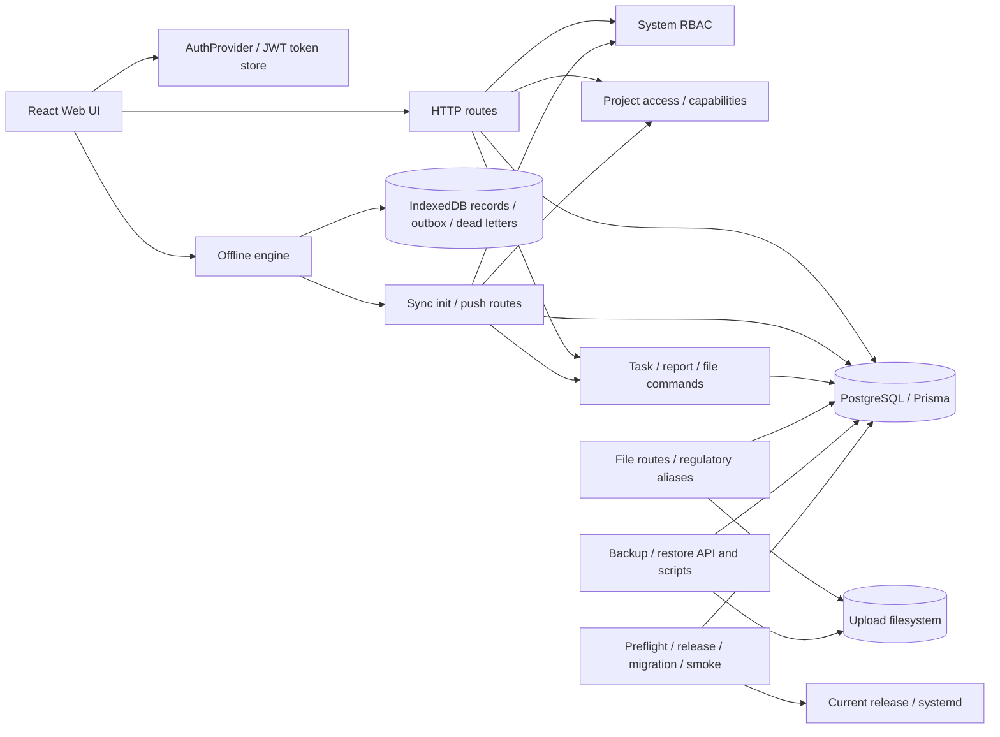

# RDPMS 深度代码审阅汇总（R14）

日期：2026-09-30。审计基线与当前 HEAD：`138cf2da1b63195cef7e884f69bdf8ded6ed3c21`。审阅目录：`docs/audits/2026-09-30-review-plan/execution/`。本轮为只读代码/证据审阅；未实施修复、迁移、依赖升级、部署或提交。

## 总体裁定

- 计划包 R00–R14 均已完成审阅交付；R01、R02、R04、R05、R06、R07、R09、R11、R12、R13 含明确 pending，R00、R03、R08、R10、R14 的审阅材料齐备。包完成不代表缺陷修复或系统验收通过。
- 28/28 历史 ID 均完成当前裁定：`SUPPORTED` 28 条；没有 `REVISED` 或 `NO_LONGER_PRESENT`。旧严重度数量仍为 P1 16、P2 12。
- 新确认缺陷 3 条：N-R02-01、N-R02-02、R06-N01，均 P2；另有 R12-N01 候选风险 `PENDING`，不计入确认缺陷。
- HEAD 等于冻结基线；`rdpms-system/` 跟踪工作树干净，未发现业务源码增量。旧审计目录及 manifest 保持不变。
- 当前确认的严重度分布：历史 P1 16 / P2 12；3 条新确认均 P2。动态证据主要继承自 2026-09-29 隔离环境；本轮没有声称重跑。

## 当前架构与关键数据流

### 路径观察

1. 浏览器同步初始化先认证并计算项目可见范围，再按实体/时间拉取到 IndexedDB；部分实体查询有硬上限但没有续页完成信号。客户端保存时间游标，ACL 清理偏重项目可见性变化，实体权限撤回与新项目历史回填没有完整版本协议（B04、B07、B08）。
2. 离线写入通过 outbox 推送；服务端单条变化依次授权、写业务数据、另行写 SyncMutation 回执。回执 key 未按主体/资源/payload 绑定，业务写与回执非同事务；项目状态、managerId 仍存在通用字段路径（B05、B06、B09、R06-N01）。批次逐项处理，不据此推断整批必须原子。
3. HTTP 与 sync 仅部分共享命令：任务命令可支持 CAS，但 HTTP 路由未传客户端基线；汇报 submit 的事务用路由事务外读到的正文建提交版本；HTTP/sync 的权限、状态机、审计、成员关系仍有语义分叉（B10、B16、B09、R06-N01）。
4. 账号身份在 JWT 外仍从数据库加载角色/权限；密码操作撤销 refresh token，但现有 access JWT 是否即时撤销受策略和 TTL 约束。前端单标签页刷新 single-flight 不协调跨标签页共享 token（B01、B14、B15、N-R02-01、N-R02-02）。
5. 文件元数据位于 PostgreSQL，二进制位于文件系统；法规原件别名没有复用通用扫描状态拒绝，项目文件策略丢失 elevated 上下文（B11、B12）。
6. 业务备份采用 PostgreSQL dump 与 uploads 分步采集；还原校验/统计可能把 skipDuplicates 的输入数报告为成功数（B13、D01、候选 R12-N01）。发布检查默认针对 current，环境变量名在模板/预检和运行时不一致，迁移兼容性尚无已证反例（D02、D03）。

## 28 条历史发现对账

| ID | 历史级别 | 当前级别 | 裁定 | 包 | 当前标题 |
|---|---|---|---|---|---|
| B01 | P1 | P1 | SUPPORTED | R01 | ADMIN可重置SUPER_ADMIN密码并取得其身份 |
| B02 | P1 | P1 | SUPPORTED | R03 | 项目编辑通过嵌套数组替换绕过子实体删除权限并物理删除任务 |
| B03 | P1 | P1 | SUPPORTED | R03 | 项目状态与模板基准日期从未选取这些字段的授权投影读取 |
| B04 | P1 | P1 | SUPPORTED | R05 | 同步拉取只按项目范围过滤，未实施实体查看权限 |
| B05 | P2 | P2 | SUPPORTED | R06 | 同步回执未绑定主体与载荷 |
| B06 | P1 | P1 | SUPPORTED | R06 | 同步业务写入与成功回执非原子 |
| B07 | P1 | P1 | SUPPORTED | R05 | 同步拉取受硬上限截断后仍推进时间游标 |
| B08 | P2 | P2 | SUPPORTED | R05 | 新授权项目只更新同步 ACL，没有触发历史数据回填 |
| B09 | P1 | P1 | SUPPORTED | R06 | 同步项目状态写入绕过归档权限与状态转换 |
| B10 | P1 | P1 | SUPPORTED | R09 | 汇报提交版本快照可能落后于最终正文 |
| B11 | P1 | P1 | SUPPORTED | R10 | 法规原文读取别名绕过统一下载入口的感染状态阻断 |
| B12 | P2 | P2 | SUPPORTED | R10 | 项目文件策略丢失 elevated 上下文并拒绝超管非成员访问 |
| B13 | P1 | P1 | SUPPORTED | R12 | 恢复接口跳过重复唯一键记录却虚报恢复成功数量 |
| B14 | P1 | P1 | SUPPORTED | R02 | 临时登录锁定实际永久生效（到期不自动解锁） |
| B15 | P2 | P2 | SUPPORTED | R02 | 刷新令牌并发可双重消费，TTL响应也不准确 |
| B16 | P2 | P2 | SUPPORTED | R09 | 在线任务修改未应用客户端并发基线 |
| B17 | P2 | P2 | SUPPORTED | R01 | Role create whitelist conflicts with global code blacklist |
| B18 | P1 | P1 | SUPPORTED | R03 | 创建项目及其阶段任务里程碑分步提交，失败可留下半成品 |
| B19 | P2 | P2 | SUPPORTED | R11 | 任务父子关系允许跨项目 |
| B20 | P2 | P2 | SUPPORTED | R03 | 软删除项目仍进入普通项目列表和统计过滤范围 |
| B21 | P1 | P1 | SUPPORTED | R04 | 注册项目入口绕过项目成员边界 |
| F01 | P1 | P1 | SUPPORTED | R07 | 初始化身份时清理路径仍可能清空尚未同步的用户草稿 |
| F02 | P1 | P1 | SUPPORTED | R08 | 冲突先从 outbox 删除，再批量持久化冲突，写入失败会丢失本地修改 |
| F03 | P2 | P2 | SUPPORTED | R07 | 实体缓存没有账号命名空间，缓存 API 可跨账号读取 |
| F04 | P2 | P2 | SUPPORTED | R08 | 离线出队没有分批，超过服务端 500 条限制后队列无法推进 |
| D01 | P1 | P1 | SUPPORTED | R12 | 文件备份将新快照做成旧快照软链并可能改写历史内容 |
| D02 | P2 | P2 | SUPPORTED | R13 | 发布前检查校验旧版本而非候选版本 |
| D03 | P2 | P2 | SUPPORTED | R13 | 部署配置检查与运行时配置不一致 |

## 新发现及候选

| ID | 级别 | 裁定 | 证据类型 | 标题 |
|---|---|---|---|---|
| N-R02-01 | P2 | SUPPORTED | NOT_NEEDED | 跨tab刷新失败可清除已轮换的新会话 |
| N-R02-02 | P2 | SUPPORTED | NOT_NEEDED | 改密或管理员重置未即时撤销已签发access JWT |
| R06-N01 | P2 | SUPPORTED | SOURCE_ONLY | 同步更新项目负责人时未同步负责人成员关系 |
| R12-N01 | P2 | PENDING | PLANNED_NOT_RUN | 候选风险：数据库 dump 与 uploads 文件快照没有共同恢复点协调 |

R12-N01 的脚本证据只说明 DB 与 uploads 顺序采集且没有脚本内共同 checkpoint；是否有持续业务写入或外部冻结机制未知，所以当前为候选 `PENDING`。

## 跨包反证与重要边界

- B01 保留有效默认 ADMIN 可重置 SUPER_ADMIN 的历史真实 JWT 证据；强制改密仅由前端约束还是后端全局阻断、session 失效合同仍需解决。
- B05 触发前提仍要求攻击者知道已成功 mutationId；未证明随机键可猜或回执正文泄漏。
- B19 只证明跨项目 parent 关系能建立；没有证明可删除他人项目任务。
- F01 历史证明引擎清空序列；真实浏览器 bootstrapping 时序仍待验证。F03 只证明缓存 API 可跨账号读到记录，不证明报告页面显示其他账号正文。
- B11 使用的是标记 INFECTED 的无害文本，不代表真实恶意样本或扫描引擎已部署。
- D01 为 macOS 临时目录历史复现，不据此断言目标 Linux 或生产备份已损坏；目标环境需独立验证。
- D02/D03 是当前脚本/配置逻辑可确认的问题；没有检查真实 `.env` 或证明生产已错误发布。没有具体不兼容 migration 证据。
- B02 的嵌套硬删除有独立证据；直接 `projects.delete` 缺少范围检查没有证明默认普通角色可利用，因此没有作为额外缺陷。

## 证据与覆盖限制

- 旧 manifest 的 11 个摘要在 R00 均匹配，28 条旧 findings 与旧报告目录对应。历史固定夹具库不得重用。
- H=历史报告/隔离结果；S=当前源码调用链及行号；D=本轮动态结果。本轮各包以 H+S 为主，没有新运行的 D 证据。数据库并发隔离、真实浏览器、目标 Linux、线上配置、线上 DB/上传目录均未验证。
- R05/R06 未验证数据库提交可见顺序和全部实体的回执故障；R07/R08 未验证真实浏览器 IndexedDB 和页面消费者；R09 未验证当前 DB 下并发 revision 竞争；R11 未读完整 migration 历史或查询生产异常关系。
- R12/R13 未运行备份、恢复、候选发布、服务重启或回滚；只给出隔离演练方案。
- 优先级仍用历史 P1/P2 定义；不增加 P0。发现标为 SUPPORTED 说明证据支持，不代表已经修复。

## 推荐执行顺序

先实施阶段 0 的业务规则裁定和止损设计；代码修复从安全/数据保全开始，之后统一写命令与事务、同步协议、模型/文件，再发布恢复。详见 [ARCHITECTURE_ROADMAP.md](ARCHITECTURE_ROADMAP.md) 与 [REMEDIATION_CARDS.md](REMEDIATION_CARDS.md)。
