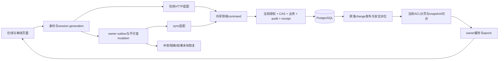

# RDPMS 修复与架构优化计划 v2

> 2026-10-02 连续执行后独立复核更新：本文原有“规划时未实施/全NOT_STARTED”描述为编写检查点。当前运行状态以 IMPLEMENTATION_STATE 为准。本复核发现两项漏修和两项补验，已追加[调整说明](execution/reviews/2026-10-02-post-continuous/PLAN_ADJUSTMENTS.md)。下一就绪任务RP10-T02；54任务结构、原审计和未批准决定保持原义。复核只改文档与运行状态，未修改业务源码。

更新：2026-10-02。源码基线：`138cf2da1b63195cef7e884f69bdf8ded6ed3c21`。

## 1. 审阅收束与本次边界

既有R00–R14与S00–S06审阅包已交付；补充审阅为COMPLETE_WITH_PENDING。可以结束全仓常规审阅并进入修复规划。仍保留31项开放项及两项必须定向补审的静态前置，不能宣称全部问题已经查尽或验收通过。本次只完善计划，没有修复、依赖升级、迁移、测试、构建、提交、部署或生产访问。

冻结结论保持33条唯一记录：32条SUPPORTED（16 P1、16 P2），1条候选R12-N01。SUPPORTED是缺陷证据，COMPLETE是审阅交付；两者都不是FIX_ACCEPTED。S02新增N-S02-01和B19影响扩展采用原证据边界，不扩大生产影响结论。

v1的13份根文档保存在[原版快照](revisions/v1-2026-10-01/SNAPSHOT_MANIFEST.json)。本轮定位并补齐18项计划缺口，详见[GAP_REVIEW](GAP_REVIEW.md)。历史审计和manifest保持冻结。

## 2. 计划结构与权威顺序

共20包RP00–RP19、54子任务、21项决定、12份跨包合同、31项历史开放项。验收矩阵共306条场景记录，保留原97条ID与原目标；新增记录包括包要求、子任务、合同、门禁及批准证据，存在共享要求，不能称为306个独立测试。全部NOT_RUN。

1. [TASK_GRAPH.json](TASK_GRAPH.json)：实施顺序、验收前置、门禁阶段/条件、可选子任务。
2. [DECISION_REGISTER.json](DECISION_REGISTER.json)及[OPEN_ITEM_GATES.json](OPEN_ITEM_GATES.json)：批准、历史证据及解除条件。
3. [CROSS_PACKAGE_CONTRACTS.md](CROSS_PACKAGE_CONTRACTS.md)：共享组件/协议和联合验收。
4. [PACKAGES.md](PACKAGES.md)及JSON：范围、步骤、验收、回退、停止条件。
5. [ACCEPTANCE_MATRIX.csv](ACCEPTANCE_MATRIX.csv)：批准后的具体断言及可归属证据。
6. [RELEASE_GATES.json](RELEASE_GATES.json)：实际candidate范围、兼容、观察和回退。
7. [IMPLEMENTATION_STATE.json](IMPLEMENTATION_STATE.json)：独立状态轴。

旧包间dependsOn改为协调参考，不以某包整体COMPLETE阻塞另包。implementationDependencies是任务先后边，acceptanceDependencies仅限制验收。联合合同不产生循环实施依赖。条件子任务RP01-T03（自定义角色绑定扩展）和RP05-T03（获准DAG增强）未获准不激活。旧客户端delete合同只限制真正改变delete适配的任务。

## 3. 当前架构到目标结构

当前审计显示React客户端含在线API、localStorage token、IndexedDB缓存/outbox和sync引擎；服务端HTTP路由承担部分业务/权限与同步适配，领域command、Prisma关系、receipt/audit组件已有可复用基础；shell/systemd负责构建、配置、备份与切换。此处复用冻结审阅，未重新扫描全仓。

目标保留模块化单体。先统一真实授权快照、领域写命令、原子提交和同步合同，避免为修复引入未论证的服务拆分。接口只做解析/认证和命令适配；内部业务snapshot与返回字段projection区分；每个写命令在同一tx完成授权复核、CAS、业务、审计、receipt及批准的change生产。

图示为拟议目标，不是已实现架构。safe-watermark和同资源revision顺序需分别用证据证明，不预先指定最终发布算法。

## 4. 阶段和可独立推进的工作

|阶段|包|主要交付|开启/发布限制|
|---|---|---|---|
|0 准备|RP00|基线/合法成功夹具/自有环境；两项静态矩阵；认证联合合同；预算监控|用户启动实施后执行RP00-T01；规则按任务取得|
|1 保护与保全|RP01, RP02, RP04, RP05, RP06, RP07, RP08, RP11, RP14, RP17|账号/角色、锁/刷新、project快照/聚合、硬删阻断、scope/state/manager、实体授权、owner/IDB草稿、文件出口和不可变备份|按子任务图推进；RP11草稿保全和RP17备份保护可早做；共享文件指定owner|
|2 会话、事务与部署基础|RP03, RP09, RP10, RP18|跨身份会话、命令tx/receipt/500恢复、任务全端CAS、报告snapshot及candidate/config gate|RP00-T02仅限制RP09/RP12；RP00-T03仅限制RP10-T01；报告snapshot独立，RP18候选构建可早准备|
|3 队列与同步协议|RP12, RP13|分批/不可变payload、分页、事件revision、水位/ACL/epoch|RP13-T01分页先行；协议需PC04/05/06/12及兼容/retention证据|
|4 数据与模块恢复|RP15, RP16|实际关系/异常、锁预算、迁移、restore registry/count及epoch安全状态|先获准只读副本再数据策略；JSON restore与整库DR分开|
|5 灾备与总体收束|RP19|候选裁定、配对恢复、范围发布/first-safe rollback和32确认项总体对账|RP19-T01候选裁定可早做；release按实际candidate，不等待全部20包|

阶段号表示建议优先级/协作波次，不是全局串行门禁；认证刷新联合设计、候选裁定和环境准备按任务图可提前开展。

相对工作量沿用任务卡S/M/L，只代表复杂度，没有人天/排期保证。实施启动后需为54任务分配owner、优先级、预算、目标日期及共享文件协调人；不在没有执行资源/目标环境时虚填时间。

## 5. 两项定向补审前置

- S03-OI-03 / RP00-T02：从sync写入到receipt提交、响应、客户端outbox移除，穷举事务内失败、提交结果未知、提交后丢响应、receipt过期及原key恢复。交付故障点矩阵和最后副本边界；静态结论明确后才做RP09-T01/RP12-T01。
- S03-OI-09 / RP00-T03：支持版本、Tasks编辑/状态/assignee、Kanban、DTO、route/command revision链；列missing baseline与旧客户端过渡合同。完成后才启用RP10-T01严格CAS；不限制独立报告snapshot修复。

不是重新扫描repo；任何新增源码或矛盾证据仅做受影响任务的最小定向补证。计划内未来测试从未运行。

## 6. 容易遗漏的联合设计

认证PC01覆盖旧成功与失败响应以及原请求actor；cookie配置旗标不能当作实际cookie传输实现。PC03固定已发key/hash，区分unknown/expired与可重试。PC04覆盖多tab blocked/versionchange与事务失活。PC05覆盖source revision、snapshot切点、每页ACL、cursor过期及所有生产者。PC06覆盖restore后session/receipt/cursor/outbox与commit前后不同状态。PC08覆盖备份run碰撞、共享inode metadata和成对retention。PC10要求首次安全发布没有安全旧版本时使用批准的containment。PC12覆盖真实用户恢复、当前授权、quota和最后副本。

这些是计划新增要求，未将它们伪造为新确认漏洞。细节与证据要求逐条在[联合合同](CROSS_PACKAGE_CONTRACTS.md)登记。

## 7. 验收、环境与交付

动态验收要使用执行者新建且确认所有权的临时PostgreSQL、合成用户/项目、临时浏览器profile及临时文件系统。先核对dotenv/子进程/测试wrapper/自动build/fixture连接；不复用旧固定审计库，不绕过DB guard。先证明鉴权和成功夹具，再执行越权/失败负例，核对真实DB、IDB与file副作用。

预算、timeout、retention、最长离线窗、支持版本、观察窗/阈值需目标事实和命名批准，未知保持PENDING/ENV_BLOCKED。证据记录源码/编译artifact/配置schema/夹具hash、命令/退出码/日志、实际持久state、资源计量和清理；不写真实凭据/正文。

每包交付change-summary、evidence、acceptance、rollback及handoff。每场景独立PASS/FAIL/NOT_RUN/ENV_BLOCKED；静态文档批准不是动态PASS；复现缺陷成功不能关闭finding。缺证据继续有范围推进，不用无关门禁拖住全包。

## 8. 迁移、发布与回退

expand/validate/contract只在批准schema设计、异常处理、长锁预算和兼容窗后实施；已应用migration不重写。先build并验证candidate编译config，再兼容gate及获准DDL/切流；失败清理、deploy锁、健康检查和runId可追溯。

实际release需包含任务清单及受影响组件、合同、gate、case、client/schema兼容、命名owner、观察窗和停止阈值。P1/P2不直接等于可发布/不可发布；以candidate范围和批准风险判断。已知危险旧版本不是安全rollback。若无兼容且安全fallback，批准维护/停止写入/关闭受影响功能并保全恢复点。回滚代码、恢复数据、禁用功能分别记录，不能用代码回滚冒充数据恢复。

## 9. 关闭规则

审阅可以收束，31开放项作为修复前置/验收/发布证据保留。总体修复收束必须对账全部32条确认项和1候选：确认项有实际baseline上的修复验收或明确残余风险处置；风险接受单列RISK_ACCEPTED，不标FIXED。候选需证据支持的最终裁定。local、目标环境、merge、deploy和上线观察状态独立；未运行仍NOT_RUN。

当前：规划文档完成，20包和54任务均NOT_STARTED；21决定无批准；31历史项仍OPEN；306场景NOT_RUN；executionAuthorized=false。文档完整性检查不代表系统验收。

## 2026-10-03 独立复核后的当前执行优先级

原20包/54任务、业务规则、依赖和门禁保持。执行者四任务交付经独立复核：RP10-T02仍有POST新建分支P1旁路，优先返工；RP08-T01需普通API/非空成功/增量补验；RP04-T02本地范围接受，RP02-T01结合独立条件更新屏障接受。以execution/reviews/2026-10-03-codebuddy/REVIEW.md、PLAN_ADJUSTMENTS.md和当前IMPLEMENTATION_STATE为准。本次只审阅和补证，未实施修复，未改变原PLAN_VALIDATION规划检查点。

## 2026-10-03 第二轮交付的独立裁定

RP10-T02、RP08-T01、RP02-T01当前本地范围经独立补证接受，停止重复业务返工。原54任务/定义/依赖/门禁不改，36项实施仍未完成。正式测试完善和普通阶段墓碑合同核对另列建议；不把当前在线字段比较当政策批准，不改RP08-T02或来源状态政策。最新依据execution/reviews/2026-10-03-codebuddy-followup/REVIEW.md和当前IMPLEMENTATION_STATE；原规划检查点与冻结证据保持。
