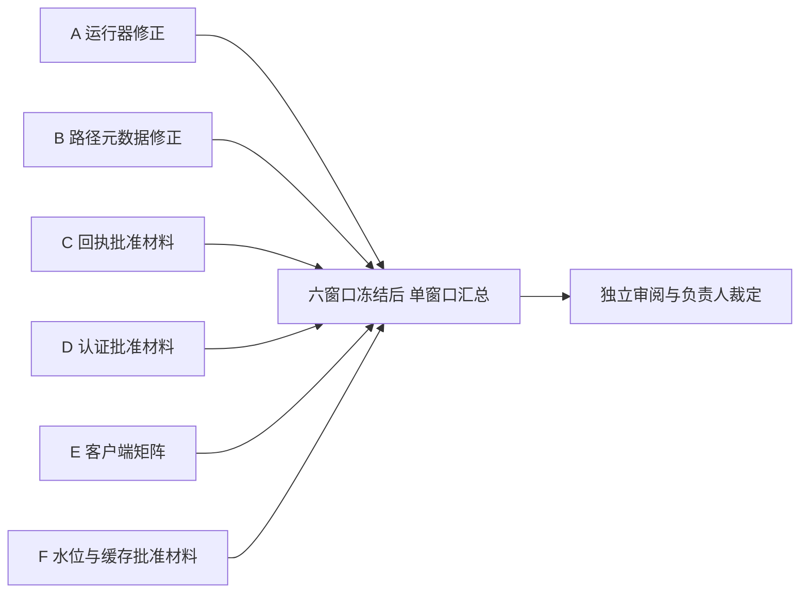

# 下一轮并行执行包

编写：2026-10-04；仅编写指令，未启动实施或批准业务门禁。

当前可直接并行的修正是两个：LR7-01运行器、LR7-02路径元数据。再加四组门禁准备材料，本轮安排六个独立工作窗口。此数为任务分区配置，不是CodeBuddy软件/账号/机器的并发上限。

| 窗口 | 指令 | 类型 | 唯一输出分区 |
|---|---|---|---|
| A | WINDOW_A_RUNNER.md | LR7-01新运行器及9条安全控制 | window-a-runner/ |
| B | WINDOW_B_PATHS.md | LR7-02严格路径解析和订正映射 | window-b-paths/ |
| C | WINDOW_C_RECEIPTS.md | T-RP-02待批准回执合同材料 | window-c-receipts/ |
| D | WINDOW_D_AUTH.md | T-RP-09待批准认证/跨身份合同 | window-d-auth/ |
| E | WINDOW_E_REVISION.md | T-RP-03/S03-OI-09源码客户端矩阵 | window-e-revision/ |
| F | WINDOW_F_CACHE.md | T-RP-04/T-RP-12待批准水位/撤权/保全合同 | window-f-cache/ |

共同必读：COMMON_RULES.md、BATCH_MANIFEST.json。运行输出根统一为：

`docs/remediation/2026-10-01-rdpms/execution/supplements/parallel-lr7-2026-10-04-p01/`

六窗口可同时开始，不读取或修改其它窗口未冻结的产物。每个窗口结束交付READY.json并冻结自己的目录。

六个窗口都有READY.json（允许真实BLOCKED/FAIL）且停止写入后，单独启动INTEGRATOR.md。汇总窗口不是第七个并行写入者；只有它可以追加六个根记录，生成最终封存和跨包冲突清单。

只有A/B是在修正当前工具/交付缺陷。C～F交付PROPOSED方案与待提供材料，不算业务修复实现、批准或验收通过。原任务仍36项实施未完成；没有批准时不能启动受门禁约束的业务代码修改。

若只想结束当前两项返工，可只开A/B；汇总指令支持显式TWO_FIX_ONLY模式。若要同时准备业务解锁材料，采用默认SIX_WINDOWS模式。不能把未启动的C～F写成完成。

