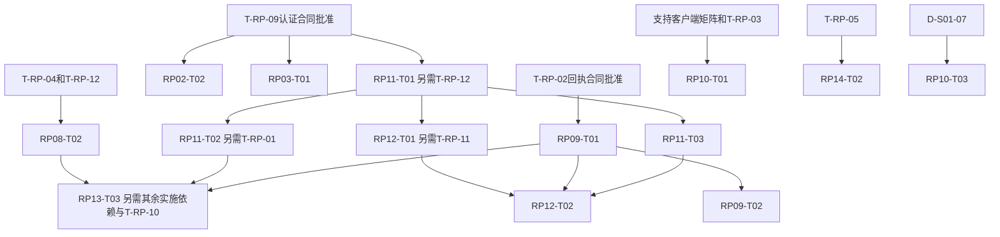

# RDPMS 剩余工作接续规划：Luna 执行版

规划日期：2026-10-05。原审计 HEAD：`138cf2da1b63195cef7e884f69bdf8ded6ed3c21`。

本规划复用修复 v2 的任务定义、门禁与已接受证据，不重新开展全仓审阅。本轮只编写规划，未启动实现、产品验证或批准任何规则。规划位于原冻结计划目录之外，CodeBuddy 当前封存输入保持原样。

## 1. 当前还有哪些工作

| 工作集合 | 数量 | 本规划处理方式 |
|---|---:|---|
| 实施未完成 | **36** | 逐项任务卡、真实依赖、范围和开启条件 |
| 其中必需任务 | **34** | 获准范围按原任务图推进 |
| 其中可选扩展 | **2** | RP01-T03、RP05-T03 保持未激活，不为凑数量实施 |
| 实施 COMPLETE、验证未 PASS | **8** | 独立补验/边界清单，不混入36项实施数量 |
| 尚未批准决定 | **21** | 差分批准材料，复用已有方案；准备不等于批准 |
| 原验收记录 | **306** | 仍是原矩阵，不增加“新独立测试数” |
| 已接受任务但仍开放的额外case | **13** | 核对已有证据/政策归属，不视为13项新缺陷或自动返工 |

54任务当前实施18 COMPLETE / 2 IN_PROGRESS / 34 NOT_STARTED；验证10 PASS / 37 NOT_RUN / 7 ENV_BLOCKED；306验收53 PASS / 228 NOT_RUN / 25 ENV_BLOCKED；发布全部NOT_EVALUATED。

36项的机器卡在 [WORK_ITEMS.json](WORK_ITEMS.json)，摘要在 [REMAINING_TASKS.csv](REMAINING_TASKS.csv)。8项补验在 [VALIDATION_BACKLOG.json](VALIDATION_BACKLOG.json)。原31历史开放项及32 SUPPORTED+1候选的边界不改变。

## 2. 与正在运行的 CodeBuddy 如何分工

CodeBuddy负责 `seal-overlay-2026-10-05-02/` 和两份history的限定追加。Luna当前只写新目录 `docs/remediation/2026-10-05-luna-remaining-execution/preparation/`。本规划本身也不写原P目录。

**当前允许两个执行窗口同时工作：CodeBuddy封存，Luna补齐开工材料。** 这是任务分工，不是模型服务或账号并发上限。

- Luna不改源码、正式测试、依赖、schema或原计划，不运行build/DB/browser/正式测试，不改六根记录。
- 新准备文件不会进入CodeBuddy正在验证的原2335计划/277保护集合。
- CodeBuddy封存期间若源码变化，会破坏它的输入一致性核对。因此不并行开展业务改码。
- 用户或执行者明确确认CodeBuddy停写并提供交付引用后，重新登记实际字节基线。停写不能从mtime、目录存在或固定等待时间推断。
- CodeBuddy封存PASS不是新增全局业务门禁；Luna準备不等待该PASS。产品实施需要写入协调解除和本任务自身门禁满足。
- 未来产品实施采用**一个Luna代码写入者，逐任务串行**。七个领域分区不等于七窗口共享dirty checkout并行写入。

详细约束在 [COORDINATION.json](COORDINATION.json)。原21项决定无批准的事实不会因执行窗口增加而改变。

## 3. 现在交给 Luna 的四个固定准备包

先启动登记LP-00，再串行完成LP-01～04；它们是准备交付编号，**不加入原54任务图**。不用重新整理全部历史证据，也不再返工已经接受的B17/报告快照/普通同步读权限/登录锁。

### LP-01：回执与删除恢复合同差分补齐

负责T-RP-02、T-RP-07。复用C窗口方案和RP00-T02原故障矩阵，优先解决AG-05实质合同矛盾。

固定交付：

1. 按原矩阵逐行写失败前提、业务/audit/receipt持久状态、响应、客户端最后副本、原key/hash查询或重放、拒绝副作用与未来断言。
2. 明确FP-06是前项持久后续receipt失败；FP-07是所有item/receipt持久后lastPushAt失败；FP-08是receipt提交后响应丢失。不能承诺任意500或整个批次整体回滚。
3. 明确actor/device/resource/command/key/hash及版本、当前授权与查无语义；列出已有方案尚未决定的唯一键/保留窗/兼容窗口，保持OPEN_INPUT。24小时、OPT-A及一个发版周期都是提案，不能自动采用。
4. 按真实受影响操作列command-scope：普通create/update可独立讨论；若共享helper改变delete/replay/tombstone，则相关T-RP-07/S03-OI-05仍适用，不能仅靠标题“非delete”规避。
5. 纠正安全回退说明：退回旧独立业务写+receipt upsert路径不是已验证安全fallback；给出保留记录、停止相关写入或获准兼容路径的待签选项。

产物：receipt-contract-addendum、failure-recovery-matrix、command-scope-matrix、acceptance-spec。不能修改C原件或直接写receipt/schema实现。

### LP-02：认证与离线归属联合批准缺口

负责T-RP-09、T-RP-01、T-RP-12、D-S01-04。复用D/F及已交付RP00-T04，整理联合作业的具体未选项，不另造完整架构。

固定交付：

1. 保留现有Bearer/body事实；cookie/CORS旗标不能视为cookie认证实现。
2. 列两tab refresh单次消费/family继承/重放窗口及失败清理的明确选择，指向已有提案。若选择允许双成功，B15的残余风险与原单次消费验收矛盾必须显式提交，不得宣称已修复。
3. 旧成功、旧失败、原请求重放三类分别绑定发起actor/generation；列A→B、logout、慢/me、离线、401/403、双tab组合的可执行规格。
4. 可靠owner、未知owner隔离、升级blocked/versionchange、事务abort、quota、页面关闭、撤权后的outbox保全与用户恢复分别列最后副本。不能从内容或首次登录猜owner。
5. D-S01-04按改密/reset/停用/降权分别列失效时限选择；T-RP-09不代替D-S01-04批准。

产物：auth-owner合同补遗、身份响应矩阵、最后副本矩阵、acceptance-spec。真实JWT、真实IDB、浏览器多tab未来验证与注入actor/mock场景分列。

### LP-03：独立业务规则和小范围修复批准表

负责D-S01-01/02/03/05/06/07/08及T-RP-05/06。每项只补现有资料缺口，形成可由负责人审查的一行/一组字段，不反复复制完整方案。

优先让负责人看到可较快独立开工的任务：

| 决定 | 最先可推进范围 | 仍有的边界 |
|---|---|---|
| T-RP-05 | RP14-T02扫描状态/elevated/审计 | 保留INFECTED阻断；逐状态、metadata/字节/delete/别名明确 |
| D-S01-07 | RP10-T03报告来源状态与复提 | 不重复报告快照与迟到写修复；same-key replay与new-key resubmit分开 |
| D-S01-01 | RP01-T02等级/reset子范围 | 强制改密allowlist另需D-S01-02；局部实现不关闭整个任务 |
| D-S01-05 | RP06-T01注册全入口scope | 全球例外的角色/字段/操作须明确，不重做普通同步读 |
| D-S01-06 | RP07-T02负责人转移 | RP06-T02另需RP06-T01完成；S03-OI-07复用同一批准 |
| T-RP-06 | RP16-T01完整registry | 模块范围/merge/replace/冲突/真实count先明确 |
| D-S01-08+T-RP-07 | RP05-T02差量/删除 | DAG增强仍是另一个未激活的可选子任务 |

D-S01-03和DAG是否启用单独标OPTIONAL_INACTIVE；不要求负责人为了普通修复批准它们。

阶段读取软删过滤与字段级授权批准来源这两个补充合同继续记录为独立范围请求。原54任务中没有因此新增一个获准fix；不得顺手修改phases.js/projects.js或字段投影。既有审阅与SUP材料只引用，不重开验证。

产物：decision-gap-table、bounded-fix-order、acceptance-spec。批准签名保持空，除非收到相应负责人真实、可追溯的完整批准证据。

### LP-04：客户端、水位、环境预算和八项补验输入

负责T-RP-03/04/08/10/11/13。

固定交付：

1. 复用E的源码矩阵和真实外部请求，列已部署版本/声明支持版本/基线能力/升级截止缺项。package版本或源码不能替代外部证据。
2. 复用F水位选项及RP13-T02已有barrier日志，列方案所需证明、producer覆盖、source revision/epoch、snapshot切点、ACL变化与RESET。模型证据、真实PG证据和生产可用方案批准分开；不重跑数据库。
3. 对8项已实施未验收分别列可复用证据、真实缺项、最小下一验证、依赖和环境。同时核对CASE_REMAINDER的13条：AC-B04-02缓存撤权、AC-B11-02其它扫描状态、AC-B19-01～04及PAC-RP04-01～04/PAC-RP05-01～03。它们目前没有被36任务+8补验直接覆盖，先复用真实证据，再提出范围/关联对账建议；不擅自重绑原CSV或补PASS。RP00-T01的不可恢复历史startHead不阻塞业务；RP19-T01候选无外部协调证据不改判SUPPORTED。
4. 只读检查本地已有工具/包文件，登记TypeScript与fake-indexeddb可用性、浏览器/临时PG工具、Linux/文件系统、candidate/config环境；不安装、启动或构建。缺fake-indexeddb不自行安装。
5. 向负责人提出外部资料请求：代理/app有效body上限、DB/锁/事务/递归/容量预算、最长离线和留存窗、Linux/FS事实、candidate/安全fallback、观察窗/阈值、数据owner出具的schema和聚合异常报告、候选DB/files一致恢复点证据。
6. 数据资料缺失时保持ENV_BLOCKED；不打开真实库、SSH/dotenv，不导入真实数据或把合成异常数充当实际存量。

产物：external-input-requests、environment-readiness、validation-plan、budget-and-release-gap-table。

## 4. 全部36项按七个领域分区

| 区 | 任务 | 数量 |
|---|---|---:|
| A 账号/认证/会话 | RP01-T02/T03、RP02-T02、RP03-T01/T02 | 5 |
| B 项目关系/注册/负责人 | RP05-T02/T03、RP06-T01/T02、RP07-T02 | 5 |
| C 任务revision/报告状态 | RP10-T01/T03 | 2 |
| D 回执事务/同步生产者 | RP09-T01/T02、RP13-T03 | 3 |
| E 离线身份/缓存/队列 | RP08-T02、RP11-T01/T02/T03、RP12-T01/T02 | 6 |
| F 文件/数据/模块恢复 | RP14-T02、RP15-T01/T02/T03、RP16-T01/T02/T03 | 7 |
| G 备份/候选/灾备/对账 | RP17-T02/T03、RP18-T01/T02/T03、RP19-T02/T03/T04 | 8 |

分区覆盖36项且没有重复。领域本身不改变任务图，不授予所有该包文件的写权限。[WORK_ITEMS.json](WORK_ITEMS.json)保留每个任务的原门禁原文、实施依赖、验收依赖、包级文件上限、任务边界、全部关联case和原证据引用。

## 5. 业务实施开启与实际选择顺序

CodeBuddy明确停写后，由用户转发 [LUNA_IMPLEMENTATION_PROMPT.md](LUNA_IMPLEMENTATION_PROMPT.md) 开启条件实施阶段；准备prompt不会自动转入实施。

每次选择任务必须依次判断：

1. 是STANDARD且在本轮具体allowlist；可选任务未激活就跳过。
2. 当前implementationDependencies逐项已满足。不要相信旧CSV的文字reason或nextReady指针；例如旧RP10-T03行仍写等待RP10-T02，但当前依赖已经COMPLETE。
3. gateRequirements按本次真实scope、before和condition判断；只有当前适用的IMPLEMENTATION门禁阻止改码。VALIDATION/RELEASE限制对应轴，不扩大为实现阻碍。
4. 支持客户端矩阵、真实数据、当前方案合同等明确的任务内前提齐全；RP00-T03的实现COMPLETE不能证明S03-OI-09已验收。
5. 共享文件无其它写入者，当前基线已登记，具体文件清单/接口/schema兼容范围已明确。
6. 对就绪任务按P1保护/数据保全优先；本规划priority仅为同等就绪任务的调度排序。阻塞任务跳过，阶段号和领域号不形成全局等待。

预计关键链如下，图中不是新的强制依赖：

注意：RP02-T02对RP03-T01、RP08-T02对RP11-T01是**验收依赖**，不强行改成实施先后。T-RP-09批准不代替D-S01-04，T-RP-04批准不代替T-RP-10/T-RP-12，一项批准也不保证整个领域或下游任务全部就绪。

## 6. 八项补验不能遗漏

| 已实施任务 | 当前验证 | 主要接续要求 |
|---|---|---|
| RP00-T01 | ENV_BLOCKED | 复用自有环境/成功夹具；旧startHead不可恢复边界独立保留 |
| RP00-T03 | NOT_RUN | 实际支持/部署版本矩阵及S03-OI-09资料 |
| RP00-T04 | NOT_RUN | T-RP-09批准和认证联合证据 |
| RP00-T05 | NOT_RUN | T-RP-11/T-RP-13预算及观察/停止阈值 |
| RP13-T01 | ENV_BLOCKED | 前端IDB应用/完整分页checkpoint；复用已有真实API日志 |
| RP13-T02 | ENV_BLOCKED | T-RP-04/T-RP-10、S03-OI-01方案证据与签署 |
| RP17-T01 | ENV_BLOCKED | Linux/真实FS及完整备份语义；与RP17-T03复用必要证据 |
| RP19-T01 | ENV_BLOCKED | S05-OI-02外部协调事实和候选裁定 |

补验不自动重做实现，单次补验只运行当前缺失的必要场景。mock、注入actor、MacFS、模型SQL与真实JWT/IDB/Linux/候选环境的层级分开。环境仍缺失时保持ENV_BLOCKED，不把准备交付COMPLETE改成产品PASS。

另有13条原case仍NOT_RUN/ENV_BLOCKED，但关联任务当前局部PASS。见 [CASE_REMAINDER.json](CASE_REMAINDER.json)。其中AC-B04-02、AC-B11-02、AC-B19-02/04的原关联与后续scope存在需要核对的差异；缓存撤权不能因为原行列D-S01-05就当普通同步读回归，扫描FAILED/SKIPPED不能以INFECTED测试替代，所有cycle要求不能自动激活DAG，存量异常不能用合成数据处置。其它9条先核对已经接受的真实run是否覆盖原要求。此处是验收范围/记录缺口，不是确认新增代码缺陷。

[ACCEPTANCE_DISPOSITION.csv](ACCEPTANCE_DISPOSITION.csv)逐行覆盖全部306记录，包括现有53条局部PASS。原结果均保持；批准后才执行相应case或进行有证据的运行镜像同步。不存在“只规划36+8就忽略其它case”的做法。

## 7. 文件范围、状态与交付

原包existingFileScope只是文件上限。每项业务启动前，从任务目的收窄为具体文件清单，写authorization；已有proposed module也要登记。不得因包包含roles.js/schema.prisma而顺带改角色/会话/关系策略；原迁移目录不等于整目录授权。新迁移需要批准的具体设计和文件名。

准备阶段只维护新准备目录自己的LP状态和handoff；不写原IMPLEMENTATION_STATE、TASK_GRAPH、PACKAGES、两history或两handoff。CodeBuddy拥有这些记录中的两history写入权。

条件业务阶段需明确登记唯一运行状态写入者，按原执行规约同步实际运行轴；不改变原任务定义/依赖/门禁/验收目标，不覆盖旧日志/审计/v1。原历史manifest/hash继续是历史检查点，正常获准代码变化记录新字节基线和diff，不要求修复后代码hash等于旧审计hash。

每项业务任务单独run交付七类，分别记录implementation/local validation/target validation/release/finding。用例关联见 [ACCEPTANCE_BINDINGS.csv](ACCEPTANCE_BINDINGS.csv)：这是342个“任务—case”关联，存在共享case，不是342个新增测试。sourceDataRow是CSV逻辑行序号，执行时以case_id取原定义。

## 8. 提高进度的做法

- 已齐的C/D/E/F材料直接引用，只有具体矛盾/空字段补差分。不要再生成同一份完整方案。
- 回执、认证/离线合同是关键链；文件扫描和报告状态是较短的独立开工范围，审批齐后可以先完成，不等待全部21决定。
- 未齐的材料汇总成一个负责人可直接填写的批准表；给具体选项、作用域、兼容、缺少的数值，不再只问“是否批准”。
- 接受的旧任务和历史复现不默认重跑。收尾按实际受影响组件运行回归，不默认运行全部306记录。
- 准备交付不走CodeBuddy的复杂两history封存流程。新目录简单输入摘要、真实状态、handoff即可，减少反复订正。
- RP19-T04仅在总体处置条件满足时收束，不能反复用对账/统计作为新的实质进度。

## 9. 停止与交接

准备包可全部完成后停止，交付总批准表、就绪条件、范围清单和实施建议。产品/安全/数据决定未批准时不代签；没有资源则列解除条件。遇到某包缺证据，继续其它独立准备包。

后续业务执行只在相应授权和门禁满足后开始。提交、push、merge、部署、生产/共享DB、真实账号、真实数据恢复、依赖安装升级、子代理和模型切换均不在本规划执行范围内。

最终programme closure仍须32确认项和候选的真实处置、支持性任务/验收、残余风险及发布轴对账；本地完成与上线验收分别记录。本规划不承诺凭本地授权即可关闭所有54项。
